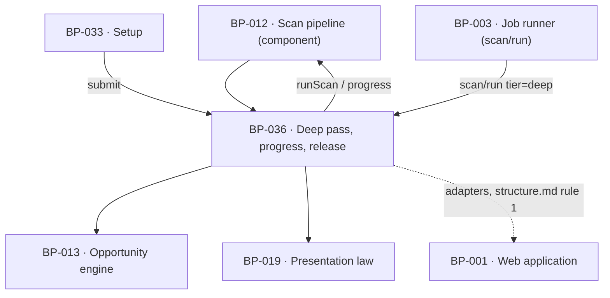

# BP-036 — The deep pass, its progress screen, and the unconditional release

- Parent: BP-012
- Kind: **feature** — cut from REQ-029, a leaf under the scan-pipeline component.

## Responsibility
Run the onboarding pass at the deep tier, project its named stages to a waiting
screen that states no duration of any kind, and release the founder into the app
exactly once — on completion, on degradation, on failure, or at ten minutes —
after which no later visit ever returns them to the wait. Research on the DataForSEO
endpoints and pricing is in `registry/evidence/RESEARCH-dataforseo-endpoints.md`.

## Module / boundary
`src/lib/scan/deep/` — the deep tier's parameters, the stage projection, and the
release latch. Two files sit in BP-001's boundary and are governed here as
transport-only adapters under structure.md rule 1: the waiting route
`src/app/(account)/setup/waiting/**` and the progress endpoint
`src/app/api/setup/progress/route.ts` (decision 4). It branches nothing about the
pipeline itself — `runScan({ tier: 'deep' })` is BP-012's and stays so.

## Diagram


## Public interface
```ts
/** The named steps REQ-029 criterion 1 promises in written words. Closed: a step
 *  the pipeline runs that is not here cannot be shown, and a step shown that is
 *  not running is a test failure. */
export type DeepStage =
  | 'reading_site' | 'building_market' | 'asking_questions'
  | 'measuring_rivals' | 'finding_opportunities'

export function runDeepPass(a: { siteId: string; domain: string }):
  Promise<{ scanId: string; status: 'done' | 'degraded' | 'failed' }>

/** REQ-029 criterion 1 made structural: this frame has no field a duration,
 *  estimate, countdown, clock or percentage could travel in. The heartbeat
 *  timestamp is the server's own send time and is never rendered. */
export interface ProgressFrame { stage: DeepStage; running: true; heartbeatAt: Date }
export type ProgressEvent = ProgressFrame | { running: false; reason: ReleaseReason }
export function progressStream(siteId: string): AsyncIterable<ProgressEvent>

export type ReleaseReason = 'completed' | 'degraded' | 'failed' | 'deadline'

/** The latch. Monotonic and idempotent: the first writer wins and no caller
 *  can clear it. REQ-029 criterion 5's "the wait is over for that founder for
 *  good" is this function's only postcondition. */
export function releaseToApp(a: { siteId: string; reason: ReleaseReason }):
  Promise<{ releasedAt: Date; reason: ReleaseReason }>

export function isReleased(siteId: string):
  Promise<{ released: false; deadlineAt: Date } | { released: true; at: Date; reason: ReleaseReason }>

/** REQ-029 criteria 3, 5 and 6: the one written sentence that travels with the
 *  founder into the app, on every screen they arrive at, until it stops being
 *  true. Derived from the current report, never from a stored flag (decision 3).
 *  Returns null when there is nothing to say. */
export function releaseNotice(siteId: string):
  Promise<{ key: CopyKey; vars: Record<string, string> } | null>
```

## Data model delta
On `sites` (migration topic `sites`; this node globs no migration):
- `setup_released_at timestamptz null`
- `setup_release_reason text null check (setup_release_reason in ('completed','degraded','failed','deadline'))`
A partial unique guard is unnecessary — the latch is a single-row conditional
update (`set … where setup_released_at is null`) whose zero-row result means
somebody else latched first.

No column records what could not be measured: that is read from the current
report's `status` and its `unmeasured` parts (BP-012's blob), so the sentence
cannot outlive the fact (decision 3).

## Error & edge behavior
- **The screen shows which step is running and nothing about time.** The stage is
  read from BP-012's `progress()` and mapped onto `DeepStage`; a stage that is not
  the stage actually running cannot be produced, because the map is total and the
  source is the pipeline's own transition, not a client-side timer.
- **Heartbeat.** The stream emits at least one frame every 15 s while the pass
  runs (parameter, decision 5), so criterion 1's 30-second promise survives one
  dropped frame. A dropped connection reconnects and resumes from the current
  stage; a resumed stream is indistinguishable from an unbroken one.
- **Release is unconditional and happens once.** Four triggers, one latch: pass
  end (`completed` / `degraded` / `failed`), and a read-path check that latches
  `deadline` when `now - setup_completed_at >= 10 min`. No scheduled job is
  required, so a missed job cannot strand a founder (decision 1).
- **A pass that finishes after the deadline** writes its report through BP-012's
  current-report pointer as normal. Its results reach the app the founder is
  already in, with nothing required of them, and `releaseNotice` starts returning
  null because the current report is no longer degraded (criterion 5).
- **Zero opportunities is legal and never faked** (criterion 4, `BUILD.md` §4.3).
  The release consults no opportunity count. An empty supply renders REQ-095's
  written lines through BP-019 on the screen the founder lands on; this node
  invents no page, proposal, rival or number to fill it and has no code path that
  could.
- `/setup/waiting` requested by a released founder → redirect to `/app`.
  `/app` requested by an unreleased founder inside the window → redirect to
  `/setup/waiting`. Past the window `/app` never redirects (criterion 6).
- `/setup/waiting` requested by a founder who never submitted setup → redirect to
  `/setup` (BP-033's gate), never a blank wait.
- A pass that fails outright latches `failed` immediately rather than waiting out
  the ten minutes: criterion 5 says "fails outright, **or** has not ended".

## NFR budget
- Release deadline: 10 minutes from `sites.setup_completed_at`, hard.
- Heartbeat interval 15 s; the SSE connection closes at 11 minutes, by which time
  the read path has latched `deadline`.
- The progress endpoint performs no vendor call, no measurement and no write
  other than the latch; it is a read of one row plus the pipeline's stage.
- Deep tier spend and stop conditions are BP-012's ceilings; this node adds none.
- Observability: one line per stage transition and one per release carrying
  `siteId`, `reason` and elapsed seconds — logged, never rendered.

## Decisions

1. **The release is a monotonic latch, written by whichever of pass-end or
   read-path reaches it first** — Status: accepted
   - Context: criterion 5 makes the release final and unconditional even for a
     pass that never reports itself finished. Something must fire at ten minutes
     for a founder who closed the tab and returns a week later.
   - Decision: `sites.setup_released_at` is set by a conditional update. Two
     writers exist: the pass on ending, and any read of `isReleased` that finds
     the deadline passed. Both are idempotent; the first wins and the reason
     recorded is the first writer's.
   - Alternatives considered: a scheduled release job at T+10 — rejected, a
     missed or delayed job strands the founder on the wait, which is the precise
     failure criterion 5 exists to forbid, and it adds a seventh job to BP-003's
     closed six; compute the release on every read without latching — rejected,
     the release reason would then change under the founder if the pass finished
     later, and criterion 5 requires the wait to be over *for good*.
   - Consequences: the latch is the checkpoint; reversing it means reintroducing
     a scheduled job and the stranding failure with it.

2. **`ProgressFrame` carries no time field at all** — Status: accepted
   - Context: criterion 1 forbids a duration, an estimate, a countdown, a clock
     and a percentage of time on the screen. A payload that carries elapsed
     seconds relies on every renderer choosing not to show them.
   - Decision: the wire type has one stage, one boolean and a server send time
     that the client uses only to detect staleness. There is no elapsed, no
     total, no percentage and no ETA to render.
   - Alternatives considered: send elapsed and let the screen omit it — rejected,
     the promise then lives in a component and the first debug overlay or
     analytics event breaks it; send a fake percentage per stage — rejected, it
     is a measurement nobody took (rule 1.2).
   - Consequences: a progress bar is impossible without changing this type, which
     is the intended friction. Reversal is cheap in code and expensive in promise.

3. **The degraded sentence is a projection of the current report, never a stored flag** — Status: accepted
   - Context: criterion 3 requires one written sentence about what could not be
     measured, criterion 6 puts it on every screen the founder arrives at
     afterwards, and criterion 3 as written carried no end for it — REQ-029's
     own `REVIEW(gap)` raised that and has since been folded and deleted.
   - Decision: `releaseNotice` reads the **current** report for the site
     (BP-012's `readCurrentReport`) and returns a key only while that report's
     status is `degraded` or `failed`. When a later pass — the founder's own late
     finish, or the first weekly re-measurement (BP-050) — moves the current
     pointer to a `done` report, the notice disappears with it. No flag is stored
     and none can go stale.
   - Alternatives considered: a stored `show_degraded_notice` boolean cleared on
     the next good pass — rejected, it is a second copy of the report's own
     status and will disagree with it; show the sentence forever — rejected, it
     would tell a fully measured customer that their measurement is incomplete.
   - Consequences: none for the shipped shape. The gap this answered is now
     closed in the requirement itself: criterion 3 states that the sentence
     "stands for as long as the most recent completed measurement of their site
     is one that fell short" and "stops being shown as soon as the most recent
     completed measurement of that site is one that completed in full, the
     founder's own late-finishing pass or a weekly re-measurement alike" — which
     is this decision, stated as the customer-observable half and derived from it
     by the analyst on 2026-09-01. The current-report pointer and
     `readCurrentReport` stay here (rule 2.4).

4. **This node governs two files inside BP-001's boundary** — Status: accepted
   - Context: REQ-029 is one behaviour with an engine half and a screen half. Its
     parent in the hierarchy is BP-012 (the pass), but the waiting route and the
     progress endpoint live under `src/app/`, which is BP-001's.
   - Decision: this node globs both, and both are transport-only under
     structure.md rule 1 — the route reads `isReleased` and renders, the endpoint
     serves `progressStream`. Neither holds pipeline logic. BP-001 remains the
     container; the diagram shows the adapter edge as a dashed line.
   - Alternatives considered: leave the two files to a separate feature node under
     BP-001 — rejected, it splits one criterion set across two nodes and rule 7.1
     puts one capability in one node; leave them unglobbed — rejected, rule 5.6
     makes an unowned file under governed paths a reported defect.
   - Consequences: the librarian sees one node spanning two containers' paths. If
     that is refused, the fix is to mint a sibling under BP-001 owning the two
     files and to make it depend on this node's interface — no code moves.

5. **Heartbeat interval 15 s** — Status: accepted
   - Context: criterion 1 promises the founder is shown at least every 30 s that
     the pass is running. A 30 s emit meets the promise only if no frame is ever
     lost.
   - Decision: 15 s, pinned in BP-005. Derivation: half the promised interval, so
     one lost frame still satisfies it; a shorter interval buys nothing on a pass
     measured in minutes.
   - Consequences: reversal is one pinned constant.

## Status grounds (rule 3.2)
Self-certified `approved`. Grounds: cut from REQ-029 while that requirement
carried `status: approved` — the moment §3's blueprint gate was met and read;
`satisfies: [REQ-029]` is the derivation edge. REQ-029 is `status: in-review`
from 2026-09-01, sent back through the owner gate by the review round that gave
criterion 3's degraded sentence an end. That fold was **derived from this
corpus** — from BP-036 decision 3, "the degraded sentence is a projection of the
current report, never a stored flag" — so the criterion now states as behaviour
what this node already builds, and no interface here changes. An `in-review`
requirement mid-gate is not a conflict with another artifact (rule 2.3) and so is
not a `blocked-by`; if the owner's approval changes the criterion rather than
ratifying it, this status reverts by the librarian's retroactive refusal (rule
3.2). Its engine
globs sit inside BP-012's `src/lib/scan/**` boundary and overlap no sibling; the
two `src/app/` globs are declared and justified in decision 4 and overlap no
sibling either (BP-033 globs `src/app/(account)/setup/*.tsx`, one level only).

## Open questions
