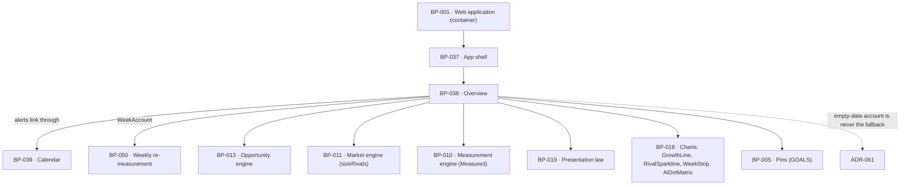

# BP-038 — Overview: is it working, what needs me, how far ahead each rival is

- Parent: BP-001
- Kind: **feature** — cut from REQ-041, a leaf under the web-application container.

## Responsibility
Render the screen a signed-in customer lands on so that it answers, from stored
measurements only, whether the work is paying off, what is waiting on them today,
and how far ahead each confirmed rival still is — with every headline number
carrying its change or its goal and never appearing bare.

## Module / boundary
`src/app/(account)/app/overview/` — the module layout, the six modules and the
one read that assembles them. It computes no measurement: the growth series, the
score, the AI-answer count, the rival counts and the verdicts are read from
stored scans through BP-010, BP-011, BP-013 and BP-050. Charts come from BP-018's
closed inventory; every sentence comes from BP-019's registry.

## Diagram


## Public interface
```ts
/** REQ-041 criterion 4 made structural. A module accepts exactly one headline and
 *  any number of context values, so "every module shows exactly one and never
 *  two" is a type property. Criterion 4's own last sentence — a value shown
 *  alongside for comparison is not a headline number — is the `context` slot. */
export interface HeadlineNumber<T> {
  value: Measured<T>
  goal: GoalKey                      // every headline has one; a pin, not a setting
  delta?: Measured<T>                // change since the previous measurement, where one exists
}
export interface ContextValue<T> { value: Measured<T>; label: CopyKey }
export interface Module<T> { headline: HeadlineNumber<T>; context?: readonly ContextValue<unknown>[] }

export type GoalKey = 'searches_appeared_in' | 'ai_answers' | 'score' | 'pages_published'
/** The pairing lives here; the numbers are BP-005's `GOAL_VALUES` and are never
 *  written in this module. All four now carry a value: `pages_published` was
 *  ruled by the owner on 2026-08-31 at **30**, meaning a month of daily pages,
 *  so `value` is no longer optional and no tile renders a goalless headline. */
export const GOALS: Readonly<Record<GoalKey, { value: number; meansKey: CopyKey }>>

export type HeadDirection = 'rising' | 'flat' | 'falling' | 'no_data'
export const OVERVIEW_HEAD: Readonly<Record<HeadDirection, CopyKey>>

export type RivalGapModule =
  | { kind: 'absolute'                                   // criteria 9 and 10
      own: Measured<number>
      rivals: readonly { domain: string; ranked: Measured<number>; series: readonly Measured<number>[] }[]
      lineKey: CopyKey }                                 // NOT the gap-shrinking line
  | { kind: 'ratio'                                      // criterion 11
      rivals: readonly { domain: string; ratio: Measured<number>
                         previous: Measured<number> | { kind: 'first_ratio'; counts: { own: Measured<number>; rival: Measured<number> } }
                         series: readonly Measured<number>[] }[]
      lineKey: CopyKey }

export interface OverviewModel {
  head: { key: CopyKey; direction: HeadDirection }
  growth:
    | { kind: 'series'; points: readonly { weekStart: Date; value: Measured<number>; measuredAt: Date }[] }
    | { kind: 'none'; firstDueOn: Date }                 // criterion 3
  score: Module<number>
  aiAnswers: Module<number>
  pagesPublished: Module<number>
  rivals: RivalGapModule
  week: { days: readonly { date: Date; state: 'done' | 'today' | 'todo' }[]
          account: WeekAccount }                          // criterion 7, from BP-050
  supply?: { key: CopyKey; vars: Record<string, string> } // REQ-095 criteria 3, 5, 6 — one statement, never two
  alerts: readonly Alert[]                                // at most two (criterion 5)
  overflow?: { remaining: number; whereKey: CopyKey }
}
export interface Alert { key: CopyKey; vars: Record<string, string>; href: string }

export function readOverview(siteId: string): Promise<OverviewModel>
```

## Data model delta
None. Every value is read from `scans` (the stored report blob, its `week_start`
and its measurement date), `opportunities` and `drafts`/`publications`. The four
goal values are `GOAL_VALUES` in `src/lib/config/constants.ts` (BP-005), asserted in
`tests/pins.test.ts`, and are the same for every customer.

## Error & edge behavior
- **Overview is the landing screen** (criterion 1). `/app` redirects here; the
  redirect lives in BP-037's `page.tsx`, so there is one redirect, not two.
- **No weekly measurement yet** → `growth: { kind: 'none' }`, and in place of the
  chart the one written line naming the date the first measurement is due
  (criterion 3), taken from BP-050's `nextDueOn` — the same date the shell states.
- **An unmeasured week is a break in the line, never a joined segment**
  (decision 3). The growth series holds a `Measured<number>` per week; an
  `unmeasured` week renders as a gap with the week's own account beside it, and
  no earlier week's value is ever labelled with a later week's date (criterion 7,
  REQ-065 criterion 2). A week measured in part shows what was measured with its
  date and states the rest as not measured.
- **Every headline number carries its delta or its goal.** `HeadlineNumber` makes
  `goal` required and `delta` optional, so the bare case is unrepresentable. Where
  no previous measurement exists, the goal is what renders (criterion 4).
- **A `Measured` value is rendered only through BP-019's `renderMeasured`**, so an
  unmeasured input cannot appear as a zero and a measured zero cannot appear as a
  dash. The type is never widened to `number | null` at this surface.
- **Rival module, cold start.** At `own = 0` the module is the `absolute` arm and
  what moves over time is the rival's own count; its `lineKey` is *not* the
  gap-shrinking line (criterion 9). Below 10 ranked searches the module stays
  `absolute` and shows no ratio (criterion 10). At 10 or more it is `ratio`, with
  the previous ratio, or — where the customer crossed the threshold this week —
  that measurement's absolute counts instead (criterion 11).
- **Rivals are drawn from the confirmed competitor set only**; a derived rival
  candidate that the customer has not confirmed never appears (criterion 8).
  Rival series render in `--chart-rival` neutral gray, never in a status tone
  (`BUILD.md` §2.5); BP-018's chart props do not accept a `Tone` for a rival
  series, so this cannot be broken by a prop.
- **At most two alerts**, each with one control that navigates straight to the
  item; where more exist, the screen states how many remain and where to see them
  (criterion 5). An empty alert list is a success state and renders BP-019's line
  for it, never a blank region.
- **The supply statement is one statement, not two.** REQ-095 criteria 3, 5 and 6
  can all be true at once; `supply` resolves in the order exhausted → short →
  first-arrival-shortfall and returns one key.
- **A day ReachKit stopped its own work is stated here**, on the screen the
  customer lands on, without opening a calendar day (REQ-092 criterion 3), and it
  stops being stated when the work resumes. Its line is BP-019's `stoppedWorkLine`
  and names no internal cause.
- **An empty region never falls back to "nothing worth publishing"** — see
  ADR-061. Overview shares the calendar's empty-account resolver; it does not
  own a second one.

## NFR budget
- p95 server render ≤ 500 ms from stored blobs. Overview runs **no** measurement,
  no vendor call and no model call during render (`BUILD.md` §3, REQ-093
  criterion 4: every value inside an explanation was read from a stored
  measurement, never recomputed for display).
- One assembling read: the current report, the last 12 weekly report headers, the
  confirmed rivals' sizes, the draft counts, the supply depth. Budget ≤ 6 index
  lookups.
- Charts are inline SVG from BP-018's closed inventory; no chart library ships.
- Accessibility: every bar and point is direct-labelled with name and value;
  identity is never colour-alone.
- Observability: BP-001's per-route line only.

## Decisions

1. **"Headline number" is defined by the `headline` slot, not by a list** — Status: accepted
   - Context: REQ-041 carries an open `REVIEW(ambiguity: criterion 4)` — the term
     is never defined, and the goal obligation makes the scope load-bearing
     because the build must pin one constant per headline number.
   - Decision: a headline number is the value passed to a module's `headline`
     slot. `Module<T>` accepts exactly one; everything else a module shows is a
     `ContextValue`, which criterion 4's own final sentence explicitly excludes
     ("A value a module shows alongside its headline number, for comparison or
     context, is not itself a headline number and this criterion does not bind
     it"). Four modules lead with a number, so there are four headline numbers
     and four goals. Criterion 10's rivals' absolute counts and the customer's own
     number are `ContextValue`s inside the rival module and render bare.
   - Alternatives considered: enumerate the headline numbers in prose — rejected,
     it drifts the moment a module is added and gives the type no way to enforce
     "never two"; treat every rendered number as a headline — rejected, it would
     require a goal for each rival's absolute count, which is a constant nobody
     stated and would be an invented one.
   - Consequences: this resolves the requirement's open question structurally
     without changing what is promised. Reported to the analyst; REQ-041 is not
     edited here.

2. **Three of the four goals are derived from pinned specification values; the
   fourth is the owner's** — Status: accepted
   - Context: criterion 4 requires every headline number to carry a fixed goal,
     the same for every customer, "shown with the number and what reaching it
     means". A goal is a number a customer reads, which §1's rights table places
     with the owner unless it is derivable from an approved artifact.
   - Decision, with derivation:
     - `searches_appeared_in = 400` — `BUILD.md` §4.5 states the growth chart's
       footnote pair as "start value · *At 400 the big category terms unlock*".
     - `ai_answers = 6` — `BUILD.md` §4.5, the AI-answers tile: "dashed goal dots
       + *goal: 6*", out of the twelve tracked questions.
     - `score = 50` — `BUILD.md` §5 pins the band boundaries "0–24 Invisible ·
       25–49 Hard to find · 50–74 Findable · 75–100 Dominant"; 50 is the first
       score at which the product's own verdict changes from not-findable to
       findable, so what reaching it means is already written.
     - `pages_published = 30` — **was not derivable; ruled by the owner on
       2026-08-31.** No approved artifact stated a page count that meant
       anything, so this node escalated rather than pick a round number. The
       ruling: **30, meaning a month of daily pages** — the product's own promise
       of one page a day (REQ-056 criterion 8's one-per-calendar-day ceiling),
       sustained for a month. What reaching it means is therefore the product's
       own promise kept for a month, which is a claim about the customer's
       outcome and is why it was the owner's to make and not this node's.
   - Alternatives considered: pick a round number for pages published — rejected
     under rule 1.2 read together with §1's rights table: the goal is shown with
     "what reaching it means", which is a claim about the customer's outcome, not
     a coefficient; drop the pages-published tile — rejected, `BUILD.md` §4.5
     specifies it and it answers "is it working".
   - Consequences: the pages-published tile's work order was held until the goal
     was ruled and is released by that ruling. Reversal of any goal is one pin.

3. **An unmeasured week breaks the growth line** — Status: accepted
   - Context: criterion 7 forbids labelling an earlier week's value with a later
     week's date, and REQ-065 criterion 3 forbids replacing an unmeasured week
     with earlier figures. A line chart's natural behaviour is to join the two
     points either side of a gap, which draws a value for a week nobody measured.
   - Decision: the series is `Measured<number>` per week and `GrowthLine` renders
     a break, not a segment, across an `unmeasured` week; the week's own account
     renders beside the break.
   - Alternatives considered: interpolate — rejected, it is a drawn measurement
     that was never taken; carry the previous value forward — rejected, that is
     precisely "last week's wearing today's date" (REQ-065's user story).
   - Consequences: BP-018's `GrowthLine` must accept a gapped series. Recorded as
     a dependency, not a change this node makes.

4. **The head line is selected by the measured direction, never asserted** — Status: accepted
   - Context: `BUILD.md` §4.5 opens Overview with the fixed words *"The gap is
     closing."* and a badge reading *"▲ every week since you started"*. For a
     customer whose gap is widening, or who has one measurement, both are false
     claims, and §4.5 itself binds the claim to the chart ("the four words are
     backed by the chart directly under them").
   - Decision: `OVERVIEW_HEAD` maps four measured directions — rising, flat,
     falling, no data — to four copy keys, and the head renders the key for the
     direction the stored series actually shows. The badge renders only on
     `rising` and only over the weeks measured.
   - Alternatives considered: keep the fixed sentence — rejected, it is a verdict
     stated without the measurement behind it, which REQ-041's rationale and
     REQ-093 criterion 4 both forbid; omit the head — rejected, `BUILD.md`
     specifies a head and an empty one is a designed blank.
   - Consequences: four owner-owed strings instead of one. Reversal reinstates a
     claim the product cannot support.

## Status grounds (rule 3.2)
Self-certified `approved`. Grounds: cut from REQ-041, `status: approved`;
`satisfies: [REQ-041]`. Globs sit inside BP-001's boundary under
`src/app/(account)/app/overview/**` and overlap no sibling. REQ-041's open
`REVIEW(ambiguity)` is answered structurally by decision 1 and reported to the
analyst rather than edited here.

## Open questions
None. The one that stood here — the **Pages published** goal value and what
reaching it means — was ruled by the owner on 2026-08-31: **30, a month of daily
pages**. The value is pinned in BP-005's `GOAL_VALUES` and the meaning is this
node's `GOALS.pages_published.meansKey`; decision 2 records both. Criterion 4 is
now satisfiable for all four tiles.
