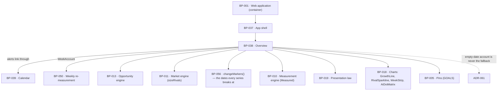

# BP-038 — Overview: is it working, what needs me, how far ahead each rival is

- Parent: BP-001
- Kind: **feature** — cut from REQ-041, a leaf under the web-application container.

## Responsibility
Render the screen a signed-in customer lands on so that it answers, from stored
measurements only, whether the work is paying off, what is waiting on them today,
and how far ahead each confirmed rival still is — with every headline number
carrying its change or its goal and never appearing bare. Research on competing
products' measurement practices and AI-answer stability is in
`registry/evidence/RESEARCH-competitor-visibility-measurement.md` and
`registry/evidence/RESEARCH-ai-answer-stability.md`.

## Module / boundary
`src/app/(account)/app/overview/` — the module layout, the six modules and the
one read that assembles them. It computes no measurement: the growth series, the
score, the AI-answer count, the rival counts and the verdicts are read from
stored scans through BP-010, BP-011, BP-013 and BP-050. Charts come from BP-018's
closed inventory; every sentence comes from BP-019's registry.

## Diagram


## Public interface
```ts
/** REQ-041 criterion 4 made structural. A module accepts exactly one headline and
 *  any number of context values, so "every module shows exactly one and never
 *  two" is a type property. The criterion's own exclusion — "A value a module
 *  shows for comparison or context is not itself a headline number and this
 *  criterion does not bind it" — is the `context` slot. Note the criterion no
 *  longer says *alongside its headline number*: it also states in terms that
 *  "the gap module leads with no headline number, and this criterion binds only
 *  a module that leads with one", which is why `RivalGapModule` is its own type
 *  and not a `Module<T>`. A module with no headline is representable; a module
 *  with two is not. */
export interface HeadlineNumber<T> {
  value: Measured<T>
  goal: GoalKey                      // every headline has one; a pin, not a setting
  delta?: Measured<T>                // change since the previous measurement, where one exists
}
export interface ContextValue<T> { value: Measured<T>; label: CopyKey }
export interface Module<T> { headline: HeadlineNumber<T>; context?: readonly ContextValue<unknown>[] }

export type GoalKey = 'searches_appeared_in' | 'ai_answers' | 'score' | 'pages_published'
/** The pairing lives here; the numbers are BP-005's `GOAL_VALUES` and are never
 *  written in this module. All four now carry a value: `pages_published` was
 *  ruled by the owner on 2026-08-31 at **30**, meaning a month of daily pages,
 *  so `value` is no longer optional and no tile renders a goalless headline. */
export const GOALS: Readonly<Record<GoalKey, { value: number; meansKey: CopyKey }>>

export type HeadDirection = 'rising' | 'flat' | 'falling' | 'no_data'
export const OVERVIEW_HEAD: Readonly<Record<HeadDirection, CopyKey>>

export type RivalGapModule =
  | { kind: 'absolute'                                   // criteria 9 and 10
      own: Measured<number>
      rivals: readonly { domain: string; ranked: Measured<number>; series: readonly Measured<number>[] }[]
      lineKey: CopyKey }                                 // NOT the gap-shrinking line
  | { kind: 'ratio'                                      // criterion 11
      rivals: readonly { domain: string; ratio: Measured<number>
                         previous: PreviousRatio
                         series: readonly Measured<number>[] }[]
      lineKey: CopyKey }

/** Criterion 11 as amended names **two** grounds on which there is no previous
 *  ratio to show with — "the customer having been below 10 at the previous
 *  measurement, or the previous ratio having been measured on the far side of a
 *  date REQ-071 criteria 12 and 13 break every series at" — and both render the
 *  same way: "it is shown with its own measurement's absolute counts instead".
 *  The arm carries `at` because REQ-071 criterion 12 requires the counts to be
 *  shown "with the counts from its own measurement and the date they were
 *  taken". `because` is not rendered; it exists so a test can discriminate the
 *  two grounds, and so the second cannot be reached by accident when
 *  `changeMarkers` (BP-056) returns nothing. */
export type PreviousRatio =
  | { kind: 'previous_ratio'; value: Measured<number>; at: Date }
  | { kind: 'no_previous_ratio'
      because: 'below_threshold_previously' | 'series_break'
      counts: { own: Measured<number>; rival: Measured<number> }
      at: Date }

/** Owner ruling, 2026-09-03 (`OWNER-QUESTIONS.md` item 2; grounds
 *  `RESEARCH-ai-answer-stability.md` §4, §6): a single week's AI-answer count,
 *  over twelve tracked questions, is too noisy to read as movement (Parse:
 *  21-32% repeat-run agreement per prompt; Profound: one run stands in for ten
 *  only when averaged over hundreds of prompts, not twelve). The `aiAnswers`
 *  headline never carries a raw week-over-week `delta` (decision 5); this is
 *  the windowed reading that replaces it, and it is the only place movement on
 *  this card is shown — at the aggregate, never broken out by question or by
 *  single week. */
export interface AiPresenceWindow {
  citedWeeks: number      // k — of the trailing window, the weeks in which the
                          // customer was named in at least one tracked
                          // question's AI answer
  windowWeeks: number     // n — min(AI_PRESENCE_WINDOW_WEEKS, weeks since the
                          // most recent change marker BP-056's changeMarkers
                          // returns for this site)
}

export interface OverviewModel {
  head: { key: CopyKey; direction: HeadDirection }
  growth:
    | { kind: 'series'; points: readonly { weekStart: Date; value: Measured<number>; measuredAt: Date }[] }
    | { kind: 'none'; firstDueOn: Date }                 // criterion 3
  score: Module<number>
  /** `headline.delta` is never populated (decision 5); `context` carries
   *  exactly one `ContextValue<AiPresenceWindow>` instead. */
  aiAnswers: Module<number>
  pagesPublished: Module<number>
  rivals: RivalGapModule
  week: { days: readonly { date: Date; state: 'done' | 'today' | 'todo' }[]
          account: WeekAccount }                          // criterion 7, from BP-050
  supply?: { key: CopyKey; vars: Record<string, string> } // REQ-095 criteria 3, 5, 6 — one statement, never two
  alerts: readonly Alert[]                                // at most two (criterion 5)
  overflow?: { remaining: number; whereKey: CopyKey }
}
export interface Alert { key: CopyKey; vars: Record<string, string>; href: string }

export function readOverview(siteId: string): Promise<OverviewModel>
```

## Data model delta
None. Every value is read from `scans` (the stored report blob, its `week_start`
and its measurement date), `opportunities` and `drafts`/`publications`. The four
goal values are `GOAL_VALUES` in `src/lib/config/constants.ts` (BP-005), asserted in
`tests/pins.test.ts`, and are the same for every customer.

## Error & edge behavior
- **Overview is the landing screen** (criterion 1). `/app` redirects here; the
  redirect lives in BP-037's `page.tsx`, so there is one redirect, not two.
- **No weekly measurement yet** → `growth: { kind: 'none' }`, and in place of the
  chart the one written line naming the date the first measurement is due
  (criterion 3), taken from BP-050's `nextDueOn` — the same date the shell states.
- **An unmeasured week is a break in the line, never a joined segment**
  (decision 3). The growth series holds a `Measured<number>` per week; an
  `unmeasured` week renders as a gap with the week's own account beside it, and
  no earlier week's value is ever labelled with a later week's date (criterion 7,
  REQ-065 criterion 2). A week measured in part shows what was measured with its
  date and states the rest as not measured.
- **Every headline number carries its delta or its goal.** `HeadlineNumber` makes
  `goal` required and `delta` optional, so the bare case is unrepresentable. Where
  no previous measurement exists, the goal is what renders (criterion 4).
- **`aiAnswers.headline.delta` is never populated** (decision 5, owner ruling
  2026-09-03). The goal (`GOAL_VALUES.ai_answers = 6`) still renders, satisfying
  criterion 4 on its own; the windowed `AiPresenceWindow` reading is a
  `ContextValue`, and it is the only place this module shows anything that
  reads as movement.
- **A `Measured` value is rendered only through BP-019's `renderMeasured`**, so an
  unmeasured input cannot appear as a zero and a measured zero cannot appear as a
  dash. The type is never widened to `number | null` at this surface.
- **Rival module, cold start.** At `own = 0` the module is the `absolute` arm and
  what moves over time is the rival's own count; its `lineKey` is *not* the
  gap-shrinking line (criterion 9). Below 10 ranked searches the module stays
  `absolute` and shows no ratio (criterion 10). At 10 or more it is `ratio`, with
  the previous ratio — or, on either of criterion 11's two grounds for there
  being none, that measurement's own absolute counts and their date instead
  (`no_previous_ratio`). The second ground is a change marker between the two
  measurements: the previous ratio was measured on the far side of a date
  REQ-071 criteria 12 and 13 break every series at, so showing it beside this
  one would present the difference across that date as movement, which is the
  one thing those criteria forbid. The break dates come from BP-056's
  `changeMarkers`; this node computes none of its own.
- **The gap module leads with no headline number** and therefore carries no
  goal — criterion 4 says so in terms, and `RivalGapModule` is not a `Module<T>`,
  so there is no `headline` slot for one to be added to. The rivals' absolute
  counts, the customer's own number and the per-rival ratio all render bare.
- **Rivals are drawn from the confirmed competitor set only**; a derived rival
  candidate that the customer has not confirmed never appears (criterion 8).
  Rival series render in `--chart-rival` neutral gray, never in a status tone
  (`BUILD.md` §2.5); BP-018's chart props do not accept a `Tone` for a rival
  series, so this cannot be broken by a prop.
- **In the rival row the numbers are rigid and the sparkline is the flexible
  element** (ADR-093 decision 4 — the row the owner cited on 2026-09-02). The
  rival's name, its distance (`78×`) and its delta badge (`was 276×`) are
  `flex: 0 0 auto`; the sparkline takes the residue and carries its own named
  minimum width. When that minimum plus the text no longer fits — which happens
  inside `compact` — **the row wraps to two lines rather than compressing
  anything**. A chart that gets narrower is still a chart; a number that gets
  narrower is an ellipsis. `.rk-chart { width: 100% }` inside the row's flex
  container is the specific defect this refuses: it resolves the chart's flex
  base to the whole row and the customer's own numbers absorb the shortfall.
- **No text in this screen renders below the type floor at any band**
  (ADR-093 decision 3). Where a band leaves no room for a label at the floor,
  the chart takes a **registered narrower arm** — the week strip's day labels
  abbreviate to a registered shorter form, the growth chart's footnote pair
  moves below the plot — never a smaller size. The direct-labelling rule is not
  relaxed by band: `BUILD.md` §2.4 admits no legend-only mode at any width, so
  a chart that cannot label its marks at the floor is not the chart this band
  renders.
- The three stat tiles are three-up at `wide`, two-up at `medium` and one column
  at `compact`, by ADR-093 decision 5's collapse rule; the "max one headline
  number per module" rule is unchanged by band.
- **At most two alerts**, each with one control that navigates straight to the
  item; where more exist, the screen states how many remain and where to see them
  (criterion 5). An empty alert list is a success state and renders BP-019's line
  for it, never a blank region.
- **The supply statement is one statement, not two.** REQ-095 criteria 3, 5 and 6
  can all be true at once; `supply` resolves in the order exhausted → short →
  first-arrival-shortfall and returns one key.
- **A day ReachKit stopped its own work is stated here**, on the screen the
  customer lands on, without opening a calendar day (REQ-092 criterion 3), and it
  stops being stated when the work resumes. Its line is BP-019's `stoppedWorkLine`
  and names no internal cause.
- **An empty region never falls back to "nothing worth publishing"** — see
  ADR-061. Overview shares the calendar's empty-account resolver; it does not
  own a second one.

## NFR budget
- p95 server render ≤ 500 ms from stored blobs. Overview runs **no** measurement,
  no vendor call and no model call during render (`BUILD.md` §3, REQ-093
  criterion 4: every value inside an explanation was read from a stored
  measurement, never recomputed for display).
- One assembling read: the current report, the last 12 weekly report headers, the
  confirmed rivals' sizes, the draft counts, the supply depth. Budget ≤ 6 index
  lookups.
- Charts are inline SVG from BP-018's closed inventory; no chart library ships.
- Accessibility: every bar and point is direct-labelled with name and value;
  identity is never colour-alone.
- Observability: BP-001's per-route line only.

## Decisions

1. **"Headline number" is defined by the `headline` slot, not by a list** — Status: accepted
   - Context: REQ-041 carried an open `REVIEW(ambiguity: criterion 4)` — the term
     was never defined, and the goal obligation makes the scope load-bearing
     because the build must pin one constant per headline number. The line was
     folded into criterion 4 and deleted on 2026-09-01; the criterion now defines
     the scope itself and this decision is the reading it ratifies, no longer the
     reading that stands in for it.
   - Decision: a headline number is the value passed to a module's `headline`
     slot. `Module<T>` accepts exactly one; everything else a module shows is a
     `ContextValue`, which criterion 4 explicitly excludes — verbatim: "A value a
     module shows for comparison or context is not itself a headline number and
     this criterion does not bind it: the rivals' absolute counts and the
     customer's own number in criterion 10, and the ratio in criterion 11, are
     such values, carry no goal, and render without one." Four modules lead with
     a number, so there are four headline numbers and four goals.
   - **What the fold changed, and why it is load-bearing.** The criterion used to
     read "A value a module shows *alongside its headline number*, for comparison
     or context…". Those three words are gone, and their absence is the point: a
     module may now lead with **no** headline at all, which criterion 4 states
     outright — "the gap module leads with no headline number, and this criterion
     binds only a module that leads with one". Under the old wording a
     context value was defined relative to a headline that had to exist, so the
     gap module either had to mint a headline (and therefore a goal nobody
     stated) or fall outside the criterion by silence. It now falls outside it by
     text. `RivalGapModule` is accordingly not a `Module<T>` and has no
     `headline` slot — the same shape as before the fold, but resting on the
     requirement's own words rather than on this node's inference.
   - Alternatives considered: enumerate the headline numbers in prose — rejected,
     it drifts the moment a module is added and gives the type no way to enforce
     "never two"; treat every rendered number as a headline — rejected, it would
     require a goal for each rival's absolute count, which is a constant nobody
     stated and would be an invented one.
   - Consequences: none for the shipped shape — the fold made the requirement
     say what this decision had inferred. Reversal would mean either a goal on
     every rival count or a headline the gap module does not have; both are
     numbers a customer reads that no artifact states.

2. **Three of the four goals are derived from pinned specification values; the
   fourth is the owner's** — Status: accepted
   - Context: criterion 4 requires every headline number to carry a fixed goal,
     the same for every customer, "shown with the number and what reaching it
     means". A goal is a number a customer reads, which §1's rights table places
     with the owner unless it is derivable from an approved artifact.
   - Decision, with derivation:
     - `searches_appeared_in = 400` — `BUILD.md` §4.5 states the growth chart's
       footnote pair as "start value · *At 400 the big category terms unlock*".
     - `ai_answers = 6` — `BUILD.md` §4.5, the AI-answers tile: "dashed goal dots
       + *goal: 6*", out of the twelve tracked questions.
     - `score = 50` — `BUILD.md` §5 pins the band boundaries "0–24 Invisible ·
       25–49 Hard to find · 50–74 Findable · 75–100 Dominant"; 50 is the first
       score at which the product's own verdict changes from not-findable to
       findable, so what reaching it means is already written.
     - `pages_published = 30` — **was not derivable; ruled by the owner on
       2026-08-31.** No approved artifact stated a page count that meant
       anything, so this node escalated rather than pick a round number. The
       ruling: **30, meaning a month of daily pages** — the product's own promise
       of one page a day (REQ-056 criterion 8's one-per-calendar-day ceiling),
       sustained for a month. What reaching it means is therefore the product's
       own promise kept for a month, which is a claim about the customer's
       outcome and is why it was the owner's to make and not this node's.
   - Alternatives considered: pick a round number for pages published — rejected
     under rule 1.2 read together with §1's rights table: the goal is shown with
     "what reaching it means", which is a claim about the customer's outcome, not
     a coefficient; drop the pages-published tile — rejected, `BUILD.md` §4.5
     specifies it and it answers "is it working".
   - Consequences: the pages-published tile's work order was held until the goal
     was ruled and is released by that ruling. Reversal of any goal is one pin.

3. **An unmeasured week breaks the growth line** — Status: accepted
   - Context: criterion 7 forbids labelling an earlier week's value with a later
     week's date, and REQ-065 criterion 3 forbids replacing an unmeasured week
     with earlier figures. A line chart's natural behaviour is to join the two
     points either side of a gap, which draws a value for a week nobody measured.
   - Decision: the series is `Measured<number>` per week and `GrowthLine` renders
     a break, not a segment, across an `unmeasured` week; the week's own account
     renders beside the break.
   - Alternatives considered: interpolate — rejected, it is a drawn measurement
     that was never taken; carry the previous value forward — rejected, that is
     precisely "last week's wearing today's date" (REQ-065's user story).
   - Consequences: BP-018's `GrowthLine` must accept a gapped series. Recorded as
     a dependency, not a change this node makes.

4. **The head line is selected by the measured direction, never asserted** — Status: accepted
   - Context: `BUILD.md` §4.5 opens Overview with the fixed words *"The gap is
     closing."* and a badge reading *"▲ every week since you started"*. For a
     customer whose gap is widening, or who has one measurement, both are false
     claims, and §4.5 itself binds the claim to the chart ("the four words are
     backed by the chart directly under them").
   - Decision: `OVERVIEW_HEAD` maps four measured directions — rising, flat,
     falling, no data — to four copy keys, and the head renders the key for the
     direction the stored series actually shows. The badge renders only on
     `rising` and only over the weeks measured.
   - Alternatives considered: keep the fixed sentence — rejected, it is a verdict
     stated without the measurement behind it, which REQ-041's rationale and
     REQ-093 criterion 4 both forbid; omit the head — rejected, `BUILD.md`
     specifies a head and an empty one is a designed blank.
   - Consequences: four owner-owed strings instead of one. Reversal reinstates a
     claim the product cannot support.

5. **The `ai_answers` headline never shows a raw week-over-week delta; a
   windowed presence reading replaces it** — Status: accepted
   - Context: owner ruling, 2026-09-03 (`OWNER-QUESTIONS.md` item 2, verbatim):
     "the AI-answers card and 'is it working' promise presence over a window ...
     — cited in k of the last n weeks — with movement shown only at the
     aggregate, never per question per week." Grounds:
     `RESEARCH-ai-answer-stability.md` §4 (repeat-run agreement on cited
     domains is 21% ChatGPT to 32% AI Overviews per prompt; Profound's
     controlled experiment shows one run stands in for ten only when averaged
     across hundreds of prompts) and §6 (this file's own summary: "the
     honest unit is presence across several weeks, not the difference between
     two weeks"). A two-point week-over-week delta on this headline, over
     twelve tracked questions, would present sampling noise as movement.
   - Decision: `readOverview` never sets `aiAnswers.headline.delta`; it attaches
     one `ContextValue<AiPresenceWindow>` instead, stating `citedWeeks` of
     `windowWeeks`. `windowWeeks = min(AI_PRESENCE_WINDOW_WEEKS, weeks since the
     most recent change marker)`, reusing BP-056's `changeMarkers` — the same
     truncation `PreviousRatio`'s `series_break` arm already applies to the
     rival ratio in this node, so no new state is introduced.
     `AI_PRESENCE_WINDOW_WEEKS = 4`, pinned in BP-005 (this node's derivation,
     that file's value, rule 2.4): it keeps the window inside one market epoch
     — the corpus's own monthly cadence (`RETENTION_D`, REQ-096's monthly rival
     resize, `GOAL_VALUES.pages_published`'s "a month of daily pages") — and
     long enough to blunt single-week noise (this file's evidence: a "fixed
     core" of citations is visible only across several weeks, not one).
     `readOverview`'s existing read of the last 12 weekly report headers
     already covers a 4-week window; no NFR budget change.
   - Alternatives considered: per-question weekly movement (a delta on each of
     the twelve tracked questions) — this is exactly what the owner declined;
     a raw two-point week-over-week count with no window — rejected as the
     noise §4 measures; a 12-week window matching the read budget exactly —
     rejected, it would routinely span more than one market epoch, comparing
     pre- and post-re-derivation question sets as one figure, which is exactly
     what `changeMarkers`'s truncation exists to prevent elsewhere in this
     node.
   - Consequences: `GOAL_VALUES.ai_answers = 6` (decision 2) is unchanged and
     still renders as the headline's goal — a per-week aspiration ("cited on 6
     of 12 tracked questions this week"), a different reading from the windowed
     context value beside it; the two are not to be conflated into one number.
   - Cost of reversing: one pin and one field; the trust cost of reversing to a
     raw delta is the noise this decision exists to hide.

## Status grounds (rule 3.2)
Self-certified `approved`. Grounds: cut from REQ-041 while that requirement was
`status: approved` — the moment §3's gate, "no blueprint from a non-approved
requirement", was met and read; `satisfies: [REQ-041]`. Globs sit inside BP-001's
boundary under `src/app/(account)/app/overview/**` and overlap no sibling.

REQ-041 is `status: in-review` from 2026-09-01, sent back through the owner gate
by the review rounds that folded its `REVIEW(ambiguity: criterion 4)` line into
criterion 4 and amended criterion 11. Both changes are folded into this node
above — decision 1's quotation and the `PreviousRatio` union — so the design this
approval stands on is the current text, not the text it was cut from. If the
owner's approval changes criterion 4 or 11 again rather than ratifying them,
this status reverts by the librarian's retroactive refusal (rule 3.2); an
`in-review` requirement mid-gate is not a conflict with another artifact and so
is not a `blocked-by` (rule 2.3).

## Open questions

- [ ] REVIEW(conflict with REQ-041): decision 5's consequence keeps
      `GOAL_VALUES.ai_answers = 6` as "a per-week aspiration ... a different
      reading from the windowed context value beside it; the two are not to be
      conflated into one number". `aiAnswers` therefore renders three
      denominators in one tile — a level out of twelve tracked questions, a goal
      out of twelve, and `AiPresenceWindow`'s `citedWeeks` out of four — while
      REQ-041 criterion 12 makes the windowed reading what that headline
      *states*. A tile that reads correctly only for a customer who holds two
      meanings of "AI answers" apart is `00-project.md` standing law 2's
      zero-knowledge limb failing, and this node's own sentence is the evidence:
      a design that has to instruct the reader not to conflate two numbers has
      already rendered one too many. Which reading survives is a number a
      customer reads: `OWNER-QUESTIONS.md` item 7.
- [ ] REVIEW(conflict with PROJECT): `RivalGapModule` renders, per rival, a
      series, an endpoint distance and its previous value, and `BUILD.md` §4.5
      adds one written line explaining how to read the series. Decision 1
      establishes that this module leads with no headline number; what no
      decision here settles is how many marks one rival's single fact is
      entitled to. Five rivals × three encodings is fifteen marks for the one
      question REQ-041 criterion 8 promises, and the explanatory line is
      evidence the series does not read on its own — §2.5 gives that line to
      explanation, not to legends. Which encoding goes is the design system's
      (REQ-041's non-goals put sparkline geometry there); that one of the three
      is redundant is this node's to record.

The one that stood here — the **Pages published** goal value and what
reaching it means — was ruled by the owner on 2026-08-31: **30, a month of daily
pages**. The value is pinned in BP-005's `GOAL_VALUES` and the meaning is this
node's `GOALS.pages_published.meansKey`; decision 2 records both. Criterion 4 is
now satisfiable for all four tiles.

## Log
- 2026-09-03 amended — architect — `/decide`: decision 5 added (`ai_answers` headline never carries a raw delta; `AiPresenceWindow` context value replaces it), `AiPresenceWindow` type and one Error & edge behavior bullet added, one `rests-on` row raised (open) — per owner ruling 2, `OWNER-QUESTIONS.md` item 2, grounds `RESEARCH-ai-answer-stability.md` §4, §6. `AI_PRESENCE_WINDOW_WEEKS = 4` pinned in BP-005. `satisfies: [REQ-041]` unaffected; no REQ-041 text changed.
- 2026-09-03 reviewed — research/ux-simplification — UX audit of `BUILD.md` §4 against `00-project.md` standing law 2: two REVIEW lines raised (the `aiAnswers` tile's three denominators, per owner item 7; `RivalGapModule`'s three encodings per rival). The `## Open questions` "None." line is replaced by them. No decision, interface or status changed; no preview redrawn.
