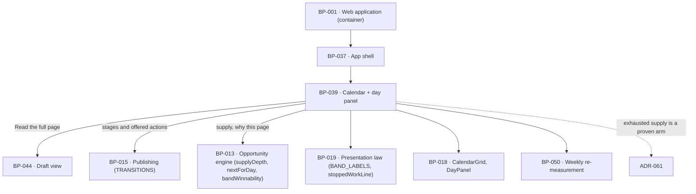

# BP-039 — The calendar, its stages, and the day panel's one account per date

- Parent: BP-001
- Kind: **feature** — cut from REQ-043, a leaf under the web-application container.

## Responsibility
Render a month in which every date today or later carries exactly one page while
qualifying supply remains and is otherwise empty with exactly one true account of
itself, and a day panel that repeats that account, states why a page exists, and
offers only the actions its stage can actually carry out.

## Module / boundary
`src/app/(account)/app/calendar/` — the month grid, the stage filter, the day
panel, the state-to-stage map and the empty-date account resolver. It stores
nothing and decides nothing about publishing: states and transitions are BP-015's,
supply and winnability are BP-013's, the draft view behind "Read the full page" is
BP-044's, and every sentence is BP-019's.

## Diagram


## Public interface
```ts
/** REQ-043 criterion 2's five stages. Closed. */
export type Stage = 'live' | 'your_review' | 'scheduled' | 'planned' | 'needs_you'

/** The exhaustive map from REQ-056 criterion 1's ten states. Total over the
 *  union: `null` means the state carries no page on a date, and the date is
 *  resolved by `accountFor` instead. REQ-043's non-goal hands this mapping here. */
export const STAGE_OF: Readonly<Record<PublishState, Stage | null>>
// planned -> planned          generating -> planned
// in_review -> your_review    approved -> scheduled     publishing -> scheduled
// failed -> scheduled         needs_attention -> needs_you
// published -> live           skipped -> null           unpublished -> null

/** REQ-043 criteria 3, 4 and 5. One account per date, resolved in one fixed
 *  order, total. `supply_exhausted` is a proven arm and is never the fallback —
 *  ADR-061 states why, and the resolver's last arm is `unattributed`. */
export type EmptyAccount =
  | { cause: 'instruction'; opportunityId: string }                  // REQ-047 c5 — outranks all
  | { cause: 'reachkit_stopped'; resumesOn: Date | null }            // REQ-092 c1, c4
  | { cause: 'page_cannot_go_live'; state: 'skipped' | 'unpublished' }
  | { cause: 'customer_change_holds_pages'; setting: 'publishing_off' | 'destination_disconnected' }
  | { cause: 'supply_exhausted'; since: Date }                       // REQ-043 c3 — proven only
  | { cause: 'unattributed' }                                        // ADR-061
export const EMPTY_PRECEDENCE: readonly EmptyAccount['cause'][]
export function accountFor(a: { siteId: string; date: Date }): Promise<EmptyAccount>

export interface DayCell {
  date: Date                                                          // site-local day
  page: { draftId: string; title: string; stage: Stage } | null
  empty: EmptyAccount | null                                          // exactly one of page / empty
}
export function readMonth(a: { siteId: string; month: string /* YYYY-MM, site-local */ }):
  Promise<{ days: readonly DayCell[]; counts: Readonly<Record<Stage | 'all', number>> }>

export interface DayDetail {
  date: Date
  page: null | {
    draftId: string; title: string; stage: Stage
    why: {                                                            // criterion 8
      search: string; volume: Measured<number>
      askedAs: string                                                 // the tracked question, with its search (REQ-093 c3)
      answeredTodayBy: readonly string[]                              // who currently answers it
      youStand: Measured<number>                                      // where the customer stands
      winnability: Winnability                                        // rendered via BAND_LABELS (ADR-001)
      doneWhen: Acceptance                                            // REQ-047 c6/c7, verbatim as recorded
    }
    provenance: { measuredAt: Date }                                  // criterion 10
  }
  empty: EmptyAccount | null                                          // criterion 11
}
export function readDay(a: { siteId: string; date: Date }): Promise<DayDetail>

/** Criterion 9. Projected from BP-015's transition table, never hand-listed per
 *  stage, so an offered action is by construction an available edge. */
export type DayAction = { key: CopyKey; to: PublishState } | { key: CopyKey; href: string }
export function actionsFor(d: DayDetail): readonly DayAction[]
```

## Data model delta
None. Dates come from `drafts.scheduled_for`, stages from `drafts.state`,
evidence from `opportunities.evidence` and `opportunities.acceptance` (which an
update trigger already makes immutable — BP-013), supply from BP-013's
`supplyDepth`, and the stopped-work fact from the day's own job record. The
calendar adds no column and no counter.

## Error & edge behavior
- **Every date today or later carries a page while qualifying supply remains**
  (criterion 1). Filling is BP-013's `nextForDay` in ranked order (REQ-047
  criterion 4); the calendar requests, it never creates. **No page is ever
  created to occupy a date** — there is no code path in this node that writes a
  draft.
- **No date carries more than one page.** `DayCell.page` is a single optional
  value, and a second draft on a date is a data defect the read surfaces rather
  than renders. Weekends are ordinary dates; nothing filters them.
- **A page never renders without a stage.** `STAGE_OF` is total over the ten
  states and its `null` arm is not a missing stage — it means the state does not
  occupy a date, and the date resolves through `accountFor`.
- **`failed` maps to Scheduled, not to Needs you.** REQ-056 criterion 4 keeps a
  `failed` page either with a retry scheduled or already moved to
  `needs_attention`; while a retry is due the customer is not being asked for
  anything, and Needs you would ask them for something that is not theirs to do.
  `needs_attention` is the only state that maps to Needs you (decision 1).
- **One account per empty date, resolved in `EMPTY_PRECEDENCE`.** An outstanding
  instruction (REQ-047 criterion 5) is the date's one account while it stands and
  the date is never presented as there having been nothing worth publishing;
  once carried out, the date falls through to the account criterion 3 or 4 gives
  it (criterion 5). `supply_exhausted` is returned only when BP-013's
  `supplyDepth().unused === 0` is proven true, and the resolver's final arm is
  `unattributed`, which renders ReachKit's own stopped-work line — **never the
  exhausted-supply line** (ADR-061).
- **Past dates get the same resolution as future ones** (criterion 3 binds "still
  to come or already past"), with `instruction` unreachable in the past because a
  carried-out instruction leaves the date and an outstanding one stands on the
  date it was placed.
- **Actions are projected from `TRANSITIONS`.** `actionsFor` intersects the
  stage's states with BP-015's edges, so an action that would be refused for the
  page's state cannot be rendered (criterion 9). An empty day offers no action
  that would publish or approve — its projection is empty by construction, not by
  a filter (criterion 11).
- **Today is selected when the calendar opens** (criterion 7), where "today" is
  the site-local day from `sites.time_zone`; a customer in UTC+13 opening at
  01:00 local sees their own today, not the server's yesterday.
- **Every measured value in the panel carries its measurement date** (criterion
  10) — rendered through BP-019's `renderMeasured`, so an unmeasured value shows
  the dash and its written line rather than a zero.
- **The winnability band renders through `BAND_LABELS`** (ADR-001), never with a
  literal; the three words are the owner's and are outstanding in the copy
  registry.
- The stage filter shows counts for All and each of the five stages (criterion 6);
  counts come from the same `readMonth` result, so the filter can never disagree
  with the grid.

## NFR budget
- `readMonth` is two queries — the month's drafts with their opportunity join, and
  one supply-depth count — plus one stopped-work lookup. p95 ≤ 300 ms for a month.
- `readDay` is one row plus its opportunity; it runs no measurement and no model
  call, and every value it shows was stored by a scan (REQ-093 criterion 4).
- Day boundaries are computed in `sites.time_zone` once per request; the grid is
  never rendered against UTC days.
- Grid geometry is BP-018's `CalendarGrid` with `repeat(7, minmax(0, 1fr))` —
  `BUILD.md` §4.6 calls the `minmax` load-bearing; this node passes data, not CSS.
- Observability: BP-001's per-route line, plus one counter for how often
  `accountFor` returns `unattributed`, which is a defect signal rather than a
  normal state (ADR-061).

## Decisions

1. **The ten publish states map onto the five stages by one total table** — Status: accepted
   - Context: REQ-043's non-goal hands "which publish state is shown as which
     stage" to this blueprint, drawn from REQ-056 criterion 1's ten states.
   - Decision: `STAGE_OF`, exhaustive, as listed in the interface. The organising
     principle is *whose move it is*: Needs you is the states where the customer
     must act, and REQ-056 criterion 4 makes `needs_attention` the only one —
     `failed` always has either a retry scheduled or that move already made.
     `skipped` and `unpublished` occupy no date, because REQ-043 criterion 4
     names "a page that can no longer go live" as a cause that empties a date.
   - Alternatives considered: map `failed` to Needs you — rejected, it asks the
     customer for something that is not theirs to do and would make the shell's
     waiting count overstate; keep `skipped` on its date as a sixth stage —
     rejected, criterion 2's five are closed and criterion 4 already provides the
     account.
   - Consequences: adding a state to REQ-056 fails the exhaustiveness check here
     rather than defaulting silently. Reversal is a table edit.

2. **Offered actions are projected from the transition table, never listed per stage** — Status: accepted
   - Context: criterion 9 says every action offered can be carried out in that
     page's current stage and none is offered that would be refused. A per-stage
     list is correct on the day it is written and wrong at the first transition
     change.
   - Decision: `actionsFor` reads BP-015's `TRANSITIONS`, keeps the edges open
     from the page's state, and maps each to a copy key. A stage with no open edge
     offers no action.
   - Alternatives considered: a hand-written map from stage to actions — rejected,
     it is a second copy of the state machine (rule 2.4) and it is the copy that
     will drift; offer everything and let the server refuse — rejected, criterion
     9 forbids offering an action that would be refused.
   - Consequences: `TRANSITIONS` becomes a rendering input. Reversing means
     maintaining the second copy that criterion 9 exists to prevent.

3. **The empty-date resolver's order, and its last arm** — Status: accepted,
   recorded as **ADR-061** rather than here
   - The precedence is `instruction → reachkit_stopped → page_cannot_go_live →
     customer_change_holds_pages → supply_exhausted → unattributed`. Why
     `supply_exhausted` must be a proven arm and `unattributed` must be the
     fallback spans this node and BP-038, and reads as backwards on its face, so
     it is a standalone landmine file. Its reasoning is not duplicated here.

## Status grounds (rule 3.2)
Self-certified `approved`. Grounds: cut from REQ-043, `status: approved`;
`satisfies: [REQ-043]`. Globs sit under `src/app/(account)/app/calendar/**`
inside BP-001's boundary and overlap no sibling. The mapping and precedence this
node fixes are the ones REQ-043's non-goals explicitly delegate to the blueprint.

## Open questions
