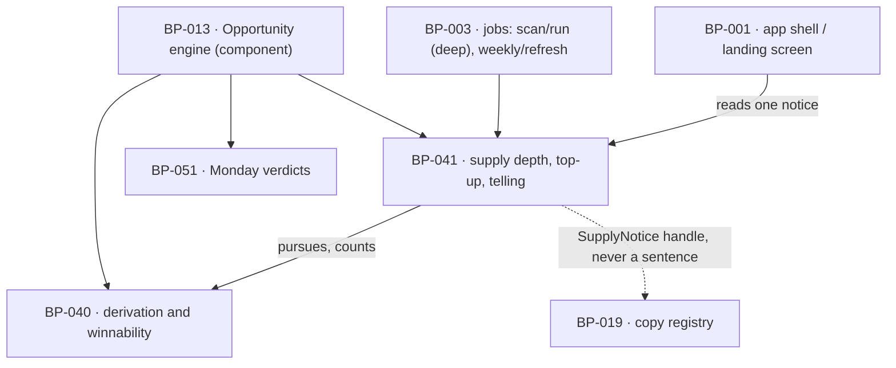

# BP-041 — Supply a month deep, topped up weekly, and told when short

- Parent: BP-013
- Kind: **feature** — a leaf of the Epic → Feature → Capability tree, cut
  straight from REQ-095.

## Responsibility
Pursue a month of unused opportunities at onboarding, add every qualifying one a
weekly re-measurement produces, and emit exactly one supply statement whenever
what the product holds falls short — without ever filling a calendar day.

## Module / boundary
`src/lib/opportunities/supply/` inside BP-013's boundary, plus the migration
discriminator `_opportunities_supply`. It counts and reports; it creates no
opportunity (BP-040 does), it renders no sentence (BP-019 does), and it fills no
date (REQ-043's calendar is BP-001's and REQ-047 c3 forbids padding it).

## Diagram


## Public interface
```ts
export const SUPPLY_TARGET_DEPTH = 30    // REQ-095 c1, pinned in BP-005
export const SUPPLY_SHORT_BELOW  = 7     // REQ-095 c5, pinned in BP-005

export type DepthStop = 'target_met' | 'evidence_spent' | 'pass_ended_early'

/** Drives BP-040's derivation over evidence the pass has already measured until
 *  the target is met or that evidence is spent. Buys nothing (REQ-095 non-goal:
 *  "Buying more data, raising a cap, or lowering the winnability bar"). */
export function pursueDepth(c: CostContext, a: {
  siteId: string; scanId: string; report: StoredReport; ownRanked: Measured<number>
  target?: number                          // defaults to SUPPLY_TARGET_DEPTH
}): Promise<{ unused: number; stop: DepthStop; created: number }>

/** Unused supply = open, non-fix. `unblock` consumes no supply (REQ-047 c5),
 *  so it is never counted as a day of pages. */
export function supplyDepth(siteId: string): Promise<{
  unused: number
  exhaustedSince: Date | null              // set only while unused === 0
}>

export type SupplyNotice =
  | { kind: 'exhausted';         days: 0;      since: Date }
  | { kind: 'short';             days: number }              // 1..6
  | { kind: 'arrival_shortfall'; days: number }              // first arrival after a short pass

/** At most one notice, ever. Criterion 5's "one statement of supply, not two"
 *  is the return type, not a rule a surface has to remember. Returns null when
 *  unused >= SUPPLY_SHORT_BELOW and no arrival telling is outstanding. */
export function supplyNotice(a: { siteId: string; firstArrivalAfter?: string /* scanId */ }):
  Promise<SupplyNotice | null>

/** Called by weekly/refresh after re-measurement; additive, never destructive. */
export function topUp(c: CostContext, a: {
  siteId: string; scanId: string; report: StoredReport; ownRanked: Measured<number>
}): Promise<{ added: number; unused: number }>
```

## Data model delta
Migration `*_opportunities_supply*.sql`, on the table BP-040 owns:

- `status_changed_at timestamptz not null default now()`, maintained by a
  `before update` trigger when `status` changes. This is the only new column,
  and it exists solely so `exhaustedSince` is derivable.
- `sites.supply_arrival_told_scan_id` is **not** added. Criterion 3's telling is
  keyed off the scan the caller names in `firstArrivalAfter` and the customer's
  own first session after it; the app already knows both. Adding a per-site flag
  would be a second copy of a fact the session already holds.
- No counter, no `supply_depth` column, no materialised view (BP-013 decision 2).

`exhaustedSince` is derived, not stored:
`max(status_changed_at)` over that site's opportunities when the open non-fix
count is zero — the moment the last one left `open` is the moment supply hit
zero — falling back to the completion time of the site's most recent completed
scan where the site has never held one.

## Error & edge behavior
- **Depth is a disclosure, never a gate** (REQ-095 c2). `pursueDepth` returning
  `stop: 'evidence_spent'` with `unused: 4` is a normal return. Nothing in this
  node can hold setup, delay arrival, or change what the customer is released
  into; it has no failure path that a caller could mistake for one, because it
  returns a value and throws only on a database error.
- **Never fills a day.** This node's only writes are BP-040's derivation calls
  and `status_changed_at`. REQ-047 c3 and REQ-043 c1 hold whatever the depth is;
  a short pass produces a shorter calendar and a truthful line, never a padded
  month (`BUILD.md` §4.6: "the calendar is never padded").
- **Precedence is total and in one place**: `exhausted` > `short` >
  `arrival_shortfall`. At `unused = 0` the customer reads the exhausted
  statement and not the short one; at first arrival with `unused = 3` they read
  the short statement, which already carries `days`, so criterion 3's content is
  conveyed by criterion 5's line and there is one statement, not two.
- **The short line stops on its own terms.** `supplyNotice` is derived on every
  read, so the `short` notice stands exactly while `unused < 7` and stops the
  moment it is 7 or more (REQ-095 c5) — there is no dismissal state to leave
  stale and no job that has to remember to clear it.
- **Restated, not repeated.** Criterion 6's "restated after each weekly
  re-measurement that adds no supply" needs nothing extra: the notice is derived
  per read and `since` does not move while supply stays at zero, so a customer
  who returns after an empty Monday reads the same statement with the same date.
  A top-up that adds supply moves `status_changed_at` on the new rows only, and
  the notice disappears.
- **Top-up is idempotent.** BP-040's partial unique index on
  `(site_id, type, target_query, target_ref) where status in ('open','queued')`
  means a weekly re-measurement re-deriving the same target adds nothing. Two
  runs of `topUp` for one week leave the same supply.
- **Access ended.** Where the site has no active access (BP-017's
  `hasActiveAccess()`), no top-up runs and no notice is produced — the same
  shape REQ-065 c5 fixes for re-measurement.
- **`unblock` is excluded everywhere in this node**: from `unused`, from
  `days`, and from `exhaustedSince`'s trigger set. A customer holding four
  outstanding instructions and no pages has zero days of pages and is told so.

## NFR budget
- `supplyDepth` and `supplyNotice` are one indexed count and, in the exhausted
  case, one `max()` — served off `(site_id) where status = 'open'`. Both run on
  the app's landing read path, so the budget is a single-digit-millisecond query
  and no vendor call, ever.
- `pursueDepth` adds no vendor spend of its own: it iterates evidence the pass
  already bought, and stops on `capHit()` from BP-007 as `pass_ended_early`.
- Observability: `stop` reason and final `unused` after every deep pass and every
  top-up; the distribution of `stop` across passes is the first place REQ-095's
  open yield assumption can be discharged (`BUILD.md` §16 milestone 6).
- Authz: `db()` under RLS only.

## Decisions

1. **Unused supply excludes the Fix family** — Status: accepted
   (refines BP-013 decision 2)
   - Context: BP-013 states supply depth as `count(*) where status = 'open'`.
     REQ-047 c5 says an `unblock` "takes no publishing day and consumes no
     supply". REQ-095's lines all say *days of pages*.
   - Decision: `count(*) where status = 'open' and family <> 'fix'`, and the same
     predicate in `exhaustedSince`.
   - Alternatives considered: counting all open rows — rejected, it tells a
     customer holding only instructions that they have days of pages, which is
     the precise failure REQ-095 was written against; a separate `fix` table —
     rejected, the eight types are one closed enum (REQ-047 c1).
   - Consequences: BP-013's stated formula is narrower than its parent wrote it;
     reported upward rather than edited (that file is another node's).

2. **The supply notice is derived on read, never a stored or dismissible state** — Status: accepted
   - Context: criteria 5 and 6 require a line that *stands* while a condition
     holds and *stops* when it stops. A stored flag has to be raised by one code
     path and cleared by another, and the failure mode is a customer told supply
     is short while it is not — the same drift BP-013 decision 2 rejected a
     counter for.
   - Decision: `supplyNotice` computes from the current count on every read; no
     row, no flag, no dismissal, no expiry.
   - Alternatives considered: a notifications table with read/dismissed state —
     rejected, criteria 5 and 6 give the customer no dismissal and the state
     would be a second copy of a count.
   - Consequences: the notice is evaluated on the landing read path, which is why
     the NFR budget above pins it to one indexed count. Cost of reversing: low in
     code, high in truthfulness — a stored notice can be stale and a derived one
     cannot.

3. **At most one notice is a return type, not a convention** — Status: accepted
   - Context: criterion 5's "the customer reads one statement of supply, not
     two" is a promise that dies quietly if two producers each emit a line and a
     surface renders both.
   - Decision: one function, returning `SupplyNotice | null` — a single value,
     never an array — with total precedence inside it.
   - Alternatives considered: returning every applicable notice and letting the
     surface pick — rejected, it puts a customer promise in the hands of every
     surface that ever renders supply, and REQ-095's telling is required at
     arrival *and* on the landing screen.
   - Consequences: a future notice kind must take a position in the precedence
     order, which is the review this design wants to force.

4. **30 and 7 are pinned, and their reversal is a constants edit** — Status: accepted
   - Context: rule 1.1. REQ-095 c1 states 30 and c5 states 7; its rationale names
     them as floors the system chose, with the derivation in
     `registry/evidence/REQ-095.md`.
   - Decision: `SUPPLY_TARGET_DEPTH = 30` and `SUPPLY_SHORT_BELOW = 7` live in
     BP-005's `constants.ts` and are asserted in `tests/pins.test.ts`; this node
     imports them and hardcodes neither.
   - Consequences: nothing stored depends on either number — `pursueDepth` takes
     the target as an argument and the notice is derived — so retuning changes
     behaviour from the next read with no migration.

## Status grounds (rule 3.2)
Self-certified `approved` per rule 3.2. Grounds: cut from **REQ-095**, which is
`status: approved`; one module inside BP-013's boundary; `code:` globs disjoint
from BP-040's and BP-051's; the two parameters it carries are the requirement's
own and are pinned rather than restated. It introduces no customer-visible
string — the three lines are handles here and words in BP-019.

## Open questions
