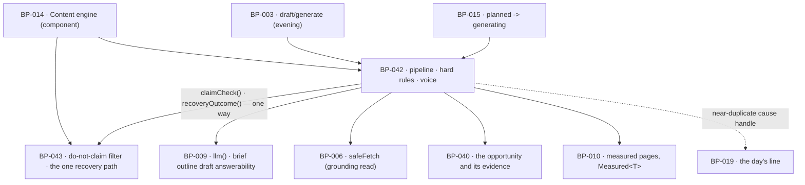

# BP-042 — The generation pipeline, the hard rules, and brand voice

- Parent: BP-014
- Kind: **feature** — a leaf of the Epic → Feature → Capability tree, cut from
  REQ-050 and REQ-055 together: brand voice is an input to the same pipeline the
  hard rules gate, and one capability has one node (rule 7.1).

## Responsibility
Write one page per opportunity through the five steps, carrying the customer's
voice text verbatim and nothing derived from them, and put every finished draft
through a deterministic hard-rule battery that decides whether it may be queued
at all.

## Module / boundary
`src/lib/generate/pipeline/`, `/rules/` and `/voice/` inside BP-014's
`src/lib/generate/` boundary, plus the `drafts` core migration
(`_drafts_core`). The do-not-claim rule and the recovery decision are
**BP-043's** and are called from here; the dependency is one-way — this node
calls BP-043's pure predicates, BP-043 never calls back into the pipeline
(structure.md rule 6). This node publishes nothing (BP-015) and renders nothing
(BP-019).

## Diagram


## Public interface
```ts
// ---- the rules (REQ-050 c1-c9, plus REQ-053's, owned by BP-043) ------------
export type HardRule =
  | 'grounding'            // c1
  | 'rival_source'         // c2
  | 'no_private_figure'    // c3
  | 'no_invented_people'   // c4
  | 'no_unsourced_testimonial' // c5
  | 'brand_gap'            // c6
  | 'no_hidden_text'       // c7
  | 'no_machine_address'   // c8
  | 'near_duplicate'       // c9
  | 'do_not_claim'         // REQ-053 c1 — evaluated by BP-043
export const HARD_RULES: readonly HardRule[]   // the closed list, in this order

export interface GroundedFact { url: string; readAt: Date; passage: string }

export interface RuleFailure {
  rule: HardRule
  /** Only ever a stored value or a handle — never a sentence and never model
   *  output (REQ-093 c1). */
  detail?:
    | { rule: 'near_duplicate'; duplicateOf: { kind: 'published' | 'measured' | 'queued'
                                               ref: string; title: string }; similarity: number }
    | { rule: 'do_not_claim';   matchedEntry: string }        // the customer's own words
    | { rule: 'rival_source';   figure: string }
    | { rule: 'no_private_figure'; figure: string }
}

export function runHardRules(c: CostContext, a: {
  markdown: string
  rendered: string                 // what a reader of the published page meets
  site: SiteRuleInputs
  comparison: ComparisonSet
  grounded: GroundedFact | null
}): Promise<{ passed: true } | { passed: false; failed: RuleFailure[] }>

// ---- brand voice: a closed input struct is how "nothing learned" is kept ----
/** Every site-scoped input to a generation prompt. The list is closed and the
 *  type is the enforcement of REQ-055 c4: there is no field through which a
 *  derived profile, summary or embedding could reach a prompt. */
export interface DraftPromptInputs {
  businessName: string | null
  domain: string
  category: string
  voiceText: string | null         // sites.voice_text, read now, carried verbatim, never stored here
  opportunity: Opportunity         // BP-040's, evidence included
  grounded: GroundedFact
}

// ---- similarity (REQ-050 c9, c13) ------------------------------------------
/** One fixed recorded measure: Jaccard over 5-gram word shingles of the
 *  rendered text, lowercased, punctuation stripped. No options, no threshold
 *  argument, no configuration — the same pair always returns the same number. */
export function similarity(a: string, b: string): number

export interface ComparisonSet {
  published: Array<{ ref: string; title: string; rendered: string }>
  measured:  Array<{ ref: string; title: string; rendered: string }>
  queued:    Array<{ ref: string; title: string; rendered: string }>
}

// ---- the pipeline ----------------------------------------------------------
export type PipelineStep = 'brief' | 'outline' | 'draft' | 'answerability' | 'claim_check'

export function generateDraft(c: CostContext, a: { opportunityId: string; siteId: string }):
  Promise<
    | { ok: true;  draftId: string; grounded: GroundedFact }
    | { ok: false; reason: 'rules'; failed: RuleFailure[]; attempt: 1 | 2 }
    | { ok: false; reason: 'step_failed'; step: PipelineStep }   // REQ-092 c1; not a rule failure
  >

/** The cause the day's line may carry when a candidate was rejected as a
 *  near-duplicate (REQ-050 c14). A handle plus stored values; REQ-043 owns the
 *  line and BP-019 owns its words. */
export function rejectionCause(draftId: string):
  Promise<{ kind: 'near_duplicate'; duplicateOf: { ref: string; title: string } } | null>
```

## Data model delta
Migration `*_drafts_core*.sql` creates `drafts` as `BUILD.md` §10, with these
deltas this node is the home of:

- `grounded_fact jsonb` = `{ url, readAt, passage }`, the passage copied word for
  word from the content fetched that day and **never updated** (BP-014 decision
  2; REQ-050 c1). A `before update` trigger rejects a change to
  `grounded_fact->>'passage'`, for the same reason BP-040's acceptance trigger
  exists: a statement the customer can still read against needs the copy to be
  unarguable, not conventional.
- `attribution text` — the business name or account-holder name recorded for the
  site, copied at generation; `null` where the site records neither, and the page
  then publishes with no attribution rather than a generated one (REQ-050 c11).
  There is no author, byline, bio or persona column, which is how c4 is enforced
  (decision 2).
- `hard_rule_attempts smallint not null default 0` — the count BP-043's
  `recoveryOutcome` reads. It counts **automatic** attempts only (ADR-070).
- `rule_failures jsonb` — the last `RuleFailure[]`, so REQ-050 c14's cause
  survives the run that produced it.
- `claim_check jsonb` is **not** here; it is BP-043's, in `*_drafts_claims*.sql`.
- No similarity cache and no shingle table: `similarity` is computed on demand
  (decision 3).

## Error & edge behavior
- **A failing draft is never queued and takes no day** (REQ-050 c10). The
  pipeline writes the draft row, runs the battery, and only a `passed: true`
  result moves the item toward review; nothing partial is published or handed to
  a destination.
- **Rules run on the right text.** `brand_gap` and `no_machine_address` run over
  `rendered` — the words the published page shows — because that is what the
  reader meets (REQ-050 c6). `no_hidden_text` runs over `markdown` **and** the
  markup embedded in it, because it is about what would be handed to the
  destination (c7). A hyperlink and its address are exempt from both, since c2
  and c4 require links.
- **Hard rules bind what ReachKit generates, never what the customer writes**
  (REQ-050 c12, REQ-053's non-goal). `runHardRules` is called from the generation
  path only. An edit the customer saves is not run through it; REQ-045 owns what
  happens to an edit, and the one check that does re-run on an edit is BP-043's
  claim check.
- **A step that failed is not a rule that failed.** `llm()` returning
  `unmeasured`, a grounding fetch that returned nothing, or `capHit()` gives
  `reason: 'step_failed'`. It does not populate `failed`, does not increment
  `hard_rule_attempts`, and takes the REQ-092 route to `needs_attention` — not
  REQ-053 c3's regeneration. ADR-070 states why merging the two would be wrong.
- **Grounding has no fallback.** If no verifiable fact can be read from a live
  page of the customer's, the draft fails `grounding` — it is never grounded in
  the report, in a rival's page, or in the model's knowledge (REQ-050's non-goal:
  "Facts about the customer sourced from anywhere other than their own live
  pages"). The same fact may ground more than one draft; c1 does not require a
  different one each time.
- **`no_private_figure` is a register, not a judgement.** The check builds the
  set of numbers the product measured for this site — ranking positions, search
  volumes, visibility and answer counts, from the stored report blob and the
  site's opportunities — and fails the draft where a numeral in the rendered text
  matches one of them and no link in the same sentence sources it. It is
  deterministic and needs no model.
- **`rival_source` is scoped to the sentence.** A statement naming a rival domain
  or rival name and containing a numeral must carry a link in the same sentence.
  Sentence rather than paragraph because a paragraph-wide scope lets one sourced
  figure legitimise three unsourced ones.
- **`no_invented_people` is two halves.** Bylines, bios and personas cannot occur
  because no field holds them (decision 2). A quoted remark — quotation marks or
  a blockquote — naming or attributing to anyone other than the customer requires
  a link in the same block; the same check serves `no_unsourced_testimonial`,
  which additionally fails a review-shaped or endorsement-shaped block with no
  link whether or not it names a speaker (REQ-050 c5).
- **Near-duplicate compares against three sets** — published, measured, and
  queued-not-yet-published (REQ-050 c9) — all of them this customer's, never
  anyone else's. A candidate at or above 0.85 against any member fails, carrying
  the member it duplicated so REQ-043 c4's line has a cause (c14). Because the
  queued set is included, the answer depends on what else is already waiting;
  that is the requirement's intent (a page must not compete with one the customer
  already has waiting) and it is why the check runs at queue time, not at
  derivation time.
- **Voice.** Absent voice text, the draft is generated without one and nothing is
  inferred (REQ-055 c3). The current text is read at generation and carried in
  full and unaltered (c1); no earlier version is stored anywhere, including on
  the draft (c2, decision 4). A voice instruction that asks for something a hard
  rule forbids loses: the rule runs after generation and stops the draft
  (REQ-055 c5), which then takes ADR-070's one path.

## NFR budget
- **Cost.** One day of content ≈ 6.5¢ (`BUILD.md` §6.3: nano brief/outline/claim
  check + haiku draft + answerability pass + retry allowance) against `CAP_DRAFT`
  45¢, checked by `capHit()` **before** the pipeline runs and re-checked between
  steps (BP-007). The hard-rule battery itself costs nothing: nine of the ten
  rules are deterministic and the tenth is BP-043's.
- **Timing.** Generation runs the evening before the publish date from the
  freshest scan, and completes before the veto window would start (`BUILD.md` §8,
  §11 `draft/generate`).
- **Similarity.** Exact Jaccard over 5-gram shingles against at most
  `MEASURED_PAGES_MAX` (25) measured pages plus this site's published and queued
  pages. At one page a day this is a few hundred comparisons of in-memory sets
  once per draft — no index, no approximation, no stored score.
- **Observability.** Per-step cost and duration, which rules failed, attempt
  number, and the `duplicateOf` ref. **Never** the prompt, the voice text, the
  draft body or the grounded passage in a log line.
- Authz: `db()` under RLS; the only outbound call is BP-006's `safeFetch` for the
  grounding read.

## Decisions

1. **The battery is a deterministic pass over finished text; the prompt is never
   the enforcement** — Status: accepted (implements BP-014 decision 1)
   - REQ-050 c10 requires that a failing draft is never queued *at all*, which a
     probabilistic instruction cannot promise. BP-014 owns the reasoning; this
     node is where the nine deterministic rules land.

2. **`no_invented_people` is enforced by the absence of a field, not by scanning
   for one** — Status: accepted
   - Context: REQ-050 c4 bars generated bylines, biographies and personas.
     Detecting an invented person in prose needs entity recognition and would be
     probabilistic — exactly what decision 1 rejects.
   - Decision: the draft schema has one attribution field, `drafts.attribution`,
     written from the site's recorded business or account-holder name and from
     nowhere else; there is no author, byline, bio or contributor field anywhere
     in `drafts` or in the destination payload. The scanning half of the rule is
     narrowed to what a pattern can decide: an attributed quotation or a
     testimonial-shaped block with no link in the same block.
   - Alternatives considered: NER over the draft body — rejected as
     probabilistic, and it would fail on every legitimately linked person c4
     explicitly allows; a model judge — rejected by decision 1.
   - Consequences: a persona named only inside body prose, with no quotation and
     no attribution field, is not caught by this rule. It is caught by
     `no_unsourced_testimonial` where it speaks and by `grounding` where it makes
     a claim, and the residual is stated here rather than papered over.
   - Cost of reversing: adding an author field to `drafts` would silently
     re-open c4. Anyone tempted should read this entry first.

3. **Similarity is exact Jaccard over 5-gram shingles, computed on demand** — Status: accepted
   - Context: REQ-050 c13 requires one fixed recorded measure with a stable
     verdict per pair; c9 fixes the threshold at 85% and the non-goals bar making
     it adjustable.
   - Decision, with derivation: Jaccard over the set of 5-word shingles of the
     rendered text, lowercased with punctuation stripped and stop-words kept.
     Set-based, so it is symmetric and order-independent; 5-gram because a
     shorter window makes two pages about one subject look alike on shared
     terminology and a longer one misses a rewritten near-copy. `similarity`
     takes two strings and returns a number — no options parameter, so there is
     no argument through which a per-customer threshold could arrive.
     `NEAR_DUPLICATE_MAX = 0.85` and `SHINGLE_SIZE = 5` are pins in BP-005.
   - Alternatives considered: embeddings — rejected, it puts a vendor and a model
     version inside a promise of determinism (c13) and would drift on every model
     upgrade; MinHash — rejected, an approximation buys nothing at a few hundred
     documents and adds a seed to get wrong; a stored score per pair — rejected,
     O(n²) rows for a value that is cheaper to recompute.
   - Consequences: changing `SHINGLE_SIZE` changes past verdicts, but nothing is
     stored, so no history is rewritten and no migration is needed.

4. **Nothing about the customer is stored between drafts, including the voice
   text that produced one** — Status: accepted
   - Context: REQ-055 c4 bars any profile, summary or embedding derived from the
     customer's edits, drafts or history; c2 bars carrying or storing an earlier
     version of the voice text.
   - Decision: `DraftPromptInputs` is a closed struct and the only path into a
     prompt; the voice text is read from `sites.voice_text` at generation time
     and is not copied onto the draft, not logged, and not cached. There is no
     per-site derived artifact of any kind in this node's data model.
   - Alternatives considered: storing the voice text on the draft for
     auditability — rejected, it is precisely "an earlier version … stored for
     reuse", and the audit it would serve is not a promise any requirement makes;
     a style profile learned from approved drafts — rejected outright by c4 and
     by REQ-055's non-goals.
   - Consequences: a draft cannot be re-explained after the customer changes
     their voice text. That is the requirement's choice, and the struct is what
     makes "nothing learned" checkable by reading a type rather than auditing a
     pipeline.

5. **`no_machine_address` is a pinned pattern battery, and its limits are
   stated** — Status: accepted
   - Context: REQ-050 c8 bars any sentence addressed to a machine reader. There
     is no deterministic test for the general case, and decision 1 bars a model
     judge as the enforcement.
   - Decision: `MACHINE_ADDRESS_PATTERNS` in BP-005's `constants.ts` — a pinned
     list matching the named forms (an instruction or assertion directed at an
     assistant, a crawler or a ranking system about how to treat, cite, rank or
     recommend the page) — applied to the rendered text. Config, not constants in
     code, so a form found later is added in one file.
   - Alternatives considered: a nano judge — rejected, it makes a hard rule
     probabilistic and adds a call to a step that must be free; no rule at all —
     rejected, c8 is a customer promise.
   - Consequences: the battery decides the forms it lists and no others. That
     limit is the `undischargeable` `rests-on` above, raised as undischargeable
     rather than open because no pass over the corpus can ever prove a pattern
     list complete (rule 2.3).

## Status grounds (rule 3.2)
Self-certified `approved` per rule 3.2. Grounds: cut from **REQ-050** and
**REQ-055**, both `status: approved`, joined in one node because REQ-055's voice
text is an input to the pipeline REQ-050's rules gate and rule 7.1 gives one
capability one node; one module inside BP-014's boundary; `code:` globs disjoint
from BP-043's. Every parameter chosen above carries its derivation and reversal
cost. It introduces no customer-visible string: the near-duplicate cause is a
handle and REQ-043 owns the day's line.

## Open questions
