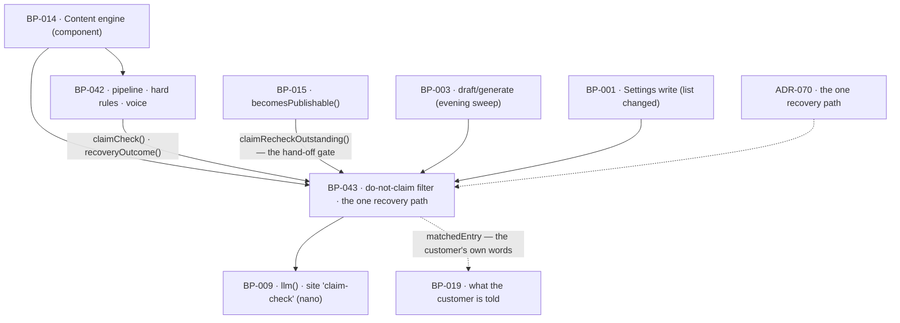

# BP-043 — The do-not-claim filter and the one recovery path

- Parent: BP-014
- Kind: **feature** — a leaf of the Epic → Feature → Capability tree, cut
  straight from REQ-053.

## Responsibility
Decide whether a piece of text states anything on the customer's do-not-claim
list, keep that decision current against the list as it stands right now, and own
the single rule that says what happens to a draft any generation hard rule
stopped.

## Module / boundary
`src/lib/generate/claims/` inside BP-014's `src/lib/generate/` boundary, plus the
migration discriminator `_drafts_claims`. Everything it exports is a **pure
predicate or a pure decision** — it never transitions a page, never regenerates
one, and never calls back into BP-042's pipeline, which is what keeps the
dependency one-way (structure.md rule 6). It does not own the do-not-claim list
itself (`sites.do_not_claim`, REQ-070's Settings card), the publish state machine
(BP-015), or any word the customer reads (BP-019).

## Diagram


## Public interface
```ts
export type ClaimVerdict =
  | { state: 'passed';  listHash: string; at: Date }
  | { state: 'failed';  listHash: string; at: Date; matchedEntry: string }
  | { state: 'unrun';   reason: 'llm_unavailable' | 'cap_hit'; at: Date }

/** String/semantic match (BUILD.md §8 hard rule 4). Deterministic normalised
 *  match first; the nano pass runs only where that finds nothing, so an empty
 *  list and an obvious match both cost zero. */
export function claimCheck(c: CostContext, a: {
  text: string; list: string[]
}): Promise<ClaimVerdict>

/** True while this draft's last passing check was against a different list than
 *  the site holds now, or there is no passing check. Derived — never a stored
 *  flag, never a job's output (decision 2). */
export function claimRecheckOutstanding(draftId: string): Promise<boolean>

/** What the customer is told when a re-check fails: the entry it matched, which
 *  is a string they wrote (REQ-053 c5). Not model output. */
export function outstandingMatch(draftId: string): Promise<{ matchedEntry: string } | null>

/** Runs the check for this site's drafts short of hand-off whose recorded hash
 *  is stale. For timeliness only; the guard above is what makes it safe. */
export function sweepOutstandingRechecks(c: CostContext, siteId: string):
  Promise<{ checked: number; failed: number; deferred: number }>

/** The one recovery rule (REQ-053 c3), for every generation hard rule.
 *  Pure: takes what happened, returns what happens next. It performs neither. */
export type Recovery = 'regenerate_once' | 'rest'
export function recoveryOutcome(a: {
  failed: HardRule[]                 // non-empty
  automaticAttempts: number          // drafts.hard_rule_attempts, automatic only
  enteredReview: boolean             // ADR-070: post-review never regenerates
}): Recovery

/** The normalised hash of a site's list. One definition, used by the writer of
 *  a verdict and by the reader of the guard. */
export function listHash(list: string[]): string
```

## Data model delta
Migration `*_drafts_claims*.sql`, on the table BP-042 owns:

- `claim_check jsonb` holding the last `ClaimVerdict` — including
  `listHash`, the hash of the list the verdict was reached against.
- Index `(site_id) where claim_check->>'state' <> 'passed'`, so the sweep and any
  "what is held" read are one indexed scan.
- **No `outstanding` column, no `recheck_due` flag, no queue table.** The
  outstanding state is `claim_check.listHash <> listHash(sites.do_not_claim)`
  or `claim_check` null — derived on every read (decision 2).
- **No version column on `sites`.** The hash is computed from the list itself, so
  nothing has to be bumped by whoever writes the list, and a write that forgets
  to bump cannot exist.
- `hard_rule_attempts` is BP-042's column; this node reads it and writes nothing
  to it.

## Error & edge behavior
- **Fail closed on an unrun check.** A draft whose claim check is `unrun` is not
  queued for review and is not handed to a destination: REQ-053 c1 requires the
  check to happen *before* queuing, so "we could not check" is not "it passed".
- **An unrun check is not a failed rule.** It does not increment
  `hard_rule_attempts` and does not consume the one regeneration, because
  regenerating would not make an unavailable model available. It is a step
  failure and takes REQ-092 c1's route (`generating → needs_attention`). ADR-070
  states why.
- **An empty list passes at zero cost.** Where the site records no claims, the
  verdict is `passed` with the hash of the empty list — and it goes stale the
  moment the customer adds their first entry, which is exactly right.
- **The guard cannot be missed.** Because outstanding-ness is derived from the
  current list, a draft is held from the instant the customer saves a change,
  before any job runs, and stays held until a check passes against the text as it
  then stands (REQ-053 c5). No fan-out, no backfill, and nothing to be missed by
  a job that failed.
- **The sweep is bounded and safe to truncate.** `sweepOutstandingRechecks`
  processes at most `CLAIM_RECHECK_SWEEP_MAX` (25) drafts per invocation and
  reports the rest as `deferred`; a deferred draft is still held by the guard, so
  truncating the sweep delays a telling and can never release a page.
- **A held page is never regenerated.** REQ-053 c5 is explicit: c3's path reaches
  only a draft stopped *before* it entered review. A page in review, approved,
  held after a failed attempt, or waiting on the customer, that fails a re-check,
  stays where it is with the matched entry named, and leaves review only by the
  two edges REQ-056 c2 allows (`in_review → approved` once a re-check passes, or
  `in_review → skipped`). ADR-070 is the file that says why merging this with c3
  would destroy customer text.
- **Reach stops at the hand-off.** Criteria 4 and 5 reach every page short of
  delivery and no further; a page already handed to a destination or already live
  is not re-checked (REQ-053's first non-goal). The predicate is only ever asked
  about drafts in a pre-hand-off state.
- **Paraphrase, not just words.** A match is the recorded words normalised, or a
  paraphrase found by the nano pass (REQ-053 c1). The nano pass returns only a
  boolean and the index of the entry it matched; the entry named to the customer
  is their own recorded string, so nothing a model wrote reaches them
  (REQ-093 c1).

## NFR budget
- **Cost.** One nano `claim-check` call per draft per list version, inside
  BP-042's ≈6.5¢ day against `CAP_DRAFT` 45¢. Deterministic match first means a
  literal match and an empty list both cost 0¢. A sweep costs at most 25 nano
  calls for a site, and only after the customer changed their list.
- The guard (`claimRecheckOutstanding`) makes **no** model call and no vendor
  call: it is one row read plus a hash of a jsonb array. It sits on the
  publish path and on the app read path, so it is budgeted as a single-digit
  millisecond call.
- Observability: verdict state, list-hash prefix, sweep counts. **Never** the
  draft text, and never a list entry — the do-not-claim list is the customer's
  most sensitive field and it does not belong in a log.
- Authz: `db()` under RLS only.

## Decisions

1. **The recovery rule is a pure function this node owns; the acting is
   BP-042's and BP-015's** — Status: accepted (see ADR-070)
   - Context: REQ-053 c3 is the recovery path for *every* generation hard rule,
     not just this one, and the rules live in BP-042 while the states live in
     BP-015. Whoever owns the decision must not own the transition, or the
     dependency between the two generation nodes becomes a cycle.
   - Decision: `recoveryOutcome` takes what happened and returns
     `regenerate_once | rest`. It has no side effect, no database write and no
     knowledge of the state machine.
   - Alternatives considered: putting the rule in BP-042 beside the battery —
     rejected, REQ-053 is the requirement that states it and rule 5.4 binds
     `satisfies` to the node cut from it; giving this node the transition —
     rejected, it makes BP-043 → BP-042 → BP-043 a cycle (structure.md rule 6).
   - Consequences: the rule is testable in isolation and the two callers are
     obliged to obey it. ADR-070 carries the reasoning that spans them.

2. **Outstanding-ness is derived from a list hash, never stored and never
   fanned out** — Status: accepted
   - Context: REQ-053 c4 requires every page short of hand-off to be re-checked
     when the list changes, and c5 requires that none of them can publish while
     the re-check is outstanding. The obvious build is a job that marks the
     affected drafts. Its failure mode is a page publishing a forbidden claim
     because a job did not run — the worst outcome REQ-053 exists to prevent.
   - Decision: every verdict records `listHash`, the normalised hash of the list
     it was reached against (entries trimmed, case-folded, sorted, joined,
     SHA-256). A draft is outstanding exactly when its recorded hash differs from
     the site's current one. The sweep exists for timeliness — so the customer
     is told which entry matched without waiting for the hand-off — and never for
     correctness.
   - Alternatives considered: a `recheck_due boolean` set by the settings write —
     rejected, it is a second copy of a fact the list already states and it is
     wrong the moment one write path forgets it; a version integer on `sites` —
     rejected for the same reason, one step further removed; a job that re-checks
     on a schedule — rejected as the sole mechanism, because a page's safety
     would rest on a cron.
   - Consequences: the guard runs on the publish path and on the app read path,
     which is why it is pinned to a row read and a hash. Cost of reversing: low
     in code, and it would reintroduce exactly the gap between "the list changed"
     and "the drafts were marked" that this removes.

3. **Deterministic match first, model second, and the model never speaks to the
   customer** — Status: accepted
   - Context: `BUILD.md` §8 hard rule 4 says "string/semantic match"; REQ-053 c1
     requires both the recorded words and a paraphrase to match; REQ-093 admits
     model output on exactly one surface, and this is not it.
   - Decision: normalised substring match over the list runs first and short-
     circuits; the nano `claim-check` call runs only when it finds nothing, and
     returns a boolean plus the matched entry's index. The string named to the
     customer is the customer's own entry, read from their list.
   - Alternatives considered: model-only — rejected, it spends a call on every
     literal match and makes the cheap half probabilistic; string-only —
     rejected, c1 requires paraphrase.
   - Consequences: `CLAIM_RECHECK_SWEEP_MAX = 25` is pinned in BP-005 and chosen
     as a bound on one site's pre-hand-off backlog — a week of queued pages plus
     held ones, with headroom. Raising it costs nano calls and nothing else;
     lowering it delays a telling and never releases a page.

## Status grounds (rule 3.2)
Self-certified `approved` per rule 3.2. Grounds: cut from **REQ-053**, which is
`status: approved`; one module inside BP-014's boundary; `code:` globs disjoint
from BP-042's, including the migration discriminator. Its two parameters are
derived above. The one string it hands upward is the customer's own list entry,
so it introduces no customer-visible copy. The decision that spans this node,
BP-042 and BP-015 is ADR-070, not this file.

## Open questions
