# BP-045 — Ten states, fifteen transitions, no duplicate post, instant stop

- Parent: BP-015
- Kind: **feature** — a leaf of the Epic → Feature → Capability tree, cut
  straight from REQ-056. It is the spine of the publishing subsystem: every
  other feature node under BP-015 is a consumer of this machine or a guard on
  one of its edges.

## Responsibility
Hold every page in exactly one of ten states, permit exactly fifteen
transitions and refuse every other move with the state unchanged, hand a page
to a destination at most once whatever the retry history, and make the
publishing switch take effect at the moment it is recorded without losing a
page.

## Module / boundary
`src/lib/publish/` — four directories and one leaf file, all inside BP-015's
`src/lib/publish/**`:

| Path | Holds |
|---|---|
| `types.ts` | `State`, `Actor`, `DraftView`, `Publication`, `DestinationAdapter`, `DeliveryResult`, and — since 2026-09-02, ADR-092 — the hosted cache-tag builders `tags`. **Imports nothing from `src/lib/publish/` and nothing from `src/app/`** — it is the leaf that lets BP-046, BP-048, BP-049 and BP-058 name these things without a cycle (structure.md rule 6). |
| `machine/` | `STATES`, `TRANSITIONS`, the guard registry, `transition()`, the append-only transition record. |
| `attempt/` | `publish()` — the claim, the delivery call, the outcome write, the retry policy. |
| `record/` | The page record REQ-056 criterion 6 describes, read-only: what the customer is shown when they open a published page — the opportunity, the mode, the address **with the label its current state earns**, and the outcome of the one check with its date. Added 2026-09-01 (decision 8). |
| `switch/` | Reading and recording the publishing switch, the held-page set, resume ordering. |
| `ceilings/` | The per-day and per-week counters, in the customer's own zone. |

Not this node's, and named here so no work order strays into them: the
publishable predicate (BP-046), the destination registry, health and the hosted
adapter (BP-058), the WordPress adapter (BP-048), the 24-hour verification
(BP-049), the settings the ceilings ignore (BP-057), the barrel
`src/lib/publish/index.ts` (BP-015's, the parent).

## Diagram

```mermaid
graph TD
  BP001["BP-001 · draft view + settings surfaces"] --> BP015
  BP003["BP-003 · publish/execute"] --> BP015
  BP015["BP-015 · Publishing subsystem (component)"] --> BP045
  BP045["BP-045 · State machine, idempotency, the switch (this node)"]
  BP015 --> BP046["BP-046 · Publishable + veto window"]
  BP015 --> BP057["BP-057 · Publishing settings"]
  BP015 --> BP058["BP-058 · Destinations, health, hold/release"]
  BP015 --> BP048["BP-048 · WordPress destination"]
  BP015 --> BP049["BP-049 · 24-hour verification"]
  BP045 -->|"guards approved→publishing"| BP046
  BP045 -->|"ceilings + resume order in the customer's zone"| BP057
  BP045 -->|"adapter for this destination, and its health"| BP058
  BP045 -->|"publications, drafts"| BP002["BP-002 · Supabase"]
  BP045 -.->|"the row and the marker are the guard — ADR-080"| ADR080["ADR-080 (landmine)"]
  BP045 -.->|"live at every destination; the two booleans; the inverted arm"| ADR084["ADR-084 (landmine)"]
  BP049 -->|"the recorded outcome, into record/"| BP045
```


## Public interface
```ts
// src/lib/publish/types.ts — the leaf; imports nothing from src/lib/publish/
export type State =
  | 'planned' | 'generating' | 'in_review' | 'approved' | 'publishing'
  | 'published' | 'skipped' | 'failed' | 'needs_attention' | 'unpublished'

export type Actor =
  | { kind: 'customer'; userId: string }
  | { kind: 'system'; job: 'draft/generate' | 'publish/execute' | 'publish/verify' }

/** Declared **here**, in the leaf, not in `attempt/`. `DeliveryResult.reason`
 *  names it and `types.ts` imports nothing from `src/lib/publish/`, so declaring
 *  it under `attempt/index.ts` made this file uncompilable as specified.
 *  `attempt/index.ts` re-exports it, which is why every caller's spelling is
 *  unchanged. `RETRYABLE` stays in `attempt/` — it is policy, not shape. */
export type FailureReason =
  // repeated attempt could clear it — retried, at most three times (REQ-056 c4)
  | 'network' | 'timeout' | 'destination_unavailable' | 'rate_limited'
  // repeated attempt could not clear it — straight to needs_attention
  | 'credentials_expired' | 'credentials_invalid' | 'dns_not_pointed'
  | 'destination_rejected' | 'no_destination'

export interface DeliveryResult {
  ok: boolean
  /** The address the page is publicly readable at. **Set on every successful
   *  delivery at every destination since ADR-084** — the owner ruled on
   *  2026-09-01 that content is published complete everywhere, so the WordPress
   *  adapter returns the permalink its one create call came back with, exactly
   *  as the hosted adapter returns the address it computed. It stays optional
   *  only because a *failed* `DeliveryResult` has no address. */
  liveUrl?: string
  /** Opaque to us; the post/page id at the destination. Never rendered. */
  remoteId?: string
  /** Did *this call* make the page live at the destination? ADR-082's
   *  discriminator, carried forward unchanged by **ADR-084 Decision 4**:
   *  declared by the adapter that did or did not do it, stored by `publish()`
   *  as `publications.made_live_by_us`.
   *
   *  **It is now `true` for every row this product writes, at both
   *  destinations, and it must not be deleted for it.** Read ADR-084's warning
   *  block before touching it: it is what keeps REQ-056 c16's second outcome
   *  renderable at all, and it is the reason `unpublish` never writes into a
   *  post ReachKit did not make live.
   *
   *  Still not `servesPublicly` and still not `liveUrl != null` — and the second
   *  substitution has **changed sign, not stopped being wrong**. ADR-081
   *  rejected `live_url != null` because it was null for every WordPress row and
   *  classified every WordPress page as never-made-live; it is now non-null for
   *  every WordPress row and would classify every WordPress page as
   *  made-live-by-us, including any page a future draft-delivery option
   *  produced, whose post ReachKit would then write into. Same substitution,
   *  opposite failure, both wrong. */
  madeLive: boolean
  reason?: FailureReason
}

/** ADR-082, carried forward **unchanged in shape** by ADR-084 Decision 4: five
 *  outcomes, never a boolean and no longer three. REQ-056 c16 names four things
 *  that can happen inside a customer's own
 *  WordPress and each of the four has its own written line on the page's record.
 *  Collapsing any pair of them makes one of those lines unrenderable, which is
 *  why they are arms of a union and not flags — `named_for_removal` tells the
 *  customer "removing the post is theirs to do" and `already_gone` tells them
 *  "nothing is theirs to remove", and a customer sent to delete a post that is
 *  not there was told the wrong one. `unreachable` is `ok: true` on purpose: the
 *  page did reach `unpublished` and the product did stop treating it as live —
 *  what failed is the write into a site we do not own, and that is the outcome,
 *  not a failure of the action (ADR-082 Decision 3a). */
export type UnpublishResult =
  | { ok: true;  outcome: 'removed' }             // hosted — REQ-056 c15, 410 at BP-047
  | { ok: true;  outcome: 'returned_to_draft' }   // WordPress, made live by us — c16 outcome 1
  | { ok: true;  outcome: 'named_for_removal' }   // WordPress, never made live, post still there — c16 outcome 2
  | { ok: true;  outcome: 'already_gone' }        // WordPress, post no longer in their site — c16 outcome 3
  | { ok: true;  outcome: 'unreachable'; retryOffered: true }
                                                  // WordPress, site not reached, nothing written — c16 outcome 4
  | { ok: false; reason: FailureReason }
// ADR-084 Decision 4 — **the populations have inverted and the empty arm has
// swapped ends.** `returned_to_draft` is now every WordPress unpublish that
// reaches the site; `named_for_removal` is the arm with no members, because
// nothing ReachKit creates there is left un-live. ADR-082's warning block told a
// future reader to protect `returned_to_draft` as the empty arm; **that warning
// now points at the wrong arm.** Not one of the five is deleted, and
// `named_for_removal` is kept for exactly the reason ADR-082 kept
// `returned_to_draft`: it is the outcome REQ-056 c16 promises, held open against
// a page ReachKit created but did not make live.

/** Declared **here**, in the leaf, and implemented and re-exported by BP-049 —
 *  the same instrument decision 6 used for `FailureReason`, for the same reason
 *  and with the same cost of getting it wrong. `record/` must name the recorded
 *  outcome of the one check (REQ-062 c7), and `types.ts` imports nothing from
 *  `src/lib/publish/`; declaring these in `verify/` would make `record/ →
 *  verify/ → types.ts` a node-level cycle between BP-045 and BP-049 that
 *  structure.md rule 6 forbids. BP-049 owns the *behaviour* — the fetch, the
 *  status whitelist, the identity test, the site condition — and every word of
 *  ADR-085 about what these arms mean is BP-049's and is not restated here. */
export type VerifyChecks = {
  reachable: Measured<boolean>; indexable: Measured<boolean>
  sitemap:   Measured<boolean>; aiReadable: Measured<boolean>
}
export type NotConfirmed = 'unreachable' | 'server_error' | 'redirected_away' | 'not_our_page'
export type VerifyOutcome =
  | { outcome: 'found';             checks: VerifyChecks; checkedAt: Date }
  | { outcome: 'page_not_found';    status: 404 | 410;    checkedAt: Date }
  | { outcome: 'could_not_confirm'; why: NotConfirmed;    checkedAt: Date }
export type VerifyDisposition =
  | { kind: 'not_yet'; dueAt: Date }
  | { kind: 'due' }
  | { kind: 'done';    result: VerifyOutcome }
  | { kind: 'never';   because: 'taken_down_first' | 'no_live_address' }

export interface DestinationAdapter {
  kind: 'hosted' | 'wordpress'
  /** Does this destination make the page publicly readable at an address we can
   *  fetch? **`true` for both kinds since ADR-084.** It governs whether
   *  `publications.live_url` is set, whether the page is verified at 24 hours
   *  (REQ-062 c1) and whether it receives a weekly verdict (REQ-063 c1). A field
   *  on the adapter, not a `kind === 'hosted'` test at each caller, so a third
   *  adapter cannot join the judged population by defaulting into it (BP-015
   *  decision 3; BP-051's second `rests-on`). */
  servesPublicly: boolean
  /** Does ReachKit run this destination, so that it can take the page off it?
   *  **`true` for hosted only.** It governs REQ-056 c15's `removed` arm ("a
   *  destination ReachKit serves … it is removed from that destination") against
   *  c16's `returned_to_draft`.
   *
   *  **ADR-084 Decision 2 — never merge this back into `servesPublicly`.** The
   *  two were one boolean until 2026-09-01 because they had the same value at
   *  every destination that existed; they now differ at WordPress, and
   *  collapsing them either stops verifying live customer pages (if the merged
   *  field keeps `hostedByUs`'s value) or points `unpublish` at a delete call
   *  against a site ReachKit does not own (if it keeps `servesPublicly`'s).
   *  Neither failure is visible in a test that exists. */
  hostedByUs: boolean
  /**
   * MUST be idempotent on `idempotencyKey` (the draft id): a second call with
   * the same key after a delivery whose outcome we never recorded must find
   * the existing post and return it, never create a second one. The unique
   * index cannot reach inside a destination we do not own — ADR-080.
   */
  deliver(page: RenderedPage, cfg: DestinationConfig, idempotencyKey: string): Promise<DeliveryResult>
  /** Whether the hosted `removed` arm or a WordPress arm is taken is read from
   *  `hostedByUs` (ADR-084 Decision 2), and which WordPress arm is read from
   *  `publications.made_live_by_us` — never from a re-read of the destination
   *  (ADR-082, carried forward from ADR-081 Decision 2). Whether the post is
   *  still there, and whether the site answered at all, are facts only this call
   *  can learn; the adapter's error mapping is what separates `already_gone`
   *  from `unreachable` (BP-048). */
  unpublish(pub: Publication, cfg: DestinationConfig): Promise<UnpublishResult>
  health(cfg: DestinationConfig): Promise<DestinationHealth>
}

/** The cache tags a published page is rendered under. Declared **here** and
 *  re-exported unchanged from BP-047's `src/app/(hosted)/resolve-host.ts`, so
 *  the surface's spelling is the one it always was. **ADR-092.** They were
 *  BP-047's, and this node and BP-058 were specified to invalidate them "by
 *  name": an import would have been `src/lib → src/app`, which structure.md
 *  rule 6 forbids outright, and a re-typed string literal would have been a
 *  second home for a key whose two copies diverge silently on the first
 *  rename. A tag names the cached rendering of a `publications` row, and the
 *  row's shape is this leaf's. Both writers of that row — `attempt/` here and
 *  `destinations/hosted/` in BP-058 — invalidate through these builders and
 *  never through a literal. */
export const tags: {
  site: (siteId: string) => `hosted:site:${string}`
  page: (publicationId: string) => `hosted:page:${string}`
}

// src/lib/publish/machine/index.ts
export const STATES: readonly State[]                                   // exactly ten
export const TRANSITIONS: readonly (readonly [State, State])[]          // exactly fifteen
export const TERMINAL: readonly State[]                                 // ['skipped','unpublished']

export type Refusal = 'not_a_transition' | 'guard'
export type GuardId =
  | 'draft_passed_hard_rules'      // needs_attention → publishing
  | 'never_entered_review'         // needs_attention → generating
  | 'customer_initiated'           // needs_attention → generating
  | 'publishable_and_due'          // approved → publishing, failed → publishing (BP-046)
  | 'customer_told'                // approved → publishing — REQ-057 c8, via BP-046
  | 'publishing_switch_on'         // every edge whose target is 'publishing'
  | 'within_ceilings'              // every edge whose target is 'publishing'
  | 'destination_working'          // every edge whose target is 'publishing'

export const GUARDS: Readonly<Record<string, readonly GuardId[]>>  // keyed 'from→to'

export function transition(
  draftId: string, to: State, by: Actor, reason?: string
): Promise<
  | { ok: true; state: State }
  | { ok: false; refused: Refusal; failedGuard?: GuardId; state: State }
>

// src/lib/publish/attempt/index.ts
export type { FailureReason } from '../types'      // declared in the leaf; re-exported here
export const RETRYABLE: readonly FailureReason[]

export function publish(a: { draftId: string; destinationId: string; by: Actor }): Promise<
  | { ok: true; publicationId: string; liveUrl?: string; alreadyPublished: boolean }
  | { ok: false; reason: FailureReason; retryable: boolean; attemptNo: number }
  | { ok: false; reason: 'held'; heldBy: 'switch_off' | 'ceiling_day' | 'ceiling_week'
                                        | 'destination_not_working' | 'not_publishable' | 'telling_owed' }
>

export function unpublish(a: { draftId: string; by: Actor }): Promise<UnpublishResult>

/** REQ-056 c16 outcome 4's action, and ADR-082 Decision 3c. Retries only the
 *  write into the customer's site: it takes **no transition** and evaluates no
 *  guard, because the page is already in the terminal `unpublished` state and
 *  criterion 3 must stay true of it — "asking leaves the page's state
 *  unchanged". Refuses with 'not_offered' unless `publications.unpublish_outcome`
 *  is 'unreachable', which is the one outcome the criterion offers it in. No
 *  attempt cap and no expiry: the criterion says "offered for as long as the page
 *  exists", and c4's three-attempt ceiling governs publish attempts, not this. A
 *  success overwrites the stored outcome with 'returned_to_draft', which is the
 *  criterion's "when an ask succeeds the record shows the first outcome in its
 *  place". */
export function retryUnpublishWrite(a: { draftId: string; by: Actor }): Promise<
  | UnpublishResult
  | { ok: false; reason: 'not_offered' }
>

// src/lib/publish/record/index.ts — REQ-056 c6 and c16, REQ-062 c7. Read-only.
/** How an address may be spoken of, decided by the page's **current state**, not
 *  by what ReachKit once did to it (decision 8). Two keys, not one string and
 *  not a boolean: the pair is a customer-visible distinction and both sentences
 *  are the owner's (REQ-093). This node names the keys and supplies the address;
 *  it mints neither sentence. */
export type AddressLabel =
  | 'record.address.publiclyReadableAt'   // while the page stands `published`
  | 'record.address.wasPublishedAt'       // from the moment it moves to `unpublished`

export type RecordedAddress =
  | { offered: true;  label: AddressLabel; url: string }
  /** REQ-056 c6's last sentence: "Where ReachKit never made the page live at its
   *  destination, no address is offered at all and the record says so in place
   *  of one." Disjoint from the unpublished case by construction — it is decided
   *  from `made_live_by_us`, and the `published`/`unpublished` split above is
   *  decided from the state. */
  | { offered: false; because: 'never_made_live'; copy: 'record.address.neverMadeLive' }

export interface PageRecord {
  draftId: string
  state: State
  opportunityId: string
  targetQuery: string
  measuredAt: Date                 // the measurement behind the page (c6)
  mode: 'approved' | 'autopilot'   // c6's "approved or published automatically"
  address: RecordedAddress
  /** REQ-056 c6 and c16: the outcome c15 or c16 named for this page, and **no
   *  other account of what is at that address**. Non-null exactly when
   *  `state === 'unpublished'`.
   *  **`Extract<…, { ok: true }>` is load-bearing, not noise.** A bare
   *  `UnpublishResult['outcome']` does not compile — `UnpublishResult`'s sixth
   *  arm is `{ ok: false; reason: FailureReason }`, which carries no `outcome`,
   *  and an indexed access over a union needs the key on every member
   *  (TS2339). It is also the right *meaning*: the five recorded outcomes are
   *  the five `ok: true` arms, which is what `publications.unpublish_outcome`
   *  stores. Corrected 2026-09-02. */
  unpublishOutcome: Extract<UnpublishResult, { ok: true }>['outcome'] | null
  /** REQ-062 c7. BP-049's whole `VerifyOutcome`, `checkedAt` included, or the
   *  disposition where no check has run. **Not optional, and not separable from
   *  `state`** — a surface cannot obtain the state without it, which is how
   *  criterion 7's "no surface presents the page as live without also carrying
   *  what ReachKit saw when it looked" holds on surfaces that do not exist yet
   *  (ADR-085 Decision 5). */
  verification: VerifyDisposition
}

/** The one read behind every surface that states a published page's state:
 *  the day panel (BP-039), the draft view (BP-044) and Overview (BP-001) all
 *  call this and none of them re-derives liveness from a column. */
export function pageRecordFor(draftId: string): Promise<PageRecord | null>

// src/lib/publish/switch/index.ts
export function isPublishingOn(siteId: string): Promise<boolean>
export function setPublishing(siteId: string, on: boolean, by: Actor): Promise<{ recordedAt: Date }>
/** REQ-056 c14: the count a surface shows without opening Settings. */
export function heldPages(siteId: string): Promise<{ count: number; draftIds: string[] }>
/** REQ-056 c13: held pages in the order they were held, oldest first. */
export function resumeOrder(siteId: string): Promise<string[]>

// src/lib/publish/ceilings/index.ts
export function ceilingRoom(siteId: string, at: Date): Promise<
  { room: true } | { room: false; blockedBy: 'day' | 'week'; nextFreeAt: Date }
>
```

## Data model delta
On the `publications` topic (`supabase/migrations/*_publications*.sql`, this
node's alone under structure.md rule 3), extending `BUILD.md` §10:

| Column | Why |
|---|---|
| `unique (draft_id, destination_id)` | REQ-056 c5. The idempotency guarantee is the index, not a code path (BP-015 decision 2). |
| `delivery_state text not null` — `claimed \| delivered \| failed` | Distinguishes "a row exists because an attempt was claimed" from "a post exists at the destination". Without it, `ON CONFLICT DO NOTHING` would refuse the legitimate retry REQ-056 c4 promises. |
| `attempt_no int not null default 0` | REQ-056 c4's "at most three times", counted where the conflict is resolved rather than in a caller. |
| `claimed_at timestamptz not null` | The moment the attempt was claimed; the switch is read inside the same transaction that writes it. |
| `failure_reason text null` | REQ-056 c4's written reason, from the `FailureReason` union. Never a vendor payload (REQ-074 c7). |
| `remote_id text null` | The post id at the destination, for `unpublish` and for the WordPress marker lookup. Never rendered. |
| `unpublish_outcome text null` | ADR-082 Decision 6. Which of `UnpublishResult`'s five arms the last unpublish (or retry) produced. It is what the page record's written line is rendered from and what `retryUnpublishWrite` reads to decide whether the action is offered. **Not derivable**: `made_live_by_us` and `unpublished_at` cannot separate REQ-056 c16's outcomes 2, 3 and 4, which are facts about what the last call *found* at a destination we do not own. Adding it deletes nothing and is the shape ADR-080 decision 2 prescribes ("outcomes are recorded by updating …"), not an exception to it. |
| `made_live_by_us boolean not null default false` | ADR-082, **retained unchanged by ADR-084 Decision 4** and still written from `DeliveryResult.madeLive` and from nothing else. It is `true` for every row this product writes, at both destinations, which makes it look like a column with one value — **read ADR-084's warning block before dropping it.** It is what keeps REQ-056 c16's second outcome renderable at all and the reason `unpublish` never writes into a post ReachKit did not make live. It still cannot be `live_url != null`, and that substitution has changed sign rather than stopped being wrong: `live_url` is now non-null for every WordPress row, so the predicate would classify every WordPress page as made-live-by-us and write into a post a future draft-delivery option had left alone. |
| `live_url text null` | Written for **every** successful delivery at **both** destinations since ADR-084 Decision 2, from `DeliveryResult.liveUrl`. It is the address REQ-056 c6 offers, under whichever label that criterion's split earns it (decision 8), and it is what makes a row due for verification and for weekly verdicts without a second destination rule (BP-049 decision 2). |
| `verify_due_at timestamptz null` | BP-049's column, on this node's migration under structure.md rule 3, and named here for one changed fact: it is set on **every** delivery at both destinations now, because the rule that sets it reads `live_url` and a WordPress row has one. Any assertion that it "is set on a hosted delivery and left null on a WordPress one" is refuted. |
| index `(site_id, published_at)` | The two ceiling counts. |

On the `drafts` topic — **not this node's glob**; `supabase/migrations/*_drafts*.sql`
is BP-014's under structure.md rule 3, so these land in BP-014's migration file
and this node declares `depends-on: BP-014` for them:

| Column | Why |
|---|---|
| `transitions jsonb not null default '[]'` | Append-only `{from,to,actor,reason,at}`. BUILD §10's own test — "A 10th table needs a rendered surface that reads it, specified first" — is not met: no approved requirement renders a transition history, and REQ-056 c6's two facts live in `publications.mode`. So observability, not a table. |
| `publishable_since timestamptz null` | Written by this node the first time BP-046's predicate returns true; it is REQ-056 c13's "the order they were held". |

`sites.publishing_enabled` (REQ-056 c9) and `sites.timezone` (REQ-073 c3) are
already BP-002's declared additions on the `sites` topic; this node reads them
and adds nothing there.

## Error & edge behavior
- **The fifteen edges are data.** `TRANSITIONS` is frozen and asserted, member
  by member, against REQ-056 criterion 2's own list, quoted (rule 5.3). A move
  that is not a member returns `{ok:false, refused:'not_a_transition'}` with the
  state unchanged and writes no transition record. `skipped` and `unpublished`
  are in `TERMINAL` and are the source of no edge, so REQ-056 c3's "never
  returned to a destination by any later attempt" holds by the table, not by a
  check somewhere.
- **Every state has an exit except the two terminal ones.** Asserted as a
  property over `TRANSITIONS`, not as ten hand-written cases: for every state
  outside `TERMINAL`, at least one edge leaves it. REQ-056 c3's "no page … is
  left in a state it has no way out of" then survives a future edit to the table.
- **Guards are named, not inline.** `needs_attention → publishing` requires
  `draft_passed_hard_rules` (BP-014's `runHardRules`); `needs_attention →
  generating` requires both `never_entered_review` and `customer_initiated`
  (`by.kind === 'customer'`), so REQ-053's bound on automatic regeneration
  cannot be raised by a state move. A failed guard returns
  `{ok:false, refused:'guard', failedGuard}` — the state is unchanged and the
  refusal names which clause failed.
- **The claim is one transaction, and the switch is read inside it.** In order:
  lock the `sites` row; re-read `publishing_enabled`; re-evaluate BP-046's
  `becomesPublishable` and `toldCurrentPair`; check `ceilingRoom`; check
  the destination is working (BP-058); then
  `insert into publications … on conflict (draft_id, destination_id) do update
  set attempt_no = publications.attempt_no + 1, claimed_at = now()
  where publications.delivery_state <> 'delivered' returning id`. No row
  returned means a delivered publication already exists → return
  `{ok:true, alreadyPublished:true}` and take no edge. Only then does the
  transaction set `state='publishing'` and commit; the adapter is called
  **after** the commit, never inside it.
- **The switch takes effect at the moment it is recorded** because that re-read
  happens inside the claiming transaction. A `publish/execute` invocation that
  began before the switch was recorded, and reaches the claim after it, is
  refused and the page is held — `{ok:false, reason:'held', heldBy:'switch_off'}`
  — never skipped, never moved to `needs_attention` (REQ-056 c10, c11).
- **A held page keeps the state it holds.** Holding is the absence of an edge,
  not a state: there is no eleventh state, and `heldPages` is derived from
  `state ∈ {approved, in_review, failed} ∧ publishable ∧ ¬published`. That is
  why REQ-056 c10's list of four kinds of held page needs no schema.
- **An attempt already under way at the moment of the switch runs to a known
  outcome** and its outcome is written exactly as it happened (REQ-056 c12). It
  is the one page that can still reach a destination, and the surface reads
  `publications.delivery_state`, never an inference from the switch.
- **Retry.** `failed` schedules a retry only while `reason ∈ RETRYABLE` and
  `attempt_no < 3`; otherwise `failed → needs_attention` is taken in the same
  invocation, so no page ever rests in `failed` with neither a retry due nor
  that move made. While the switch is off the retry is **withheld and the page
  held in `failed`** — the one case where a page rests in `failed` legitimately,
  and it becomes due again on resume (REQ-056 c4, c11).
- **Resume drains, never bursts.** `resumeOrder` sorts by
  `drafts.publishable_since` ascending, tiebreak `drafts.id`, and the ceilings
  apply unchanged, so a backlog of thirty drains at one a day and eight a week
  (REQ-056 c13, and REQ-074's non-goal saying the same).
- **The ceilings hold independently and outrank every setting.** They read
  `RATE_LIMITS` from BP-005, never a per-site column, so no settings write can
  raise them (REQ-070 c3). A ceiling refusal is a hold, not a failure.
- **`unpublish` is available for as long as the page is published** (REQ-056 c7)
  and calls the adapter's `unpublish`. Which family of arms applies is read from
  `hostedByUs` (**ADR-084 Decision 2**), never from `servesPublicly`, which is
  now true at both destinations: on a destination ReachKit runs, the page is
  removed and its address answers 410 (BP-047); at the customer's own WordPress
  the arm is chosen by `made_live_by_us` (ADR-082) and every arm is BP-048's.
  This node passes the row and records the outcome in `unpublish_outcome`, and
  takes no branch of its own. The edge `published → unpublished` is the same edge
  in all five arms, which is why two rulings in two days changed two columns, one
  boolean and one return union here and **no transition, no state and no
  guard**.
- **A WordPress delivery is verified and judged like any other.** `publish()`
  writes `live_url` and sets `verify_due_at` for a WordPress row exactly as for a
  hosted one, because both rules read the address rather than the kind. Nothing
  in this node switches on `destination.kind`, and nothing should start.
- **The page reaches `unpublished` even when the write did not land.** REQ-056
  c16's opening binds all four WordPress outcomes alike — the product stops
  treating the page as one of their live pages — so `unreachable` takes the edge
  and sets `unpublished_at` exactly as the other three do. Reading it as a
  failure and holding the page in `published` would leave the customer's stop
  un-taken, which is the one thing c16 promises in every branch.
- **`retryUnpublishWrite` takes no edge at all, and it belongs to this node.**
  `unpublished` is terminal (c3, and it is in `TERMINAL`), so there is no
  sixteenth transition and the retry never asks for one: it calls the adapter,
  rewrites `unpublish_outcome`, and returns. Its placement was re-checked
  2026-09-02 and stands: it is the exact peer of `unpublish()` — same caller
  shape, same adapter call, same column written — and `unpublish_outcome` is a
  column this node specifies, so putting the retry in BP-048 would give the
  WordPress adapter a writer on a `publications` column it does not own and
  split one contract across two nodes (rule 7.1). BP-048 keeps what it always
  had: the arm the call returns. A discriminating test asserts that a retry leaves
  `drafts.transitions` unchanged — if the retry ever needed an edge, that test
  fails before the state table grows a member REQ-056 c2 does not enumerate.

## NFR budget
- `transition()` p95 ≤ 30 ms (one indexed read, one update, one jsonb append).
- `publish()` p95 ≤ 10 s end to end, of which the claim transaction is ≤ 100 ms;
  the adapter call carries a 20 s hard timeout, after which the outcome is
  `timeout` (retryable) and the delivery is reconciled by the idempotency key on
  the next attempt.
- Retry backoff `[5 min, 30 min, 180 min]` — chosen (rule 1.1) so the three
  attempts span under four hours and therefore always fit inside the one-per-day
  ceiling's own window, while the first retry is slower than any transient
  vendor blip and the last is slow enough to clear a short destination outage.
  It belongs in BP-005 as `PUBLISH_RETRY_BACKOFF_MIN` (config over constants,
  rule 7); reversal is one pin edit and no migration.
- Every transition emits one structured log line — draft id, from, to, actor
  kind, guard outcome, reason — and never a credential or a vendor payload
  (REQ-074 c7).
- Authz: every read and write goes through `db()` under RLS (BP-002); the only
  `dbAdmin()` use is the job path, and it still filters by `site_id`.

## Decisions
1. **The claim distinguishes `claimed` from `delivered`, and the conflict
   target is the delivered row** — Status: accepted
   - Context: BP-015 decision 2 fixes that the publication row is inserted
     first, inside the claiming transaction, and that "a conflicting insert
     means the page is already there". Taken literally with
     `on conflict do nothing`, the legitimate retry REQ-056 criterion 4 promises
     would be refused by our own idempotency guard.
   - Decision: `delivery_state` on the publication row; the conflict clause
     updates the row and bumps `attempt_no` **while it is not `delivered`**, and
     refuses only against a delivered row. BP-015 decision 2 stands unchanged;
     this states which row "already there" means.
   - Alternatives considered: a separate `publish_attempts` table — rejected,
     it splits one fact across two rows and BUILD §10's tenth-table test is not
     met. A nullable `published_at` as the marker — rejected, it makes the
     idempotency predicate a null check, which is the sort of condition that
     gets "simplified" (ADR-080).
   - Consequences: one extra column and one exhaustive union. Reversing means
     reintroducing the race REQ-056 criterion 5 names.
2. **A held page is the absence of an edge, not an eleventh state** — Status: accepted
   - Context: REQ-056 criterion 1 closes the state set at ten and criterion 10
     describes four kinds of held page.
   - Decision: `held` is a derived predicate, never a stored state. Criterion
     10's "it stays in the state it holds" is then true by construction.
   - Alternatives considered: a `held` state — rejected, it needs an eleventh
     state (a requirement change) and re-entry would have to remember which
     state to return to, which is a second copy of the machine.
   - Consequences: every surface that shows held pages calls `heldPages()`
     rather than reading a column. Cheap to reverse, and the reversal is a
     requirement change first.
3. **The calendar week is Monday-start, in the customer's own zone** — Status: accepted
   - Context: REQ-056 criterion 8 says "calendar week … counted in the time zone
     the customer set" and fixes no first day.
   - Decision: Monday-start, because `weekly/refresh` (BP-003, `BUILD.md` §11)
     already fixes one week boundary for this product; a second boundary would
     be a second copy of the same fact (rule 2.4) and the two would disagree the
     first time a page published on a Sunday.
   - Alternatives considered: Sunday-start, or a rolling seven days — the
     rolling window was rejected outright: criterion 8 says *calendar* week, and
     a rolling window would let nine publish inside one calendar week.
   - Consequences: reversal is a constant in BP-005 plus a re-derivation of the
     week key; no migration, because the counts are computed from `published_at`.
4. **The transition record is an append-only jsonb column, not a table** — Status: accepted
   - Context: BP-015's NFR asks that every transition be logged with from, to,
     actor and reason; `BUILD.md` §10 says a tenth table "needs a rendered
     surface that reads it, specified first".
   - Decision: `drafts.transitions jsonb`, append-only, bounded in practice by
     the fifteen edges. REQ-056 criterion 6's two rendered facts — approved
     versus automatic, and the record of the publication — are
     `publications.mode` and the publication row, which already exist.
   - Alternatives considered: a `draft_transitions` table — rejected under
     §10's test, no surface reads it. Logs only — rejected, a customer question
     about a page held last Tuesday must be answerable from the row.
   - Consequences: promoting the column to a table when a surface earns one is
     a migration, which is the right price for the surface that earns it.
5. **The publication row and the WordPress marker are load-bearing and must
   never be tidied away** — recorded as **ADR-080** (landmine), not here: it
   spans this node, BP-048, BP-058, BP-002's migration and BP-017's erasure and
   unpublish-everything paths, and no one of those owns it.
6. **`FailureReason` is declared in `types.ts`, not in `attempt/`** — Status:
   accepted (corrects this node's own interface, 2026-08-31)
   - Context: `types.ts` is declared to import nothing from `src/lib/publish/`
     — that is what lets BP-046, BP-048, BP-049 and BP-058 name these types
     without the cycle structure.md rule 6 forbids. But `DeliveryResult.reason`
     is `FailureReason`, and `FailureReason` was declared under
     `attempt/index.ts`. As specified, `types.ts` could not compile: either it
     imports from a sibling, or the leaf is not a leaf.
   - Decision: the union moves to `types.ts` (it is shape, and `DeliveryResult`
     is already there); `attempt/index.ts` re-exports it, so no consumer's
     import path or spelling changes. `RETRYABLE` stays in `attempt/` — it is
     the retry *policy* over that union, and policy is what `attempt/` is.
   - Alternatives considered: type-only import from `attempt/` into `types.ts`
     — rejected, a type-only import is still an edge in the module graph the
     leaf exists to keep empty, and it is exactly the "it's only a type" step
     BP-028 and BP-034 each refused for the same reason; drop `reason` from
     `DeliveryResult` — rejected, the adapter's failure reason is the only thing
     that decides whether REQ-056 c4 retries.
   - Cost of reversing: one file move. The cost of *not* fixing it is a work
     order that cannot compile its first file.
7. **Unpublish is scoped by liveness, and states which of five things
   happened** — recorded as **ADR-082**, which supersedes ADR-081, not here: it
   spans this node's two columns, return union and second entry point, BP-048's
   arms and error mapping, BP-063's criterion 4 branch and `stillLive`, and
   BP-015's adapter contract. It settles a conflict two requirements carried and
   it amends another decision — both of rule 2.2's file tests. ADR-081 is
   `superseded`; cite ADR-082.

8. **The address's label is decided by the page's current state, not by what
   ReachKit did to it** — Status: accepted (2026-09-01)
   - Context: REQ-056 criterion 6 used to split on whether ReachKit *made* the
     page live — a fact about the past — and hung the "never an address that
     does not resolve to that page" guard on the arm ADR-084 Decision 4's table
     has left with no members. A page ReachKit published and then took down
     (criterion 7, 15 or 16) stayed in the first arm and was shown "the address
     it is publicly readable at" for a page that is not. The criterion's
     2026-09-01 fold moves the split onto the page's **current state**.
   - Decision: one read model, `record/`, returning `RecordedAddress` as a
     two-arm union — `offered` with one of **two copy keys**
     (`record.address.publiclyReadableAt` while `published`,
     `record.address.wasPublishedAt` from `unpublished` onward), or `not
     offered` with `because: 'never_made_live'`. The keys are named here; both
     **sentences are the owner's** and neither is minted (REQ-093, §1's rights
     table). The `unpublished` arm carries `unpublishOutcome` beside the address
     and nothing else, which is criterion 6's "no other account of what is at
     that address".
   - Why a read model and not a rule each surface follows: the same mechanism
     REQ-062 criterion 7 needs (ADR-085 Decision 5). `PageRecord` carries the
     state, the address's label and the recorded check outcome as one value with
     no optional fields, so a surface cannot render the state without them.
     Three surfaces read a published page's standing — BP-039, BP-044, BP-001 —
     and a rule they each follow is a rule two of them will stop following.
   - Alternatives considered: a boolean `isLive` on the existing publication read
     — rejected, it is the liveness assertion REQ-062 criterion 7 and REQ-060
     criterion 2 both forbid, made from a column rather than from an
     observation; one copy key with the tense interpolated — rejected, it makes a
     customer-visible distinction a variable substitution and puts half a
     sentence in this node; keeping the past-act split and adding the taken-down
     case to it — rejected, that is the bug: the two arms were not disjoint.
   - Consequences: the guard is no longer a promise to verify that the address
     resolves — ReachKit cannot verify it and never looks again — but a ban on
     claiming liveness at an address ReachKit itself stopped serving or asked the
     customer's site to stop serving. Cost of reversing: one union and two keys
     in code; in effect, a customer reading "publicly readable at" over a page
     ReachKit took down for them yesterday.

9. **The verification outcome's shape is declared in `types.ts`; its behaviour
   stays BP-049's** — Status: accepted (2026-09-01)
   - Context: REQ-062 criterion 7 requires every surface stating a page's state
     to carry the recorded outcome and its date alongside, and decision 8 makes
     `record/` the one place that value is assembled. Naming BP-049's
     `VerifyDisposition` from `record/` would give this node a `depends-on` edge
     into BP-049, which already depends on this one — a circular BP dependency,
     and a module cycle `structure.md` rule 6 makes a build failure.
   - Decision: the shapes (`VerifyChecks`, `VerifyOutcome`, `NotConfirmed`,
     `VerifyDisposition`) are declared in `src/lib/publish/types.ts`, the leaf
     that imports nothing, and BP-049 implements and re-exports them so no
     caller's spelling changes. Exactly the instrument decision 6 used for
     `FailureReason`, applied before the same failure happens twice.
   - What this does **not** move: the fetch, the two-status whitelist, the
     identity test, the site condition and every rule in ADR-085 about what the
     arms mean are BP-049's and are not restated here (rule 2.4). This node
     stores the value in the column it owns and hands it to a surface; it never
     decides an arm.
   - Alternatives considered: a structurally-typed local copy in `record/` —
     rejected, it is the second copy of a union whose whole safety is that it is
     exhaustive; a type-only import from `verify/` — rejected for the reason
     decision 6 gives, a type-only import is still an edge in the module graph
     the leaf exists to keep empty.
   - Cost of reversing: one file move. The cost of not making it is a work order
     that cannot compile its first file.

## Status grounds (rule 3.2)
Self-certified `approved`. Grounds: cut from REQ-056 while that requirement was
`status: approved` — the moment §3's "no blueprint from a non-approved
requirement" was met and read; one `satisfies` edge, to that requirement,
written at creation; `code:` globs sit inside BP-015's `src/lib/publish/**` and
overlap no sibling node's, and the two migration globs BP-015 also declared are
withdrawn there rather than here (structure.md rule 2a), because this node is
where the `publications` columns' meaning is stated.

**Status grounds addendum, 2026-09-01 — discharged 2026-09-02.** That addendum
recorded that this node's 2026-09-01 edits derived from **REQ-056** while it was
`status: in-review` — criterion 6 rewritten to split on the page's current
state, criterion 16 with its populations inverted by ADR-084 — and read
**REQ-060** and **REQ-062** in the same state, and that §3's gate was therefore
not met. **The owner has since approved all three, unchanged in every clause
this node was cut from. The gate is now met and these grounds hold.** What the
two rulings changed here was and remains bounded: two column meanings, one
boolean split on the adapter, one added module (`record/`), and **no state, no
transition and no guard** — criterion 1's ten states and criterion 2's fifteen
transitions are untouched. No retroactive refusal is owed.

**Correction, 2026-09-02 (this pass).** `PageRecord.unpublishOutcome` was
declared `UnpublishResult['outcome'] | null`, which does not compile: the
union's `{ ok: false }` arm carries no `outcome` and an indexed access needs the
key on every member. It is now `Extract<UnpublishResult, { ok: true }>` — the
five recorded outcomes, which is what the column stores. **The contract three
work orders copied verbatim moved**, so WO-258, WO-263 and WO-206 re-extract
that one line; nothing else in this node's interface changed.

**Correction, 2026-09-02 — `tags` moves into `types.ts` (ADR-092).** BP-047's
`tags` object was declared in `src/app/(hosted)/resolve-host.ts` and named by
this node and by BP-058 "by name". Either spelling was wrong: an import is
`src/lib → src/app`, which `structure.md` rule 6 forbids outright, and a
re-spelled string literal is a second home for a cache key that a rename
silently breaks (rule 2.4). The two builders are now declared in this node's
`types.ts` — the leaf that imports nothing — and re-exported unchanged from
`resolve-host.ts`, so no caller's spelling changes. It is the same instrument as
decisions 6 and 9, applied for the same reason, and it removes the one edge of
the six-node cycle ADR-092 records that rule 6 actually forbids.

## Open questions
