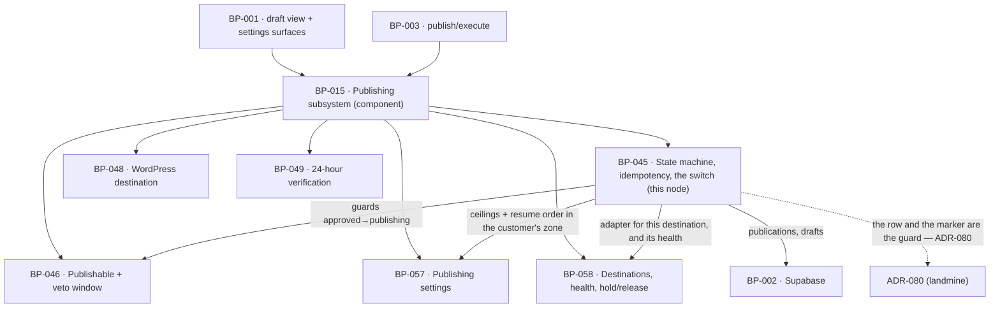

# BP-045 — Ten states, fifteen transitions, no duplicate post, instant stop

- Parent: BP-015
- Kind: **feature** — a leaf of the Epic → Feature → Capability tree, cut
  straight from REQ-056. It is the spine of the publishing subsystem: every
  other feature node under BP-015 is a consumer of this machine or a guard on
  one of its edges.

## Responsibility
Hold every page in exactly one of ten states, permit exactly fifteen
transitions and refuse every other move with the state unchanged, hand a page
to a destination at most once whatever the retry history, and make the
publishing switch take effect at the moment it is recorded without losing a
page.

## Module / boundary
`src/lib/publish/` — four directories and one leaf file, all inside BP-015's
`src/lib/publish/**`:

| Path | Holds |
|---|---|
| `types.ts` | `State`, `Actor`, `DraftView`, `Publication`, `DestinationAdapter`, `DeliveryResult`. **Imports nothing from `src/lib/publish/`** — it is the leaf that lets BP-046, BP-048, BP-049 and BP-058 name these types without a cycle (structure.md rule 6). |
| `machine/` | `STATES`, `TRANSITIONS`, the guard registry, `transition()`, the append-only transition record. |
| `attempt/` | `publish()` — the claim, the delivery call, the outcome write, the retry policy. |
| `switch/` | Reading and recording the publishing switch, the held-page set, resume ordering. |
| `ceilings/` | The per-day and per-week counters, in the customer's own zone. |

Not this node's, and named here so no work order strays into them: the
publishable predicate (BP-046), the destination registry, health and the hosted
adapter (BP-058), the WordPress adapter (BP-048), the 24-hour verification
(BP-049), the settings the ceilings ignore (BP-057), the barrel
`src/lib/publish/index.ts` (BP-015's, the parent).

## Diagram


## Public interface
```ts
// src/lib/publish/types.ts — the leaf; imports nothing from src/lib/publish/
export type State =
  | 'planned' | 'generating' | 'in_review' | 'approved' | 'publishing'
  | 'published' | 'skipped' | 'failed' | 'needs_attention' | 'unpublished'

export type Actor =
  | { kind: 'customer'; userId: string }
  | { kind: 'system'; job: 'draft/generate' | 'publish/execute' | 'publish/verify' }

/** Declared **here**, in the leaf, not in `attempt/`. `DeliveryResult.reason`
 *  names it and `types.ts` imports nothing from `src/lib/publish/`, so declaring
 *  it under `attempt/index.ts` made this file uncompilable as specified.
 *  `attempt/index.ts` re-exports it, which is why every caller's spelling is
 *  unchanged. `RETRYABLE` stays in `attempt/` — it is policy, not shape. */
export type FailureReason =
  // repeated attempt could clear it — retried, at most three times (REQ-056 c4)
  | 'network' | 'timeout' | 'destination_unavailable' | 'rate_limited'
  // repeated attempt could not clear it — straight to needs_attention
  | 'credentials_expired' | 'credentials_invalid' | 'dns_not_pointed'
  | 'destination_rejected' | 'no_destination'

export interface DeliveryResult {
  ok: boolean
  /** Set only where the destination serves the page publicly (REQ-056 c6). */
  liveUrl?: string
  /** Opaque to us; the post/page id at the destination. Never rendered. */
  remoteId?: string
  /** Did *this call* make the page live at the destination? ADR-081's
   *  discriminator, declared by the adapter that did or did not do it and
   *  stored by `publish()` as `publications.made_live_by_us`. `true` for the
   *  hosted adapter, `false` for WordPress, which delivers a draft. Not
   *  `servesPublicly` and not `liveUrl != null`: the first is a property of the
   *  destination rather than of what we did to this page, and the second is
   *  null for every WordPress row by design. */
  madeLive: boolean
  reason?: FailureReason
}

/** ADR-081. Three outcomes, never a boolean: a boolean cannot separate "the
 *  post ReachKit made live is a draft again" from "the post ReachKit never made
 *  live was named and not touched", and those are two different promises to the
 *  customer about their own site. */
export type UnpublishResult =
  | { ok: true;  outcome: 'removed' }             // hosted — REQ-056 c15, 410 at BP-047
  | { ok: true;  outcome: 'returned_to_draft' }   // WordPress, made live by us — REQ-079 c4
  | { ok: true;  outcome: 'named_for_removal' }   // WordPress, never made live — REQ-056 c16
  | { ok: false; reason: FailureReason }

export interface DestinationAdapter {
  kind: 'hosted' | 'wordpress'
  /** Does this destination serve the page publicly at an address we can
   *  measure? `true` for hosted, `false` for WordPress. It is the population
   *  boundary for REQ-063 c1's weekly verdicts and for the 24-hour
   *  verification. A field on the adapter, not a `kind === 'hosted'` test at
   *  each caller, so a third adapter cannot join the judged population by
   *  defaulting into it (BP-015 decision 3; BP-051's second `rests-on`). */
  servesPublicly: boolean
  /**
   * MUST be idempotent on `idempotencyKey` (the draft id): a second call with
   * the same key after a delivery whose outcome we never recorded must find
   * the existing post and return it, never create a second one. The unique
   * index cannot reach inside a destination we do not own — ADR-080.
   */
  deliver(page: RenderedPage, cfg: DestinationConfig, idempotencyKey: string): Promise<DeliveryResult>
  /** Which arm is taken is read from `publications.made_live_by_us`, never from
   *  a re-read of the destination — ADR-081. */
  unpublish(pub: Publication, cfg: DestinationConfig): Promise<UnpublishResult>
  health(cfg: DestinationConfig): Promise<DestinationHealth>
}

// src/lib/publish/machine/index.ts
export const STATES: readonly State[]                                   // exactly ten
export const TRANSITIONS: readonly (readonly [State, State])[]          // exactly fifteen
export const TERMINAL: readonly State[]                                 // ['skipped','unpublished']

export type Refusal = 'not_a_transition' | 'guard'
export type GuardId =
  | 'draft_passed_hard_rules'      // needs_attention → publishing
  | 'never_entered_review'         // needs_attention → generating
  | 'customer_initiated'           // needs_attention → generating
  | 'publishable_and_due'          // approved → publishing, failed → publishing (BP-046)
  | 'customer_told'                // approved → publishing — REQ-057 c8, via BP-046
  | 'publishing_switch_on'         // every edge whose target is 'publishing'
  | 'within_ceilings'              // every edge whose target is 'publishing'
  | 'destination_working'          // every edge whose target is 'publishing'

export const GUARDS: Readonly<Record<string, readonly GuardId[]>>  // keyed 'from→to'

export function transition(
  draftId: string, to: State, by: Actor, reason?: string
): Promise<
  | { ok: true; state: State }
  | { ok: false; refused: Refusal; failedGuard?: GuardId; state: State }
>

// src/lib/publish/attempt/index.ts
export type { FailureReason } from '../types'      // declared in the leaf; re-exported here
export const RETRYABLE: readonly FailureReason[]

export function publish(a: { draftId: string; destinationId: string; by: Actor }): Promise<
  | { ok: true; publicationId: string; liveUrl?: string; alreadyPublished: boolean }
  | { ok: false; reason: FailureReason; retryable: boolean; attemptNo: number }
  | { ok: false; reason: 'held'; heldBy: 'switch_off' | 'ceiling_day' | 'ceiling_week'
                                        | 'destination_not_working' | 'not_publishable' | 'telling_owed' }
>

export function unpublish(a: { draftId: string; by: Actor }): Promise<UnpublishResult>

// src/lib/publish/switch/index.ts
export function isPublishingOn(siteId: string): Promise<boolean>
export function setPublishing(siteId: string, on: boolean, by: Actor): Promise<{ recordedAt: Date }>
/** REQ-056 c14: the count a surface shows without opening Settings. */
export function heldPages(siteId: string): Promise<{ count: number; draftIds: string[] }>
/** REQ-056 c13: held pages in the order they were held, oldest first. */
export function resumeOrder(siteId: string): Promise<string[]>

// src/lib/publish/ceilings/index.ts
export function ceilingRoom(siteId: string, at: Date): Promise<
  { room: true } | { room: false; blockedBy: 'day' | 'week'; nextFreeAt: Date }
>
```

## Data model delta
On the `publications` topic (`supabase/migrations/*_publications*.sql`, this
node's alone under structure.md rule 3), extending `BUILD.md` §10:

| Column | Why |
|---|---|
| `unique (draft_id, destination_id)` | REQ-056 c5. The idempotency guarantee is the index, not a code path (BP-015 decision 2). |
| `delivery_state text not null` — `claimed \| delivered \| failed` | Distinguishes "a row exists because an attempt was claimed" from "a post exists at the destination". Without it, `ON CONFLICT DO NOTHING` would refuse the legitimate retry REQ-056 c4 promises. |
| `attempt_no int not null default 0` | REQ-056 c4's "at most three times", counted where the conflict is resolved rather than in a caller. |
| `claimed_at timestamptz not null` | The moment the attempt was claimed; the switch is read inside the same transaction that writes it. |
| `failure_reason text null` | REQ-056 c4's written reason, from the `FailureReason` union. Never a vendor payload (REQ-074 c7). |
| `remote_id text null` | The post id at the destination, for `unpublish` and for the WordPress marker lookup. Never rendered. |
| `made_live_by_us boolean not null default false` | ADR-081. Written from `DeliveryResult.madeLive` when the outcome is recorded, so it is `true` only where ReachKit itself performed the act that made the page live at that destination. It is the whole discriminator between REQ-079 c4's population and REQ-056 c16's, and it cannot be `live_url != null`: BP-048 leaves `live_url` null for every WordPress delivery, so that predicate would classify every WordPress page as never-live and quietly refuse to take a single page down. |
| index `(site_id, published_at)` | The two ceiling counts. |

On the `drafts` topic — **not this node's glob**; `supabase/migrations/*_drafts*.sql`
is BP-014's under structure.md rule 3, so these land in BP-014's migration file
and this node declares `depends-on: BP-014` for them:

| Column | Why |
|---|---|
| `transitions jsonb not null default '[]'` | Append-only `{from,to,actor,reason,at}`. BUILD §10's own test — "A 10th table needs a rendered surface that reads it, specified first" — is not met: no approved requirement renders a transition history, and REQ-056 c6's two facts live in `publications.mode`. So observability, not a table. |
| `publishable_since timestamptz null` | Written by this node the first time BP-046's predicate returns true; it is REQ-056 c13's "the order they were held". |

`sites.publishing_enabled` (REQ-056 c9) and `sites.timezone` (REQ-073 c3) are
already BP-002's declared additions on the `sites` topic; this node reads them
and adds nothing there.

## Error & edge behavior
- **The fifteen edges are data.** `TRANSITIONS` is frozen and asserted, member
  by member, against REQ-056 criterion 2's own list, quoted (rule 5.3). A move
  that is not a member returns `{ok:false, refused:'not_a_transition'}` with the
  state unchanged and writes no transition record. `skipped` and `unpublished`
  are in `TERMINAL` and are the source of no edge, so REQ-056 c3's "never
  returned to a destination by any later attempt" holds by the table, not by a
  check somewhere.
- **Every state has an exit except the two terminal ones.** Asserted as a
  property over `TRANSITIONS`, not as ten hand-written cases: for every state
  outside `TERMINAL`, at least one edge leaves it. REQ-056 c3's "no page … is
  left in a state it has no way out of" then survives a future edit to the table.
- **Guards are named, not inline.** `needs_attention → publishing` requires
  `draft_passed_hard_rules` (BP-014's `runHardRules`); `needs_attention →
  generating` requires both `never_entered_review` and `customer_initiated`
  (`by.kind === 'customer'`), so REQ-053's bound on automatic regeneration
  cannot be raised by a state move. A failed guard returns
  `{ok:false, refused:'guard', failedGuard}` — the state is unchanged and the
  refusal names which clause failed.
- **The claim is one transaction, and the switch is read inside it.** In order:
  lock the `sites` row; re-read `publishing_enabled`; re-evaluate BP-046's
  `becomesPublishable` and `toldCurrentPair`; check `ceilingRoom`; check
  the destination is working (BP-058); then
  `insert into publications … on conflict (draft_id, destination_id) do update
  set attempt_no = publications.attempt_no + 1, claimed_at = now()
  where publications.delivery_state <> 'delivered' returning id`. No row
  returned means a delivered publication already exists → return
  `{ok:true, alreadyPublished:true}` and take no edge. Only then does the
  transaction set `state='publishing'` and commit; the adapter is called
  **after** the commit, never inside it.
- **The switch takes effect at the moment it is recorded** because that re-read
  happens inside the claiming transaction. A `publish/execute` invocation that
  began before the switch was recorded, and reaches the claim after it, is
  refused and the page is held — `{ok:false, reason:'held', heldBy:'switch_off'}`
  — never skipped, never moved to `needs_attention` (REQ-056 c10, c11).
- **A held page keeps the state it holds.** Holding is the absence of an edge,
  not a state: there is no eleventh state, and `heldPages` is derived from
  `state ∈ {approved, in_review, failed} ∧ publishable ∧ ¬published`. That is
  why REQ-056 c10's list of four kinds of held page needs no schema.
- **An attempt already under way at the moment of the switch runs to a known
  outcome** and its outcome is written exactly as it happened (REQ-056 c12). It
  is the one page that can still reach a destination, and the surface reads
  `publications.delivery_state`, never an inference from the switch.
- **Retry.** `failed` schedules a retry only while `reason ∈ RETRYABLE` and
  `attempt_no < 3`; otherwise `failed → needs_attention` is taken in the same
  invocation, so no page ever rests in `failed` with neither a retry due nor
  that move made. While the switch is off the retry is **withheld and the page
  held in `failed`** — the one case where a page rests in `failed` legitimately,
  and it becomes due again on resume (REQ-056 c4, c11).
- **Resume drains, never bursts.** `resumeOrder` sorts by
  `drafts.publishable_since` ascending, tiebreak `drafts.id`, and the ceilings
  apply unchanged, so a backlog of thirty drains at one a day and eight a week
  (REQ-056 c13, and REQ-074's non-goal saying the same).
- **The ceilings hold independently and outrank every setting.** They read
  `RATE_LIMITS` from BP-005, never a per-site column, so no settings write can
  raise them (REQ-070 c3). A ceiling refusal is a hold, not a failure.
- **`unpublish` is available for as long as the page is published** (REQ-056 c7)
  and calls the adapter's `unpublish`. On a destination ReachKit serves, the
  page is removed and its address answers 410 (BP-047). On WordPress the arm is
  chosen by `made_live_by_us` (ADR-081) and both arms are BP-048's; this node
  passes the row and records the outcome, and takes no branch of its own. The
  edge `published → unpublished` is the same edge in every arm, which is why the
  ruling changed one column and one return union here and no transition.

## NFR budget
- `transition()` p95 ≤ 30 ms (one indexed read, one update, one jsonb append).
- `publish()` p95 ≤ 10 s end to end, of which the claim transaction is ≤ 100 ms;
  the adapter call carries a 20 s hard timeout, after which the outcome is
  `timeout` (retryable) and the delivery is reconciled by the idempotency key on
  the next attempt.
- Retry backoff `[5 min, 30 min, 180 min]` — chosen (rule 1.1) so the three
  attempts span under four hours and therefore always fit inside the one-per-day
  ceiling's own window, while the first retry is slower than any transient
  vendor blip and the last is slow enough to clear a short destination outage.
  It belongs in BP-005 as `PUBLISH_RETRY_BACKOFF_MIN` (config over constants,
  rule 7); reversal is one pin edit and no migration.
- Every transition emits one structured log line — draft id, from, to, actor
  kind, guard outcome, reason — and never a credential or a vendor payload
  (REQ-074 c7).
- Authz: every read and write goes through `db()` under RLS (BP-002); the only
  `dbAdmin()` use is the job path, and it still filters by `site_id`.

## Decisions
1. **The claim distinguishes `claimed` from `delivered`, and the conflict
   target is the delivered row** — Status: accepted
   - Context: BP-015 decision 2 fixes that the publication row is inserted
     first, inside the claiming transaction, and that "a conflicting insert
     means the page is already there". Taken literally with
     `on conflict do nothing`, the legitimate retry REQ-056 criterion 4 promises
     would be refused by our own idempotency guard.
   - Decision: `delivery_state` on the publication row; the conflict clause
     updates the row and bumps `attempt_no` **while it is not `delivered`**, and
     refuses only against a delivered row. BP-015 decision 2 stands unchanged;
     this states which row "already there" means.
   - Alternatives considered: a separate `publish_attempts` table — rejected,
     it splits one fact across two rows and BUILD §10's tenth-table test is not
     met. A nullable `published_at` as the marker — rejected, it makes the
     idempotency predicate a null check, which is the sort of condition that
     gets "simplified" (ADR-080).
   - Consequences: one extra column and one exhaustive union. Reversing means
     reintroducing the race REQ-056 criterion 5 names.
2. **A held page is the absence of an edge, not an eleventh state** — Status: accepted
   - Context: REQ-056 criterion 1 closes the state set at ten and criterion 10
     describes four kinds of held page.
   - Decision: `held` is a derived predicate, never a stored state. Criterion
     10's "it stays in the state it holds" is then true by construction.
   - Alternatives considered: a `held` state — rejected, it needs an eleventh
     state (a requirement change) and re-entry would have to remember which
     state to return to, which is a second copy of the machine.
   - Consequences: every surface that shows held pages calls `heldPages()`
     rather than reading a column. Cheap to reverse, and the reversal is a
     requirement change first.
3. **The calendar week is Monday-start, in the customer's own zone** — Status: accepted
   - Context: REQ-056 criterion 8 says "calendar week … counted in the time zone
     the customer set" and fixes no first day.
   - Decision: Monday-start, because `weekly/refresh` (BP-003, `BUILD.md` §11)
     already fixes one week boundary for this product; a second boundary would
     be a second copy of the same fact (rule 2.4) and the two would disagree the
     first time a page published on a Sunday.
   - Alternatives considered: Sunday-start, or a rolling seven days — the
     rolling window was rejected outright: criterion 8 says *calendar* week, and
     a rolling window would let nine publish inside one calendar week.
   - Consequences: reversal is a constant in BP-005 plus a re-derivation of the
     week key; no migration, because the counts are computed from `published_at`.
4. **The transition record is an append-only jsonb column, not a table** — Status: accepted
   - Context: BP-015's NFR asks that every transition be logged with from, to,
     actor and reason; `BUILD.md` §10 says a tenth table "needs a rendered
     surface that reads it, specified first".
   - Decision: `drafts.transitions jsonb`, append-only, bounded in practice by
     the fifteen edges. REQ-056 criterion 6's two rendered facts — approved
     versus automatic, and the record of the publication — are
     `publications.mode` and the publication row, which already exist.
   - Alternatives considered: a `draft_transitions` table — rejected under
     §10's test, no surface reads it. Logs only — rejected, a customer question
     about a page held last Tuesday must be answerable from the row.
   - Consequences: promoting the column to a table when a surface earns one is
     a migration, which is the right price for the surface that earns it.
5. **The publication row and the WordPress marker are load-bearing and must
   never be tidied away** — recorded as **ADR-080** (landmine), not here: it
   spans this node, BP-048, BP-058, BP-002's migration and BP-017's erasure and
   unpublish-everything paths, and no one of those owns it.
6. **`FailureReason` is declared in `types.ts`, not in `attempt/`** — Status:
   accepted (corrects this node's own interface, 2026-08-31)
   - Context: `types.ts` is declared to import nothing from `src/lib/publish/`
     — that is what lets BP-046, BP-048, BP-049 and BP-058 name these types
     without the cycle structure.md rule 6 forbids. But `DeliveryResult.reason`
     is `FailureReason`, and `FailureReason` was declared under
     `attempt/index.ts`. As specified, `types.ts` could not compile: either it
     imports from a sibling, or the leaf is not a leaf.
   - Decision: the union moves to `types.ts` (it is shape, and `DeliveryResult`
     is already there); `attempt/index.ts` re-exports it, so no consumer's
     import path or spelling changes. `RETRYABLE` stays in `attempt/` — it is
     the retry *policy* over that union, and policy is what `attempt/` is.
   - Alternatives considered: type-only import from `attempt/` into `types.ts`
     — rejected, a type-only import is still an edge in the module graph the
     leaf exists to keep empty, and it is exactly the "it's only a type" step
     BP-028 and BP-034 each refused for the same reason; drop `reason` from
     `DeliveryResult` — rejected, the adapter's failure reason is the only thing
     that decides whether REQ-056 c4 retries.
   - Cost of reversing: one file move. The cost of *not* fixing it is a work
     order that cannot compile its first file.
7. **Unpublish is scoped by liveness** — recorded as **ADR-081**, not here: it
   spans this node's column and return union, BP-048's two arms, BP-063's
   criterion 4 branch and BP-015's adapter contract, and it settles a conflict
   two requirements carried.

## Status grounds (rule 3.2)
Self-certified `approved`. Grounds: cut from REQ-056, which is `status:
approved`, so §3's "no blueprint from a non-approved requirement" is met; one
`satisfies` edge, to that requirement, written at creation; `code:` globs sit
inside BP-015's `src/lib/publish/**` and overlap no sibling node's. REQ-056 is
`in-review` from 2026-08-31 while the analyst folds ADR-081's liveness scoping
into criterion 16's wording; that ruling changed one column and one return union
here and no state, no transition and no guard, so this node's approval stands on
the design the criterion binds. This node never carried a `blocked-by` for the
conflict, and does not gain one now.

## Open questions
