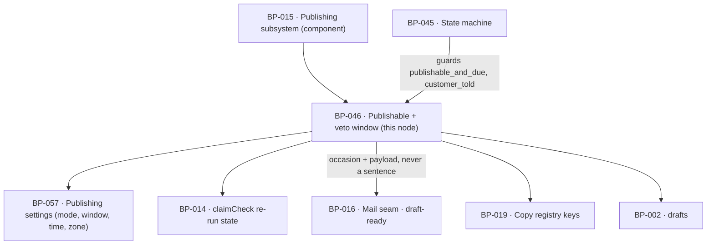

# BP-046 — Approval, the veto window, and when a page becomes publishable

- Parent: BP-015
- Kind: **feature** — a leaf cut straight from REQ-057. It owns one predicate
  and one obligation: when a page becomes publishable, and what the customer
  must have been told before it does.

## Responsibility
Decide, in exactly one place, whether a draft has become publishable and at what
moment it may publish, and hold the guarantee that no page publishes on terms
the customer was never told.

## Module / boundary
`src/lib/publish/publishable/` — inside BP-015's `src/lib/publish/**`, sibling
to BP-045's `machine/`, `attempt/`, `switch/` and `ceilings/`:

| Path | Holds |
|---|---|
| `publishable/predicate.ts` | `becomesPublishable()` — REQ-057 criterion 2's rule and nothing else. |
| `publishable/telling.ts` | `tellingFor()`, `toldCurrentPair()`, `recordTold()` — the occasion, the payload contract, the record of what was said. |
| `publishable/veto.ts` | The veto token, its expiry, and the one action it performs. |

It computes; it never transitions. Every state change it implies is taken by
BP-045's `transition()`. It writes no mail: it returns the occasion and the
payload, and BP-016's `sendEmail()` sends it. It reads the window, the mode,
the publish time and the zone from BP-057 and holds none of them.

## Diagram


## Public interface
```ts
// src/lib/publish/publishable/predicate.ts
// Signature as BP-015 declares it. The four reasons are closed and are exactly
// REQ-057 criterion 2's conjuncts; a fifth would be a change to that criterion.
export type NotPublishable = 'window' | 'unapproved' | 'unsaved_edit' | 'claim_recheck'

export function becomesPublishable(d: DraftView):
  | { publishable: true; at: Date }          // `at` = the first publish time at or after it became publishable
  | { publishable: false; because: NotPublishable }

// src/lib/publish/publishable/telling.ts
export type Telling =
  | { kind: 'interval';     publishesAt: Date; stopAction: VetoLink; copy: 'mail.draftReady.autopilotWindow' }
  | { kind: 'no_interval';  publishesAt: Date;                        copy: 'mail.draftReady.autopilotZero' }
  | { kind: 'approval_only';                                          copy: 'mail.draftReady.copilot' }

export interface GoverningPair {          // the pair REQ-057 criterion 8 tracks
  mode: 'autopilot' | 'copilot'
  vetoHours: number                       // 0..168, BP-057
  publishTime: string                     // 'HH:mm', in `timezone`
  timezone: string                        // IANA
}

export function tellingFor(d: DraftView): Telling
export function toldCurrentPair(d: DraftView):
  | { told: true }
  | { told: false; owed: Telling; because: 'never_told' | 'pair_changed' }
export function recordTold(draftId: string, t: Telling, pair: GoverningPair): Promise<void>

/** True only for `kind: 'no_interval'`: this telling is the whole of the telling. */
export function isUnsuppressible(t: Telling): boolean

// src/lib/publish/publishable/veto.ts
export interface VetoLink { token: string; expiresAt: Date | null }   // null at a zero window: no link is issued
export function issueVetoLink(draftId: string): Promise<VetoLink>
export function redeemVeto(token: string): Promise<
  { ok: true; draftId: string } | { ok: false; reason: 'unknown' | 'expired' | 'not_in_review' }
>
```

`DraftView` is BP-045's `types.ts`. The fields this node requires of it:
`id`, `siteId`, `state`, `vetoDeadline`, `approvedAt`, `approvedBy`,
`hasUnsavedEdit`, `claimRecheckOutstanding`, `told`, and the `GoverningPair` in
force at the moment of evaluation.

## Data model delta
All on the `drafts` topic — `supabase/migrations/*_drafts*.sql` is BP-014's
under structure.md rule 3, so these land in BP-014's migration file and this
node declares `depends-on: BP-014` for them. `drafts.veto_deadline` already
exists in `BUILD.md` §10.

| Column | Why |
|---|---|
| `approved_at timestamptz null`, `approved_by text null` (`customer \| autopilot`) | REQ-057 criterion 2's second disjunct, and REQ-056 criterion 6's "approved or published automatically" at the moment it is decided rather than inferred later. `publications.mode` is written from it. |
| `told jsonb null` | `{pair, kind, publishesAt, sentAt}` — the pair the customer was last told about. REQ-057 criterion 8 is a comparison against this and has nowhere else to live. |
| `veto_token_hash text null`, `veto_token_expires_at timestamptz null` | REQ-057 criterion 1's "a single action to stop it", inside a mail, reachable by a customer who is not signed in. The hash, never the token. Null at a zero window, where criterion 7 says no action to stop it exists. |

## Error & edge behavior
- **One rule, one implementation.** `becomesPublishable` is the only expression
  of REQ-057 criterion 2 anywhere in the codebase: `(window expired under
  autopilot ∨ explicitly approved) ∧ ¬unsavedEdit ∧ ¬claimRecheckOutstanding`.
  It is a pure function of `DraftView` — no clock read of its own, no database
  read, no settings read — so it is testable at every boundary of the window and
  cannot drift between the calendar, the draft view and the job.
- **Copilot: expiry is not an approval.** Under `mode: 'copilot'` the first
  disjunct is unconditionally false, so an expired window returns
  `{publishable:false, because:'unapproved'}` and the page stays in `in_review`
  for as long as the customer has access (REQ-057 criteria 3 and 6). It does not
  block the next day's generation: nothing in `draft/generate`'s due-work query
  reads this predicate.
- **Autopilot at a window longer than zero.** Expiry without a veto returns
  publishable; BP-045 then takes `in_review → approved` with
  `approved_by='autopilot'` and `approved→publishing` at `at`.
- **Autopilot at a window of zero.** The window is expired at the moment the
  draft enters review, so the page is publishable at once and `at` is the next
  publish time. No veto link is issued — `expiresAt: null` — because no
  interval exists in which one could be used (REQ-057 criterion 7); the telling
  is `kind:'no_interval'`, and its payload offers taking the page down
  (REQ-056 criterion 7) in place of a stop action.
- **The zero-window telling is unsuppressible and carries no unsubscribe link.**
  `isUnsuppressible` is true for it alone; the `sendEmail` call carries
  `suppressible: false, unsubscribeLink: false`. It is sent, and `recordTold`
  written, **before** the claim transaction commits, which is how "no later
  than the moment the page publishes" is enforced rather than hoped for. Every
  other telling is the ordinary `draft-ready` mail the customer may switch off
  (REQ-075 criterion 1), and switching it off changes neither the window nor the
  draft in review (REQ-075 criterion 2).
- **A changed pair re-opens the obligation.** `toldCurrentPair` compares the
  `GoverningPair` in force against `drafts.told.pair`. Any difference that
  changes whether or when the page publishes returns `told:false` with the
  telling now owed, on criterion 1's terms where the new pair leaves an interval
  and on criterion 7's where it does not. BP-045's `customer_told` guard reads
  this, so a page whose telling is owed is **held**, not published — which is
  REQ-057 criterion 8's "no page publishes at all without their having been
  told" as a guard rather than as a convention.
- **A veto is `in_review → skipped`**, taken through BP-045 with
  `Actor{kind:'customer'}`. `redeemVeto` refuses an expired or unknown token
  without disclosing which draft it was for, and refuses a draft no longer in
  review with `not_in_review` — a customer who clicks after the page published
  is shown the take-down action instead (REQ-056 criterion 7), never a silent
  failure and never a second stop.
- **No copy is written here.** Every sentence is a `CopyKey` resolved by
  BP-019's `copy()` (REQ-093). This node names the key and supplies the values
  the key interpolates — the page, why it was chosen, the exact date and time in
  the customer's zone — and never the sentence.
- **Access ended.** At the end of the paid-through period the approve action is
  no longer offered (REQ-076): `becomesPublishable` is not consulted, because
  BP-045's edge into `publishing` is already closed by BP-017's
  `hasActiveAccess()`. The draft stays exportable (REQ-078). This node adds no
  check of its own, so there is one access gate and not two.

## NFR budget
- `becomesPublishable` is pure and allocation-free; p99 ≤ 1 ms. It is called on
  every draft-view render and on every `publish/execute` tick.
- `toldCurrentPair` is one jsonb comparison on a row already loaded; no extra
  query.
- Veto tokens: 32 bytes from a CSPRNG, stored as a SHA-256 hash, compared in
  constant time, single-use, expiring at `veto_deadline`. Chosen (rule 1.1) to
  match the magic-link posture BP-017 already sets for an unauthenticated action
  in a mail; reversal is a token-format change with no migration beyond the
  column.
- Observability: one log line per telling (draft id, kind, pair, suppressible)
  and one per veto redemption outcome. No token, hashed or otherwise, is logged.

## Decisions
1. **`becomesPublishable` keeps BP-015's four reasons; "told" is a separate
   predicate and a separate guard** — Status: accepted
   - Context: REQ-057 criterion 2 states the publishable rule as a conjunction
     of four things. Criterion 8 adds a fifth precondition on publishing — the
     customer having been told about the pair the page actually publishes under.
   - Decision: two predicates, `becomesPublishable` and `toldCurrentPair`, and
     two named guards on BP-045's edge into `publishing`. "Publishable" keeps
     exactly the meaning criterion 2 gives it.
   - Alternatives considered: a fifth `NotPublishable` reason, `'not_told'` —
     rejected: it would silently redefine a term REQ-073 criterion 2 and
     REQ-056 both refer to by name, and a page held for want of a telling is not
     a page that failed criterion 2's test. Folding the check into the mail
     sender — rejected, an unsent mail would then not hold the page.
   - Consequences: BP-045's `GuardId` union carries `customer_told` alongside
     `publishable_and_due`. Reversal is a union edit.
2. **The zero-window telling is sent before the claim commits** — Status: accepted
   - Context: at a window of zero there is no interval, so criterion 7 makes the
     mail the whole of the telling and requires it "no later than the moment the
     page publishes".
   - Decision: send, then `recordTold`, then claim. A send failure holds the
     page (the `customer_told` guard fails) rather than publishing it untold.
   - Alternatives considered: send after a successful publish — rejected, it
     loses the promise the moment a send fails. Send asynchronously and publish
     regardless — rejected for the same reason.
   - Consequences: a mail outage stops zero-window autopilot publishing. That is
     the correct failure: the alternative is publishing in the customer's name
     with no telling at all. Cost of reversing: the promise.
3. **The zero-window mail carries no unsubscribe link, and that is not an
   oversight** — Status: accepted
   - Context: REQ-057 criterion 7 states it, with its reason: "because no link
     would stop it (REQ-075 criterion 5)". Every other product mail carries one.
   - Decision: `MAIL_KINDS` (BP-016) records this occasion as unsuppressible and
     without an unsubscribe link, and this node passes
     `suppressible: false, unsubscribeLink: false`.
   - Alternatives considered: adding the link for consistency — rejected. It is
     the change that will look like a compliance fix and is not one: an
     unsubscribe that cannot stop the thing it appears to stop is a false
     statement to the customer, and suppressing this mail means a page publishes
     in their name with no telling whatsoever.
   - Consequences: one mail kind behaves differently from the other five, and
     the difference is asserted in a test named for criterion 7. It is recorded
     here rather than as an ADR because the reasoning is already stated verbatim
     in an approved acceptance criterion (rule 2.4) — an engineer who removes it
     is contradicting a criterion, not a lost rationale.
4. **The veto action is a hashed single-use token bound to the draft** — Status: accepted
   - Context: criterion 1 puts "a single action to stop it" inside a mail, which
     a customer may open without a session.
   - Decision: token in the link, hash in the row, expiry at the veto deadline,
     single use, and the redemption performs exactly one transition.
   - Alternatives considered: a link into the signed-in app — rejected, it turns
     one action into two and the window is often 24 hours. A long-lived
     unhashed token — rejected, it is a stop action that outlives the interval
     it belongs to.
   - Consequences: one route on BP-001 and two columns. Reversal is cheap.

## Status grounds (rule 3.2)
Self-certified `approved`. Grounds: cut from REQ-057, `status: approved`, so
§3's blueprint gate is met; one `satisfies` edge written at creation; `code:`
globs sit inside BP-015's `src/lib/publish/**` and overlap no sibling's. No
`blocked-by`: REQ-057 carries no unresolved review line, and its interaction
with REQ-073 is a stated dependency (criterion 5 defers the window's lengths to
REQ-073), not a conflict.

## Open questions
