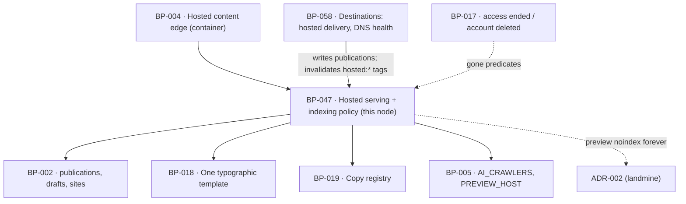

# BP-047 — Hosted pages on the customer's own domain, never ranking on ours

- Parent: BP-004
- Kind: **feature** — a leaf cut straight from REQ-059: the serving half of the
  hosted destination, and the indexing policy that goes with it.

## Responsibility
Serve a published page at `content.{customer-domain}` with the sitemap, the
canonical on the customer's own domain, the question-and-answer markup where the
page has one and the robots policy REQ-059 criterion 4 fixes — and serve the
`{slug}.reachkit.app` preview of the same page permanently unindexable.

## Module / boundary
`src/app/(hosted)/` — inside BP-004's container, carved so that the other nodes
under BP-004 do not overlap it:

| Path | Holds |
|---|---|
| `resolve-host.ts` | `Host` → site, or preview, or nothing. The one place a Host becomes a customer. |
| `[slug]/page.tsx` | The one page render, and the head it emits: canonical, robots, `FAQPage`. |
| `robots.ts` · `sitemap.ts` | The two policy documents, served by us on the customer's domain. |
| `layout.tsx` | The typographic shell, entirely BP-018's tokens and components. |

**Not this node's**, and named so no work order strays: the reasons a page is
`gone` other than being unpublished — access ended more than 30 days ago
(REQ-076 criterion 10) and account deleted (REQ-079 criterion 6) — are
predicates their own nodes own in `src/lib/account/**` (BP-017); this node
consumes them through `HostDisposition` and adds no lifecycle rule of its own.
The delivery side of the hosted destination, its DNS readiness and its health
are BP-058's, in `src/lib/publish/destinations/hosted/`.

This surface **writes nothing**. It holds no `POST`, no server action and no
mutation, so no crawler and no visitor can advance BP-045's state machine.

## Diagram


## Public interface
```
GET  https://content.{customer-domain}/{slug}       one published page
GET  https://content.{customer-domain}/robots.txt   we serve it, on their domain
GET  https://content.{customer-domain}/sitemap.xml  every live page of that site, and nothing else
GET  https://{slug}.reachkit.app/                   the same render; noindex forever (ADR-002)
```
```ts
// src/app/(hosted)/resolve-host.ts
export type HostDisposition =
  | { kind: 'site';     siteId: string; domain: string; indexable: true }
  | { kind: 'preview';  draftId: string;                indexable: false }
  | { kind: 'gone';     reason: 'unpublished' | 'access_ended' | 'account_deleted' }
  | { kind: 'unknown' }

export function resolveHost(host: string): Promise<HostDisposition>

// cache tags this surface reads under; BP-058 and BP-045 invalidate them by name
export const tags: {
  site: (siteId: string) => `hosted:site:${string}`
  page: (publicationId: string) => `hosted:page:${string}`
}
```

## Data model delta
None. Reads `sites.domain`, `publications.live_url`, `publications.published_at`,
`publications.unpublished_at`, `publications.delivery_state`, `drafts.body_md`
and `drafts.meta`. It has no write path of any kind.

## Error & edge behavior
- **Host resolution is exact and never falls back.** An unknown or unmapped Host
  is `{kind:'unknown'}` → 404, and no ReachKit page and no other customer's page
  is served in its place. A `content.` label on a domain no `sites` row claims is
  `unknown`, not an error page carrying our brand.
- **410, not 404, and never a redirect.** A page whose `publications.unpublished_at`
  is set is `gone:'unpublished'` → **410 Gone**. The two lifecycle reasons resolve
  the same way through the same disposition, so there is one `gone` response and
  not three.
- **A page is served only where it is really live.** The render requires a
  publication row with `delivery_state='delivered'`, `destination.kind='hosted'`
  and `unpublished_at is null`. REQ-059 criterion 2's "no page … recorded as live
  at that address" is upheld on the write side by BP-058 refusing to deliver to a
  destination whose DNS is not pointed; this surface additionally never renders a
  page whose row does not say delivered, so the two sides cannot disagree.
- **The head, on the customer's domain**: `<link rel="canonical">` at
  `https://content.{sites.domain}/{slug}` — always the customer's domain, never
  a ReachKit address, and never a self-canonical on the preview host. `FAQPage`
  JSON-LD is emitted only where `drafts.meta.faq` is present and non-empty; an
  absent or empty section emits no markup at all rather than an empty `FAQPage`.
- **The preview is the same render with indexing forced off**, on both `<meta
  name="robots">` and the `X-Robots-Tag` header, and there is no code path and no
  settings value that can clear it — the flag is a constant of the disposition,
  not a column. ADR-002 is why; that reasoning is not restated here (rule 2.4).
- **`robots.txt` blocks no general crawler**, has no blanket `Disallow`, and
  names `BP-005`'s `AI_CRAWLERS` list with `Allow` — GPTBot, ClaudeBot,
  OAI-SearchBot, Claude-SearchBot, PerplexityBot, Google-Extended. The list is a
  pin, so adding or removing an agent is a pins-test change and not an edit to a
  template string. The preview host is served a different document, and the two
  are produced by two functions that share no helper (ADR-002's consequence: the
  two policies must never be merged into one).
- **`sitemap.xml` lists exactly the live hosted pages of the site the Host
  resolved to** — never another site's, never a page in any other state, never
  a preview address, and never a ReachKit-addressed URL.
- **No JavaScript is required to read the page.** The whole page content is in
  the HTML at first byte, because REQ-062 criterion 1 verifies it as a crawler
  that runs no scripts. A component that needs client JavaScript to render page
  text is a defect on this surface, not a preference.
- **Generated prose is allowed here and nowhere else.** The page body is the one
  place the product renders text no copy key holds (REQ-093 criterion 2); every
  other string on the surface is `copy()`.
- **Cache and takedown.** Pages are cached by the two tags above. Publishing and
  unpublishing invalidate them at the moment the publication row changes, so a
  410 is never served from a stale cache and a takedown never waits on a TTL.

## NFR budget
- Static render, p95 ≤ 200 ms at the edge, no database round trip on a cache hit
  (BP-004's budget, inherited, not re-derived).
- `resolveHost` p95 ≤ 20 ms, one indexed lookup on `sites.domain`, cached per
  Host for 60 s — chosen (rule 1.1) short enough that a newly pointed CNAME
  serves within a minute and long enough that a crawl of 500 pages costs one
  lookup. Reversal: one constant. A `gone` disposition is **never** cached
  beyond the request.
- Zero client JavaScript on the page route.
- Observability: Host, slug, disposition, status and cache disposition per
  request. No customer identifier, no user id and no draft id in a log line
  emitted from a request served on a customer's own domain.

## Decisions
1. **One render, two dispositions, two robots documents** — Status: accepted
   - Context: the same page must be indexable on the customer's domain and
     permanently unindexable on the preview host (REQ-059 criteria 3–5).
   - Decision: `resolveHost` decides indexability once, at the edge, and the
     page render takes it as data; `robots.ts` branches on the disposition and
     emits two documents that share no helper and no partial.
   - Alternatives considered: one parameterised robots template — rejected as
     ADR-002's consequence states outright: the two policies must never be
     merged, because a merged helper is one edit away from serving the wrong
     one on the wrong host, and that edit reads as a tidy-up.
   - Consequences: a little duplication between two small documents, kept on
     purpose. Reversal cost is the reputational guardrail `BUILD.md` §9 and
     §14.6 exist to hold.
2. **`FAQPage` is emitted from `drafts.meta.faq`, not from parsing markdown** —
   Status: accepted
   - Context: criterion 3 asks for the markup "where the page has a
     question-and-answer section". Markdown gives no reliable structural signal.
   - Decision: the generator records the section structurally; the edge emits
     markup only when that data is present. Absent data emits nothing, which is
     the correct behaviour for a page with no such section.
   - Alternatives considered: a render-time heading/question heuristic —
     rejected, a heuristic that is wrong emits schema claiming a Q&A that is not
     there, which is a structured false statement on the customer's own domain.
   - Consequences: it rests on BP-014 writing the field, recorded as this node's
     `rests-on`, disposition open. If it turns out unavailable, the fallback is
     a generation-side change, not a parser here.
3. **The `AI_CRAWLERS` list is a pin, not a string in a template** — Status: accepted
   - Context: six named agents, quoted in `BUILD.md` §9 and in REQ-059
     criterion 4.
   - Decision: `BP-005`'s `AI_CRAWLERS` holds them, `tests/pins.test.ts` asserts
     them against the quoted clause, and `robots.ts` renders the list.
   - Alternatives considered: literal lines in the document — rejected under
     structure.md rule 5; the list appears in a robots document and in a
     verification user-agent decision (BP-049) and would be two copies.
   - Consequences: adding an agent is a pin change with a failing test until the
     quote is updated. Trivial to reverse.

## Status grounds (rule 3.2)
Self-certified `approved`. Grounds: cut from REQ-059, `status: approved`, so
§3's blueprint gate is met; one `satisfies` edge written at creation; `code:`
globs sit inside BP-004's `src/app/(hosted)/**` and `tests/hosted/**` and are
carved narrowly so the REQ-076 and REQ-079 nodes under the same parent can claim
their own paths without overlap. The preview policy is ADR-002's, cited not
restated.

## Open questions
