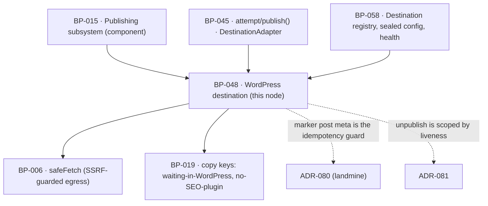

# BP-048 — The WordPress destination

- Parent: BP-015
- Kind: **feature** — a leaf cut straight from REQ-060: one destination adapter,
  for a site we do not own and never make live.

## Responsibility
Deliver a page into the customer's own WordPress as a draft, at most once, with
the SEO title and description written into whichever of Yoast and RankMath is
present, and never make anything live there.

## Module / boundary
`src/lib/publish/destinations/wordpress/` — inside BP-015's
`src/lib/publish/**`, disjoint from BP-058's `destinations/index.ts`,
`destinations/health/` and `destinations/hosted/`:

| Path | Holds |
|---|---|
| `adapter.ts` | The `DestinationAdapter` implementation: `deliver`, `unpublish`, `health`. |
| `client.ts` | The REST calls, every one through BP-006's `safeFetch`. |
| `seo.ts` | Plugin detection and the title/description write. |
| `errors.ts` | Vendor response → BP-045's `FailureReason`. The one place a vendor payload stops. |

Credential storage, encryption, the destination row and disconnect-time
destruction are **BP-058's** (REQ-074 criterion 4); this adapter receives a
decrypted `DestinationConfig` for the duration of one call and holds nothing.
The state machine, the retry policy and the publication row are **BP-045's**.

## Diagram


## Public interface
```ts
// src/lib/publish/destinations/wordpress/adapter.ts
export const wordpressAdapter: DestinationAdapter   // kind: 'wordpress'

export interface WordPressConfig {          // the shape stored in destinations.config, sealed by BP-058
  baseUrl: string                           // the customer's site root; the REST root is derived, never stored twice
  username: string
  applicationPassword: string               // present only in memory, only inside one call
}

export type SeoPlugin = 'yoast' | 'rankmath'
export function detectSeoPlugins(cfg: WordPressConfig): Promise<readonly SeoPlugin[]>

// deliver(): creates the post as a draft, or finds the one we already created
export type WordPressDelivery = DeliveryResult & {
  liveUrl: undefined                        // never set: we never make it live
  madeLive: false                           // ADR-081's discriminator, narrowed to false
                                            // by type: REQ-060 c1 is upheld by there
                                            // being no value this adapter could return
  remoteId: string                          // the WordPress post id
  seoWritten: readonly SeoPlugin[]          // possibly empty — criterion 4's case
  deliveredAt: Date
}
```

## Data model delta
None of its own. It reads `destinations.config` through BP-058's sealed
accessor and writes only what BP-045's publication row already holds:
`remote_id` (the WordPress post id), `published_at` (the delivery date),
`live_url` left **null**, and `delivery_state='delivered'`. REQ-060 criterion 2's
"names the WordPress site and the date of delivery and no live address" is
therefore the row itself, with no WordPress-specific column and no second copy.

The written line the customer reads — that the page is waiting in their
WordPress for them to publish — is a `copy()` key, `publish.wordpress.awaitingYou`,
rendered by BP-001 on the page's own record. Its occasion is fixed by REQ-056
criterion 6, which says the customer sees "a written line saying so in place of
an address" when they open the page; this node supplies the key and the values,
never the sentence (REQ-093). The same holds for criterion 4's line,
`publish.wordpress.noSeoPlugin`.

## Error & edge behavior
- **A post is created as a draft and is never made live.** The create call sets
  the post status to draft and this node has no code path that sets any other
  status, on creation or afterwards. REQ-060 criterion 1 is upheld by the
  absence of the call, not by a flag.
- **At most one post, even after an unrecorded delivery.** Before creating,
  `deliver` searches the site for a post carrying our marker for this
  `idempotencyKey` (the draft id); a hit is returned as the existing delivery.
  The unique index on `(draft_id, destination_id)` cannot reach inside a site we
  do not own, so the marker is the second half of the same guarantee. Neither
  the marker nor the row may be cleaned up — **ADR-080**.
- **Existing posts are never touched.** The only writes are the creation of our
  own post and the SEO fields on that post. Nothing this node does reads, edits,
  deletes or reorders a post it did not create (REQ-060's non-goals).
- **SEO plugins are detected, never assumed.** `detectSeoPlugins` inspects the
  REST index of the customer's site once per delivery. Both present means both
  written; one present means one written; **neither present is not a failure** —
  the page is still delivered and the customer is told, in one written line,
  that no SEO plugin was found (REQ-060 criterion 4). A write to one plugin
  failing while the delivery succeeded is reported the same way, as a
  not-written outcome on `seoWritten`, never as a failed publish: the page is in
  their site, and saying otherwise would be false.
- **Credentials never leave the call.** The application password is decrypted by
  BP-058 for the duration of one call, never logged, never returned by any read
  path a surface uses, and never echoed back to anyone (REQ-060 criterion 5,
  REQ-074 criterion 7). `errors.ts` maps every vendor response to a
  `FailureReason` member and discards the payload; no vendor string reaches a
  screen, a mail or an export.
- **Failure mapping.** 401/403 → `credentials_expired` (not retryable → the page
  comes to rest needing the customer, and BP-058 marks the destination
  `expired`). 404 on the REST root, or a root that is not a WordPress REST
  index → `destination_rejected`, not retryable. 429 → `rate_limited`,
  retryable. 5xx, connection reset, DNS failure, timeout → the retryable members.
  A response we cannot classify is **not retryable**: an unrecognised outcome at
  a destination we do not own must not be hammered three times.
- **Verification does not apply.** A WordPress draft has no live address, so
  `publish/verify` never schedules a check for it and the four outcomes are not
  shown as pending for it (REQ-062's non-goal). BP-049 makes that decision from
  the null `live_url`, not from the destination kind, so it stays true for any
  future destination that delivers rather than serves.
- **`unpublish` is scoped by liveness (ADR-081), and the discriminator is
  stored.** `publications.made_live_by_us` (BP-045) is the only input; the
  customer's site is never re-read to decide which path to take, because a
  customer who published our draft themselves is not a page ReachKit made live.
  In both arms the product stops treating the page as one of the customer's live
  pages and `publications.unpublished_at` is set.
  - **`made_live_by_us = true` → `returned_to_draft`.** One `POST` setting that
    post's status to `draft`. Exactly one field of exactly one post this adapter
    itself created and itself made live; no other field is read, edited or
    reordered. Setting an already-draft post to draft is a no-op and still
    returns `returned_to_draft`; a post the customer has since deleted returns
    `named_for_removal`, not a failure — there is nothing left to return and
    nothing was lost.
  - **`made_live_by_us = false` → `named_for_removal`.** **No write of any kind
    to the customer's site**: not the post status, not a tag, not a comment, and
    not a removal of the marker (ADR-080 decision 5 stands unchanged — a cleanup
    that strips the marker while returning the post to draft is the same
    landmine). The post is named for the customer on ReachKit's own surface,
    through `publish.wordpress.namedForRemoval`.
  - The marker stays on the post in both arms.
  - **Today, only the second arm is reachable from this adapter.** REQ-060
    criterion 1 promises a WordPress post is never made live by us and this node
    has no code path that sets any status but draft, so `made_live_by_us` is
    `false` on every publication it creates. `returned_to_draft` is therefore
    specified, tested against a fixture, and unreachable in production until the
    product gains the ability to publish into a customer's WordPress live. It is
    **not** dead code — ADR-081's warning block is why — and the discriminating
    test asserts the arm is taken for a `made_live_by_us = true` row, so deleting
    the branch fails a test rather than passing silently.

## NFR budget
- `deliver` p95 ≤ 8 s including the marker search, the create and up to two SEO
  writes; hard timeout 20 s, inherited from BP-045's adapter contract.
- `health` p95 ≤ 3 s: one authenticated read of the REST index. Called by
  BP-058, never by this node on a schedule of its own.
- Every outbound call goes through BP-006's `safeFetch` with a 2 MB response cap
  and DNS pinning. Chosen (rule 1.1): robots checking is **off** for this
  adapter, because these are authenticated API calls to a site the customer
  connected and gave us a credential for; `robots.txt` governs crawling, not an
  API the site's own administrator authorised. Reversal is one flag, and
  reversing it would make a customer's own `Disallow: /` stop their paid
  publishing.
- Observability: one log line per delivery — destination id, draft id, outcome,
  `remoteId`, plugins written, duration. Never the base URL's credentials,
  never a response body.

## Decisions
1. **The marker on the post is the destination-side idempotency guard** —
   recorded as **ADR-080** (landmine), not here: the same invariant has one half
   in BP-045's publication row, one half in this adapter, and touches BP-058's
   disconnect path and BP-017's erasure and unpublish-everything paths. No one
   blueprint owns it.
2. **Neither SEO plugin present is a success, not a degradation** — Status: accepted
   - Context: criterion 4 requires the page still be delivered and the customer
     told in one written line.
   - Decision: `seoWritten: []` on a successful `DeliveryResult`; the state
     machine reaches `published` in the delivered sense, and the line is a copy
     key on the page record.
   - Alternatives considered: `needs_attention` — rejected, the page is in their
     site and nothing needs the customer. A silent success — rejected, criterion
     4 requires the telling.
   - Consequences: `seoWritten` is on the delivery result and must survive into
     the publication record for the line to be rendered later; it is stored in
     the publication row's existing `verify jsonb` sibling field rather than a
     new column. Cheap to reverse.
3. **An unclassifiable vendor response is not retryable** — Status: accepted
   - Context: REQ-056 criterion 4 retries only "while that reason is one a
     repeated attempt could clear". An unknown response is by definition not
     known to be one.
   - Decision: the default arm of the error mapping is non-retryable, so the
     page comes to rest needing the customer rather than making three writes
     into somebody else's site on a guess.
   - Alternatives considered: retry by default — rejected: the destination is
     not ours, the failure mode is a duplicate or a partial post, and the
     customer is the one who can look.
   - Consequences: more pages reach `needs_attention` early. That is the safer
     direction at a destination we do not own, and each arrival is a mapping we
     can then classify.

## Blocked-by — discharged 2026-08-31 by ADR-081 (rule 2.3)
This node carried `blocked-by: [REQ-079]` because REQ-056 criterion 16 and
REQ-079 criterion 4 described one customer action two incompatible ways. The
owner ruled: **scope by liveness** — a page ReachKit published to the customer's
WordPress is returned to draft there; a page it created but never made live is
named, and not touched. Each criterion is true of its own population. The edge is
removed and both arms are specified above.

The ruling, its two rejected readings, and why the discriminator must be a stored
fact rather than a re-read of the customer's site are **ADR-081**, not restated
here (rule 2.4). REQ-056 and REQ-079 are `in-review` while the analyst folds the
scoping into their criteria; that is a requirement gate, not a block on this
node, whose behaviour is now fully determined in both arms.

One thing this node still needs and does not have: the two written lines the
customer reads (`publish.wordpress.namedForRemoval` and the was-live line). They
are copy keys under BP-019/BP-020 and their strings are the owner's — this node
supplies the keys and the values, never the sentence (REQ-093).

## Status grounds (rule 3.2)
Self-certified `approved`: cut from REQ-060, `status: approved`, so §3's
blueprint gate is met; one `satisfies` edge written at creation; `code:` globs
sit inside BP-015's `src/lib/publish/**` and overlap no sibling's. The
`blocked-by` that previously scoped the unpublish write path out of this approval
is discharged by ADR-081, so the fourth work order — the one never cut — may now
be planned alongside the three (deliver, SEO detection and write, health and
failure mapping) that were never affected.

## Open questions
- [ ] REQ-060's own `REVIEW(ambiguity)` — whether a WordPress-only customer is
      told anywhere other than in the app that their page is waiting for them —
      is unresolved upstream and is the requirements-analyst's, not this node's.
      What is derivable is already built above: REQ-056 criterion 6 settles the
      in-app occasion (the page's own record, in place of an address), so this
      node supplies the key and the values for it. Only the *mail* question is
      open, and it is REQ-060's line, not a second copy of it here.
