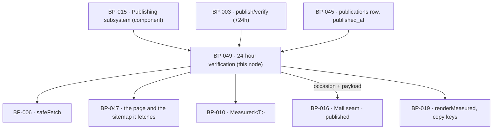

# BP-049 — 24-hour liveness verification, failures shown plainly

- Parent: BP-015
- Kind: **feature** — a leaf cut straight from REQ-062: one check, once, a day
  after a page went out, and four outcomes that are never guessed.

## Responsibility
Fetch a published page's own live address 24 hours after it published and record,
as four `Measured<boolean>` outcomes, whether it is reachable, is not marked
against indexing, is in the sitemap, and returns its whole content to a crawler
that runs no scripts.

## Module / boundary
`src/lib/publish/verify/` — inside BP-015's `src/lib/publish/**`, disjoint from
BP-045's four directories and from `destinations/`:

| Path | Holds |
|---|---|
| `verify.ts` | `verifyLive()` — the four checks and their `Measured` results. |
| `due.ts` | Which publications are due, and the disposition of one that never will be. |
| `coverage.ts` | The one definition of "returns its whole page content". |
| `telling.ts` | The occasion and payload for the `published` message. |

It writes only `publications.verify` and `publications.verify_due_at`; it takes
no transition, sends no mail itself, and never repairs anything.

## Diagram


## Public interface
```ts
// src/lib/publish/verify/verify.ts
export type CheckId = 'reachable' | 'indexable' | 'sitemap' | 'aiReadable'

export interface VerifyResult {
  reachable:  Measured<boolean>
  indexable:  Measured<boolean>
  sitemap:    Measured<boolean>
  aiReadable: Measured<boolean>
  checkedAt: Date
}

export function verifyLive(publicationId: string): Promise<VerifyResult>

// src/lib/publish/verify/due.ts
export type VerifyDisposition =
  | { kind: 'not_yet';     dueAt: Date }                       // REQ-062 c3, the 24 hours before
  | { kind: 'due' }
  | { kind: 'done';        result: VerifyResult }
  | { kind: 'never';       because: 'taken_down_first' }       // REQ-062 c4
  | { kind: 'never';       because: 'no_live_address' }        // REQ-062 non-goal (REQ-060)

export function dispositionFor(publicationId: string): Promise<VerifyDisposition>
export function dueNow(limit: number): Promise<string[]>       // publication ids, oldest due first

// src/lib/publish/verify/coverage.ts
/** The one definition of REQ-062 criterion 1's "whole page content". */
export function bodyCoverage(fetchedHtml: string, draftBodyMd: string): number  // 0..1

// src/lib/publish/verify/telling.ts
export interface PublishedTelling {
  publicationId: string
  liveUrl: string
  result: VerifyResult
  failed: readonly CheckId[]        // possibly empty; never a reason not to send
  copy: 'mail.published.verified'
}
export function tellingFor(publicationId: string): Promise<PublishedTelling>
```

## Data model delta
On the `publications` topic — `supabase/migrations/*_publications*.sql` is
**BP-045's** glob under structure.md rule 3, so these land in BP-045's migration
file and this node declares `depends-on: BP-045` for them.
`publications.verify jsonb` already exists in `BUILD.md` §10.

| Column / shape | Why |
|---|---|
| `verify_due_at timestamptz null` | REQ-062 criterion 3 requires the surface to state **when** the check will run, in the 24 hours before it does. Set to `published_at + 24h` at the moment `delivery_state` becomes `delivered`, and left null where `live_url` is null. It is also the due-work index (`(verify_due_at) where verify is null`), so BP-003's "the queue is the state machine" holds here too. |
| `verify jsonb` shape | `{reachable, indexable, sitemap, aiReadable, checkedAt}`, each of the four a serialised `Measured<boolean>` — **not** a bare boolean, so "not checked yet" and "checked and false" are different values in the column and cannot be conflated by a reader. |

## Error & edge behavior
- **Four outcomes, never inferred from each other.** A page that is unreachable
  still records `indexable`, `sitemap` and `aiReadable` as `unmeasured` with the
  reason, never as `false`. Failing to reach a page is not evidence that it is
  unindexable, and REQ-062 criterion 3 forbids stating an outcome that was not
  observed.
- **Before the check, the outcomes say so.** `dispositionFor` returns
  `not_yet` with `dueAt`, and BP-019's `renderMeasured` renders the four as
  unmeasured. Nothing anywhere defaults a `Measured<boolean>` to `false`; that
  is the trichotomy's whole purpose (BP-010).
- **Taken down first.** A publication with `unpublished_at` set before
  `verify_due_at` is `never: 'taken_down_first'`; no fetch is made and the
  surface states that the page was taken down before it could be verified
  (REQ-062 criterion 4). The row is not deleted and `verify` stays null —
  deleting it would break BP-045's idempotency guard (ADR-080).
- **No live address, no check.** The disposition is decided from
  `live_url is null`, **not** from `destination.kind`, so a WordPress draft is
  excluded (REQ-062's non-goal, REQ-060) and so is any future destination that
  delivers rather than serves, without a second rule being written.
- **Exactly one check per publication.** `dueNow` selects only rows with
  `verify is null`; a completed check is never re-run, and there is no
  re-verification schedule (REQ-062's non-goal). A run that crashed mid-way
  wrote nothing, so it is still due — the job is idempotent by the null check.
- **The four checks.**
  - `reachable` — one `safeFetch` GET of `live_url`; a 2xx with a non-empty
    body is true, any other status or a transport failure is false with the
    status recorded internally. A redirect to a different host is **false**, not
    followed: a page that is only reachable somewhere else is not reachable at
    the address we reported.
  - `indexable` — true when neither the response's `X-Robots-Tag` nor the
    document's `<meta name="robots">` marks it against indexing. Both are
    checked, because either alone can be the one that is set.
  - `sitemap` — one `safeFetch` of `https://content.{sites.domain}/sitemap.xml`
    (BP-047's document), true when the page's own address is listed.
  - `aiReadable` — the same fetch as `reachable`, made with a user agent the
    policy REQ-059 serves permits and with no script execution of any kind, is
    true when `bodyCoverage(html, drafts.body_md) ≥ VERIFY.coverageFloor`. We
    never run a browser; if a page needs one, that is precisely the failure this
    check exists to find.
- **A failed check is a recorded outcome, not an error.** `verifyLive` never
  throws for a failing check and never retries one. A failure of the *job* —
  our own timeout, a transport error before any check completed — writes nothing
  and leaves the row due, so the difference between "we could not check" and
  "the page failed" is never lost.
- **The message is sent on the same occasion either way.** `tellingFor` returns
  the live address, all four outcomes and the list of those that failed, and
  BP-016 sends it whether `failed` is empty or not (REQ-062 criterion 5). Whether
  the customer has switched that mail off is REQ-075's and BP-016's; the outcome
  of the checks never enters that decision.
- **Nothing is repaired.** A failed check produces no retry, no republish and no
  transition (REQ-062's non-goal). The customer reads it.

## NFR budget
- Two fetches per publication, ≤ 10 s timeout and ≤ 2 MB each through BP-006;
  `verifyLive` p95 ≤ 5 s, p99 ≤ 21 s.
- Due window: a check is run at the first `publish/verify` invocation at or
  after `published_at + 24h` and must run inside 25 h of publication — one hour
  of slack, chosen (rule 1.1) so a job tick of up to an hour satisfies "24 hours
  have passed" without a per-publication timer. Reversal: a pin and a schedule.
- `VERIFY.coverageFloor = 0.95` and `VERIFY.userAgent` belong in BP-005
  (config over constants, rule 7). The floor is chosen so that template chrome,
  typographic substitution and markdown-to-HTML differences cannot fail a page
  whose content is wholly present, while a page gated behind client JavaScript —
  which returns close to none of the draft's tokens — fails decisively. Reversal
  is one pin; the risk of raising it is false failures on a customer's own
  domain, and of lowering it is calling a JavaScript-gated page AI-readable.
- The user agent is our own token and is permitted because the robots document
  BP-047 serves blocks no general crawler (REQ-059 criterion 4) — it is not one
  of the six named AI agents, and impersonating one of them would be a false
  statement to a server we are measuring.
- `publish/verify` is read-only and is **not** stopped by the kill switch
  (BP-003), so a page that went out before a stop is still verified.
- Observability: one log line per check — publication id, four outcomes,
  coverage ratio, duration. No page body and no fetched HTML is logged.

## Decisions
1. **The four outcomes are `Measured<boolean>`, not booleans** — Status: accepted
   - Context: REQ-062 criterion 3 forbids showing an unrun check as passed or
     failed, and criterion 4 adds a third case that is neither.
   - Decision: reuse BP-010's `Measured<T>`, which already distinguishes
     measured, measured-zero and unmeasured, and let BP-019 render it. No new
     tri-state and no nullable boolean.
   - Alternatives considered: `boolean | null` — rejected, null reads as false
     in every language the surface will pass through, and the reason a check did
     not run (not due, taken down, no address) would be lost. A separate
     `verify_status` column — rejected, a second copy of the same fact.
   - Consequences: the jsonb is bulkier and one existing renderer serves it.
     Reversing means re-introducing exactly the "published means a row was
     written" failure REQ-062 exists to end.
2. **Exclusion from verification is decided by a null live address, not by
   destination kind** — Status: accepted
   - Context: REQ-062's non-goal excludes a WordPress draft "because it has no
     live address".
   - Decision: the rule tests the address, which is the stated reason, rather
     than the kind, which is only today's instance of it.
   - Alternatives considered: `if (kind === 'wordpress')` — rejected, it is a
     rule that says the wrong thing and would be wrong for the first destination
     that delivers without serving.
   - Consequences: none today; the two are coextensive. Trivial to reverse.
3. **`bodyCoverage` is one function, one threshold, one place** — Status: accepted
   - Context: "returns its whole page content" needs an operational definition
     or the check is unfalsifiable, and a vague check is a vacuous test (§8).
   - Decision: normalise both sides to lowercase alphanumeric tokens and measure
     multiset containment of the draft's tokens in the fetched document; one
     pinned floor.
   - Alternatives considered: a byte-length ratio — rejected, chrome and markup
     dominate it. Exact substring match — rejected, any markdown rendering
     difference fails a correct page. A headless browser comparison — rejected,
     it would defeat the check's purpose, which is precisely to look without one.
   - Consequences: the definition is testable against a fixture page and against
     a JavaScript-gated one, so the check discriminates. Reversal is a pin.

## Status grounds (rule 3.2)
Self-certified `approved`. Grounds: cut from REQ-062, `status: approved`, so
§3's blueprint gate is met; one `satisfies` edge written at creation; `code:`
globs sit inside BP-015's `src/lib/publish/**` and overlap no sibling's. No
`blocked-by`: REQ-062 carries no unresolved review line, and its interaction
with REQ-060 is a stated non-goal, not a conflict.

## Open questions
