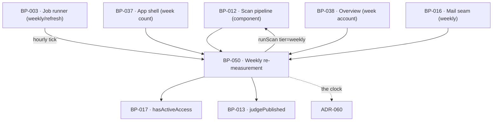

# BP-050 — The weekly re-measurement, and a week that could not be measured

- Parent: BP-012
- Kind: **feature** — cut from REQ-065, a leaf under the scan-pipeline component.

## Responsibility
Run exactly one re-measurement inside each active site's own Monday-to-Sunday
week, stamp it with the site-local week it belongs to, and produce the one
account of that week — complete, partial, not measured, or not owed — that every
surface and every mail reads instead of deriving its own. Research on the DataForSEO
endpoints, competing products' measurement practices, and AI-answer stability is in
`registry/evidence/RESEARCH-dataforseo-endpoints.md`,
`registry/evidence/RESEARCH-competitor-visibility-measurement.md`, and
`registry/evidence/RESEARCH-ai-answer-stability.md`.

## Module / boundary
`src/lib/scan/weekly/` — the site-local week arithmetic, the due-site selection,
the `runScan({ tier: 'weekly' })` invocation, the idempotency key, and
`accountForWeek`. It is not a job: BP-003 owns `weekly/refresh` and calls this.
It renders nothing and holds no copy; the written lines its account maps to are
BP-019's.

## Diagram


## Public interface
```ts
/** The site-local week. Monday 00:00 in the site's stored zone (REQ-073 c1).
 *  Returned as a calendar date, never an instant, so it survives a zone change. */
export function weekStartFor(a: { at: Date; zone: string }): string   // 'YYYY-MM-DD'

/** BP-003's stated idempotency key for this job, made concrete here. */
export function weekKey(a: { siteId: string; weekStart: string }): string

export type UnmeasuredPart =
  | 'rankings' | 'ai_answers' | 'rivals' | 'on_page' | 'verdicts'

export type WeeklyOutcome =
  | { ran: true;  scanId: string; status: 'done' }
  | { ran: true;  scanId: string; status: 'degraded'; unmeasured: readonly UnmeasuredPart[] }
  | { ran: false; because: 'week_not_begun' | 'already_measured' | 'no_active_access' | 'kill_switch' }
export function runWeekly(a: { siteId: string; now: Date }): Promise<WeeklyOutcome>

/** Every site whose local week has begun, whose local hour has reached the due
 *  hour, that has active access, and that has no row for (site_id, week_start).
 *  Called by BP-003's hourly tick — see ADR-060 for why the tick is hourly. */
export function dueSites(now: Date): Promise<readonly { siteId: string; weekStart: string }[]>

/** REQ-065 criteria 2 to 5, as one total function. Every surface and every mail
 *  reads this; none derives a second account of the same week (rule 7.1). */
export type WeekAccount =
  | { kind: 'complete';     measuredAt: Date }
  | { kind: 'partial';      measuredAt: Date; unmeasured: readonly UnmeasuredPart[] }  // c4
  | { kind: 'not_measured'; nextDueOn: Date }                                          // c3
  | { kind: 'not_owed' }                                                               // c5
export function accountForWeek(a: { siteId: string; weekStart: string }): Promise<WeekAccount>

/** The date the shell and Overview both state when nothing has been measured. */
export function nextDueOn(a: { siteId: string; now: Date }): Promise<Date>

export const WEEKLY_DUE_HOUR_LOCAL: 6      // 06:00 in the site's zone (BUILD.md §11's hour, its zone)
```

## Data model delta
On `scans` (migration topic `scans`, BP-012's; this node globs no migration and
the delta lands in that node's topic):
- `week_start date null` — the site-local Monday the scan belongs to, computed
  once at insert and never recomputed on read (decision 2).
- `unique (site_id, week_start) where tier = 'weekly'` — a partial unique index,
  so "twice in one week" is unrepresentable rather than guarded, matching BP-012's
  treatment of the current-report pointer.
- `unmeasured jsonb null` — which parts a degraded weekly scan did not reach,
  read by `accountForWeek` for criterion 4.
No counter and no per-week table: a week's account is a projection of its scan
row, or of the absence of one.

## Error & edge behavior
- **One measurement per site per site-local week, never before that week begins.**
  `dueSites` selects on the site's own local Monday and local hour; the partial
  unique index makes a second insert fail rather than duplicate. A site west of
  UTC−6 is not measured at 06:00 UTC on Monday because that instant falls in its
  previous week — ADR-060 states the clock this rests on.
- **A week that did not run has an account, not a silence.** `accountForWeek`
  returns `not_measured` with the day the next measurement is due; the line
  stands until a measurement for that week completes and is never replaced by an
  earlier week's figures (criterion 3). No movement figure and no verdict is
  produced for that week — `judgePublished` is not called for a week with no scan.
- **A partial week is a first-class outcome, not an error.** `degraded` records
  which parts were unmeasured; what was measured shows with its date and the rest
  is stated as not measured (criterion 4). The week is never presented as
  complete.
- **Values carry their own measurement date.** Everything the weekly pass
  produces is a `Measured<T>` with `at` set by BP-010 at measurement, so no
  surface can label an earlier week's value with this week's date (criterion 2).
- **Access ended → `not_owed`.** No scan is run, no week is stated as unmeasured,
  no next measurement is announced, and every measurement already taken stays
  readable with the date it was taken (criterion 5). `hasActiveAccess` is BP-017's
  single gate; this node holds no second definition of active.
- **A zone change does not relabel history.** `week_start` is stored, so weeks
  already measured keep the labels they were measured under; only future weeks
  are computed against the new zone (decision 2).
- **The kill switch stops the run before any spend** (BP-003), and the week then
  reads `not_measured` with its next due day — REQ-092's account, not a silent
  skip.
- A run that starts and crashes leaves no `week_start` row, so the next hourly
  tick retries it inside the same week; a run that completed partially leaves a
  `degraded` row and is not retried, because criterion 1 permits one measurement.

## NFR budget
- Weekly tier: standard queue, ≈8¢ ledgered per site (BP-012's ceiling), fanned
  out at BP-003's fixed concurrency so one slow site never starves the week.
- `dueSites` is one indexed query on `(active, time_zone)` joined against
  `scans (site_id, week_start)`; it runs hourly and must stay under 50 ms at
  10⁴ sites.
- `accountForWeek` is one row lookup and is called on every app screen render, so
  it is memoised per request by the callers, never cached across requests.
- Observability: one line per due-selection carrying the count and the local hour
  band, and one per run carrying `siteId`, `weekStart`, status and cost. A
  `degraded` line names which parts were unmeasured and never a vendor payload.

## Decisions

1. **The trigger clock** — Status: accepted, recorded as **ADR-060**
   - `BUILD.md` §11's "Mon 06:00 UTC" cannot deliver REQ-065 criterion 1 for
     sites west of UTC−6. The correction spans BP-003 (the schedule), BP-005 (the
     pin), BP-012 and this node, and restoring the literal reads as specification
     fidelity, so it is a standalone landmine file rather than an entry here.

2. **`week_start` is stored at insert, never derived on read** — Status: accepted
   - Context: a week's identity is a local calendar fact. A customer may change
     their time zone (REQ-073 criterion 1 permits it at any time), and REQ-040
     criterion 6 counts measured weeks from stored history.
   - Decision: compute the site-local Monday once, at insert, and store it as a
     `date`. Reads join on it and never recompute.
   - Alternatives considered: derive the week on read from `created_at` and the
     site's current zone — rejected, a customer moving from UTC+13 to UTC−8 would
     silently shift historic scans across week boundaries, changing the shell's
     week count with no measurement having changed, which is exactly the
     overstatement REQ-040 criterion 6 forbids; store an instant rather than a
     date — rejected, an instant re-invites the same recomputation at every
     render.
   - Consequences: a zone change needs no backfill and history is stable.
     Reversing requires a backfill and reopens the silent shift.

3. **One `WeekAccount`, read by every surface** — Status: accepted
   - Context: criteria 3 and 4 are rendered by the app shell, Overview, the
     calendar and the weekly mail. Four derivations of "was this week measured"
     is four chances to disagree, and rule 7.1 puts one capability in one node.
   - Decision: `accountForWeek` is total over the four cases and is the only
     producer. Surfaces map its variants onto copy keys; they never inspect scan
     status directly.
   - Alternatives considered: expose the scan row and let each surface interpret
     — rejected, `degraded` would be read as complete by whichever surface
     forgot; a materialised weekly summary table — rejected, it is a second copy
     of the scan row (rule 2.4).
   - Consequences: the function is on the render path of every app screen, so it
     is one indexed lookup and nothing more.

## Status grounds (rule 3.2)
Self-certified `approved`. Grounds: cut from REQ-065, `status: approved`;
`satisfies: [REQ-065]`. Globs sit inside BP-012's `src/lib/scan/**` boundary as
`src/lib/scan/weekly/**` and overlap no sibling (BP-036 owns
`src/lib/scan/deep/**`). REQ-065's non-goal explicitly delegates "the clock the
job runs on" to the design, which decision 1 takes.

## Open questions
