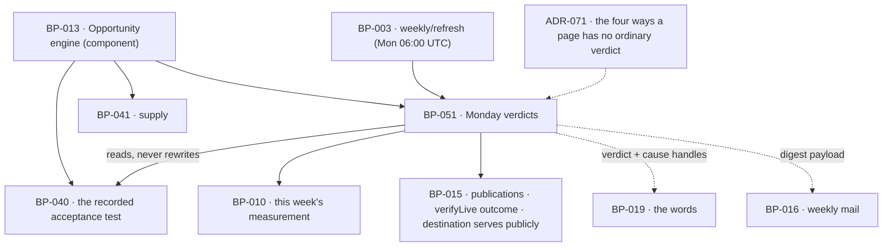

# BP-051 — Monday verdicts against the test each page was created with

- Parent: BP-013
- Kind: **feature** — a leaf of the Epic → Feature → Capability tree, cut
  straight from REQ-063.

## Responsibility
Once a week, evaluate each publicly served published page against the acceptance
test recorded when its opportunity was created, using only that week's
measurement, and record one verdict per page per week — including the verdict
that says the test can no longer be evaluated.

## Module / boundary
`src/lib/opportunities/verdicts/` inside BP-013's boundary, plus the migration
discriminator `_opportunities_verdicts`. It reads the acceptance test BP-040
wrote and never writes it; it reads this week's measurement and never triggers
one (REQ-065's re-measurement is another node's); it renders nothing and sends
nothing — BP-019 words the verdict and BP-016 mails it.

## Diagram


## Public interface
```ts
export type Verdict = 'working' | 'too_early' | 'not_working'   // the three
export type NotJudgeableCause =
  | 'search_untracked'   // its target search is no longer measured
  | 'unpublished'        // REQ-056 c7
  | 'question_left_set'  // REQ-071 c7
  | 'domain_changed'     // REQ-071 c14 — the one terminal cause (ADR-071)

/** A page's standing for one week. Four shapes, and they never collapse into
 *  three (ADR-071). */
export type WeekStanding =
  | { kind: 'verdict';       verdict: Verdict
      measuredAt: Date
      movement: Movement | null
      verifyFailedAt: Date | null }        // c1: shown beside, never in place of
  | { kind: 'not_judgeable'; cause: NotJudgeableCause
      lastJudgedWeek: WeekStart | null }   // null = never judged (c6)
  | { kind: 'not_measured' }               // c5, second half — transient, no row
  | { kind: 'no_week' }                    // c5, first half — the week was not measured at all

export interface Movement {
  previousWeek: WeekStart
  spansWeeks: number          // 1 unless a week was missed (c4)
  from: Measured<number>; to: Measured<number>
  declined: boolean           // c3 — carried, never smoothed away
}

export type WeekStart = string   // ISO date of Monday in the site's own time zone

/** The week's judgement for one site. Idempotent per (site, week). */
export function judgeWeek(a: { siteId: string; week: WeekStart }):
  Promise<{ standings: Array<{ publicationId: string; standing: WeekStanding }> }>

/** This week's measurement reduced to exactly what a recorded acceptance test
 *  can be decided from — and nothing else, so `evaluateAcceptance` cannot reach
 *  a figure the test does not name. Declared **here**, not in BP-050: see
 *  decision 6. Absence from a map is meaningful and is how three of the four
 *  not-judgeable causes are read; it is never a zero. */
export interface WeekMeasurements {
  week: WeekStart
  /** null where the week was not measured at all — `WeekStanding.no_week`. */
  measuredAt: Date | null
  /** The domain measured this week. Compared with the publication's; a
   *  difference is `domain_changed`, the one terminal cause (REQ-071 c14). */
  domain: CanonicalDomain
  /** Position for each search still measured this week, keyed by the query the
   *  `top20` form records. A key that is absent is `search_untracked`. */
  positions: ReadonlyMap<string, Measured<number>>
  /** Whether this week's AI answer for a question names the customer, keyed by
   *  the question the `named_on` form records. A key that is absent is
   *  `question_left_set` (REQ-071 c7). */
  namesCustomer: ReadonlyMap<string, Measured<boolean>>
  /** Whether each barrier is cleared on the page its `unblock` opportunity
   *  named. Keyed by BP-040's `Barrier`. */
  gatesCleared: ReadonlyMap<Barrier, Measured<boolean>>
}

/** Pure. Can this recorded test be decided from what this week measured?
 *  Returns the value, or which of the four causes stops it being decidable. */
export function evaluateAcceptance(a: {
  acceptance: Acceptance                    // BP-040's, read-only
  week: WeekMeasurements
}): { decided: true; passes: boolean; measuredAt: Date }
 | { decided: false; cause: NotJudgeableCause }

/** What a surface or the weekly mail reads. Never recomputes a verdict. */
export function readWeek(a: { siteId: string; week: WeekStart }):
  Promise<Array<{ publicationId: string; standing: WeekStanding }>>

export function weeklyDigest(a: { siteId: string; week: WeekStart }): Promise<{
  standings: Array<{ publicationId: string; standing: WeekStanding }>
  weekMeasuredAt: Date | null
}>
```

## Data model delta
Migration `*_opportunities_verdicts*.sql` creates `page_verdicts`:

| column | note |
|---|---|
| `id` | |
| `publication_id` | fk `publications` |
| `site_id` | fk `sites`, for RLS and the weekly read |
| `week_start date` | Monday in the site's time zone |
| `verdict text` | `working \| too_early \| not_working \| not_judgeable` |
| `cause text` | non-null exactly when `verdict = 'not_judgeable'` |
| `measured_at timestamptz` | the measurement this verdict came from |
| `scan_id` | the week's scan the verdict was evaluated from |
| `movement jsonb` | `{ previousWeek, spansWeeks, from, to, declined }` or null |
| `created_at` | |

- Unique `(publication_id, week_start)` — one verdict per page per week, so
  `judgeWeek` is idempotent and a re-run cannot mint a second.
- Index `(site_id, week_start)`.
- **A verdict row is never updated and never deleted.** The series is the record
  REQ-063 c6's "date of the last verdict it did receive" is derived from, and c5's
  "no earlier week's verdict is shown as this week's" is enforced by reading only
  the requested week.
- **`not_measured` and `no_week` have no row** — absence is their
  representation, which is why they can never be mistaken for a judgement
  (ADR-071).
- The migration files under the `opportunities` topic token because the test this
  table judges is the `opportunities` table's; `structure.md` rule 3's token set
  is unchanged.

## Error & edge behavior
- **Only this week's measurement decides.** `judgeWeek` reads the scan for the
  named week and no other. Where REQ-065 c3 says the week was not measured, it
  writes **no rows at all** and every page's standing is `no_week` (REQ-063 c5).
- **A partly measured week judges what it can.** Where REQ-065 c4 applies, a page
  whose recorded test could be evaluated from what that week did measure gets a
  verdict — whichever of REQ-047 c6's three forms the test takes — and every other
  page is `not_measured`, with no row. Neither case ever shows an earlier week's
  verdict as this week's, because a read is scoped to one `week_start`.
- **Too early is a floor, not a ceiling.** A page published less than
  `TOO_EARLY_WEEKS` (3) ago that already passes its test is `working`; otherwise
  it is `too_early`, never `not_working` (REQ-063 c2, `BUILD.md` §4.5).
- **A decline is carried, never smoothed.** `movement.declined` is set from the
  comparison with the previous *recorded* measurement, and `from`/`to` carry the
  raw `Measured<number>` values. Nothing rounds a decline away and nothing
  substitutes the better earlier figure (c3).
- **A gap in the series is stated as a span.** Where the previous recorded
  measurement is not the previous week's, `spansWeeks` says how many weeks the
  change covers (c4).
- **Verification failure sits beside the verdict.** REQ-062's 24-hour check
  failing sets `verifyFailedAt` on the standing; it never withholds, replaces or
  downgrades the verdict (c1), and it is never re-run for the purpose of judging.
- **`not_judgeable` is not a state a page recovers from silently.** Three of the
  four causes lift on their own terms — a search returning to the tracked set, a
  page being republished, a question rejoining the set — and the page is judged
  again from that week. `domain_changed` never lifts (REQ-071 c14): once it holds,
  every later week is `not_judgeable` for that page. ADR-071 states why the four
  causes are not one.
- **The recorded test is never rewritten** — the trigger is BP-040's, and this
  node holds no code path that writes `opportunities.acceptance` (REQ-063 c6,
  REQ-047 c8).
- **Never judged is a value, not a missing one.** `lastJudgedWeek: null` means
  the page received no verdict before becoming unjudgeable, which c6 requires the
  customer to be told.
- **Pages outside the population.** A page delivered to a destination the
  customer must publish themselves is not judged and produces no standing
  (REQ-063's second non-goal); it is `publications` data BP-015 renders, not a
  verdict this node withholds.
- **Access ended** (REQ-065 c5): no week is judged, and every verdict already
  recorded stays readable with the date it was taken.

## NFR budget
- `judgeWeek` runs inside `weekly/refresh` (Mon 06:00 UTC, `BUILD.md` §11) after
  the site's re-measurement, within that job's per-site fan-out budget. It makes
  **no vendor call and no model call** — it reads the week's stored measurement
  and writes one row per judged page.
- Cost: 0¢. A verdict is arithmetic over data the weekly scan (≈8¢) already
  bought; nothing here has a budget line of its own.
- Writes are one bulk insert per site per week, bounded by that site's published
  page count (≤ 8/week added, `BUILD.md` §9).
- `readWeek` is one indexed read on `(site_id, week_start)`; it sits on the
  Overview read path and on the weekly mail path.
- Observability: per site, the count in each of the four standings and the
  breakdown of `not_judgeable` by cause. A rising `search_untracked` count is the
  early signal that a market re-derivation is orphaning pages, and it is
  invisible without that counter.
- Authz: `db()` under RLS; verdicts are per-site rows and never cross a tenant.

## Decisions

1. **A verdict is a row per page per week, not a column on `publications`** — Status: accepted
   - Context: `BUILD.md` §10 gives `publications.verdict(working/too_early/
     not_working)`. REQ-063 c3 needs the previous measurement, c4 needs the
     interval a change spans, and c6 needs "the date of the last verdict it did
     receive" — none of which one column can answer, and c6's fourth value is not
     in that column's enum.
   - Decision: `page_verdicts`, unique on `(publication_id, week_start)`,
     insert-only. `publications.verdict` is not written by this node and should
     not exist; the `rests-on` above records that no BP-015 node writes it.
   - Alternatives considered: the column plus a history table — rejected, two
     homes for one fact (rule 2.4) and the column is the one that will drift;
     deriving the verdict on read from measurements — rejected, c1 binds a
     verdict to the week's measurement, and a verdict recomputed later against a
     changed test or a changed tracked set would silently rewrite history.
   - Consequences: a "latest verdict" is a query, not a field. Cost of reversing:
     adding the column back looks like a denormalisation win and would give the
     product two answers to "did this page work".

2. **The four standings are four shapes, and `not_measured` carries no row** — Status: accepted
   (governed by ADR-071)
   - This node computes `verdict`, `not_judgeable`, `not_measured` and `no_week`
     as four distinct shapes. The reasoning spans this node, BP-019's rendering
     and BP-016's mail, and reversing it looks like a cleanup — so it is a file.

3. **The week is the site's own Monday** — Status: accepted
   - Context: REQ-063 c1 says "the week beginning on Monday in the time zone the
     customer set"; `BUILD.md` §11 schedules `weekly/refresh` at Mon 06:00 UTC.
     These are two different clocks.
   - Decision: `week_start` is stored as the ISO date of Monday **in the site's
     time zone**, computed once when the week's scan completes and carried into
     every verdict from it. The job's UTC schedule is an implementation detail of
     when work is attempted; it never appears in a stored week or in a customer's
     reading of one.
   - Alternatives considered: UTC weeks — rejected, a customer west of UTC would
     read a verdict dated to a Monday they had not reached; per-verdict time-zone
     conversion at render — rejected, it recomputes a stored fact for display,
     which REQ-093 c4 forbids.
   - Consequences: two sites in different zones can hold verdicts for
     `week_start` values a day apart from one job run, which is correct and is
     what the uniqueness key is scoped by.

4. **`TOO_EARLY_WEEKS` is a pin, and the too-early rule cannot mask a pass** — Status: accepted
   - Context: REQ-063 c2 and `BUILD.md` §4.5's "rest under 3 weeks — too early to
     judge". Rule 1.1 makes the number a parameter; the requirement fixes 3.
   - Decision: `TOO_EARLY_WEEKS = 3` in BP-005's `constants.ts`, asserted in
     `tests/pins.test.ts`. The order of evaluation is fixed: the test is
     evaluated **first**, and only a page that does not yet pass is aged into
     `too_early`. A young page that already passes reads `working`.
   - Alternatives considered: age first, then test — rejected, it would report a
     page that is demonstrably working as too early to judge, which is the
     opposite of the promise; a per-type window — rejected, REQ-063 states one.
   - Consequences: retuning is a constants edit; recorded verdicts are not
     recomputed, because a verdict is a fact about the week it was taken.

5. **`WeekMeasurements` is this node's, not BP-050's** — Status: accepted
   (2026-08-31)
   - Context: `evaluateAcceptance` named the type and nothing declared it. The
     obvious home looks like BP-050, which owns the weekly measurement and
     already exports `WeekAccount` and `UnmeasuredPart`. A planner declared it
     locally in `src/lib/opportunities/verdicts/types.ts` and asked.
   - Decision: it stays here. BP-050 lives in `src/lib/scan/weekly/` and this
     node in `src/lib/opportunities/verdicts/`; the declared dependency runs
     `src/lib/scan → src/lib/opportunities` (BP-012 `depends-on: BP-013`), so
     importing a type the other way is the cycle `structure.md` rule 6 makes a
     build failure. The planner's placement was right.
   - It is also the right *shape* boundary, not only the cycle-free one: this
     type is the acceptance test's input, reduced to what the three `Acceptance`
     forms name. It is not an account of the week — that is `WeekAccount`, which
     stays BP-050's, and the two must not merge, because a week can be fully
     measured and still leave a particular test undecidable (ADR-071).
   - Alternatives considered: declare it in BP-050 and import it here — rejected
     as the cycle; declare it in BP-040 beside `Acceptance` — rejected, BP-040
     writes the test and never reads a measurement against it, so the type would
     sit in a node that never constructs it.
   - Cost of reversing: one file. The reversal that looks tidiest — "put the
     week's types with the week's job" — is the one that breaks the build.

## Status grounds (rule 3.2)
Self-certified `approved` per rule 3.2. Grounds: cut from **REQ-063**, which is
`status: approved`; one module inside BP-013's boundary; `code:` globs disjoint
from BP-040's and BP-041's, including the migration discriminator. Its one chosen
parameter and its one chosen clock are derived above. It introduces no
customer-visible string: the verdict words and criterion 6's line are handles
here and the owner's words in BP-019.

## Open questions
