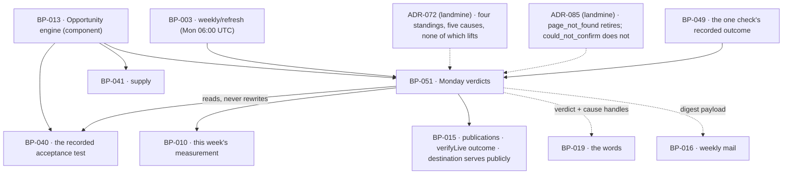

# BP-051 — Monday verdicts against the test each page was created with

- Parent: BP-013
- Kind: **feature** — a leaf of the Epic → Feature → Capability tree, cut
  straight from REQ-063.

## Responsibility
Once a week, evaluate each publicly served published page against the acceptance
test recorded when its opportunity was created, using only that week's
measurement, and record one verdict per page per week — including the verdict
that says the test can no longer be evaluated.

## Module / boundary
`src/lib/opportunities/verdicts/` inside BP-013's boundary, plus the migration
discriminator `_opportunities_verdicts`. It reads the acceptance test BP-040
wrote and never writes it; it reads this week's measurement and never triggers
one (REQ-065's re-measurement is another node's); it renders nothing and sends
nothing — BP-019 words the verdict and BP-016 mails it.

## Diagram


## Public interface
```ts
export type Verdict = 'working' | 'too_early' | 'not_working'   // the three

/** **ADR-072 (landmine, superseding ADR-071) — every one of these is terminal.**
 *  There is no lift condition for any of them and no code computes one. Read that
 *  file before writing the branch that judges a page again once its search comes
 *  back into the tracked set: it is the change that will present as a *bug
 *  report* rather than a tidy-up, and REQ-063 criterion 6 forbids it in terms —
 *  "A page marked no longer judgeable stays so, and nothing restores it". */
export type NotJudgeableCause =
  | 'search_untracked'   // its target search is no longer measured
  | 'unpublished'        // REQ-056 c7 — and `unpublished` is itself a terminal state
  | 'page_not_found'     // BP-049 recorded REQ-062 c4's second outcome, and nothing
                         // else: this node never fetches a page's address (ADR-085)
  | 'question_left_set'  // REQ-071 c7
  | 'domain_changed'     // REQ-071 c14

/** REQ-063 c1's two verification outcomes that sit **beside** a verdict without
 *  qualifying it: a check the page failed (REQ-062 c3) and a check that could not
 *  be confirmed (REQ-062 c4's third outcome). Read from BP-049's stored
 *  `VerifyOutcome`; never re-derived and never re-fetched.
 *
 *  **`could_not_confirm` is deliberately here and deliberately not a
 *  `NotJudgeableCause`** — ADR-085 Decision 4 and ADR-072 Decision 5b. It and
 *  `page_not_found` render as the same grey line and have opposite consequences:
 *  one leaves the page fully judged, the other retires it forever. Merging them
 *  is the cleanup those two files exist to stop. */
export type VerifyNote =
  | { note: 'checks_failed';     failed: readonly CheckId[]; checkedAt: Date }
  | { note: 'could_not_confirm'; checkedAt: Date }

/** A page's standing for one week. Four shapes, and they never collapse into
 *  three (ADR-071, carried forward unchanged by ADR-072). */
export type WeekStanding =
  | { kind: 'verdict';       verdict: Verdict
      measuredAt: Date
      movement: Movement | null
      verifyNote: VerifyNote | null }      // c1: shown beside, never in place of
  | { kind: 'not_judgeable'; cause: NotJudgeableCause
      lastJudgedWeek: WeekStart | null }   // null = never judged (c6)
  | { kind: 'not_measured' }               // c5, second half — transient, no row
  | { kind: 'no_week' }                    // c5, first half — the week was not measured at all

export interface Movement {
  previousWeek: WeekStart
  spansWeeks: number          // 1 unless a week was missed (c4)
  from: Measured<number>; to: Measured<number>
  declined: boolean           // c3 — carried, never smoothed away
}

export type WeekStart = string   // ISO date of Monday in the site's own time zone

/** The week's judgement for one site. Idempotent per (site, week).
 *  **It fetches nothing.** No page's address is visited here, this week or any
 *  week — REQ-063's non-goal ("Any look at a published page's address") and the
 *  owner's ruling of 2026-09-01. Anything derived from REQ-063's old criteria 6
 *  and 7 that added a page visit to the weekly job is to be **dropped, not
 *  implemented**. */
export function judgeWeek(a: { siteId: string; week: WeekStart }):
  Promise<{ standings: Array<{ publicationId: string; standing: WeekStanding }> }>

/** This week's measurement reduced to exactly what a recorded acceptance test
 *  can be decided from — and nothing else, so `evaluateAcceptance` cannot reach
 *  a figure the test does not name. Declared **here**, not in BP-050: see
 *  decision 5. Absence from a map is meaningful and is how the **two** causes
 *  `evaluateAcceptance` can produce are read — `search_untracked` from
 *  `positions`, `question_left_set` from `namesCustomer`; it is never a zero.
 *  The other three causes are not readable from this shape at all: see the
 *  comment on `evaluateAcceptance` below. */
export interface WeekMeasurements {
  week: WeekStart
  /** null where the week was not measured at all — `WeekStanding.no_week`. */
  measuredAt: Date | null
  /** The domain measured this week. **`judgeWeek` compares it with the
   *  publication's** and writes `domain_changed` (REQ-071 c14) on a difference;
   *  `evaluateAcceptance` cannot — the publication is not among its inputs, and
   *  it is a pure function of the recorded test and the week. Corrected
   *  2026-09-02: this comment read "Compared with the publication's" without
   *  saying by whom, and the only reader of the field it sat in could not make
   *  that comparison. */
  domain: CanonicalDomain
  /** Position for each search still measured this week, keyed by the query the
   *  `top20` form records. A key that is absent is `search_untracked`. */
  positions: ReadonlyMap<string, Measured<number>>
  /** Whether this week's AI answer for a question names the customer, keyed by
   *  the question the `named_on` form records. A key that is absent is
   *  `question_left_set` (REQ-071 c7). */
  namesCustomer: ReadonlyMap<string, Measured<boolean>>
  /** Whether each barrier is cleared on the page its `unblock` opportunity
   *  named. Keyed by BP-040's `Barrier`. */
  gatesCleared: ReadonlyMap<Barrier, Measured<boolean>>
}

/** Pure. Can this recorded test be decided from what this week measured?
 *  Returns the value, or which cause stops it being decidable.
 *
 *  **It produces exactly two of `NotJudgeableCause`'s five members** —
 *  `search_untracked` (an absent key in `positions`) and `question_left_set`
 *  (an absent key in `namesCustomer`). It produces `unpublished`,
 *  `domain_changed` and `page_not_found` **never**: the first two are stored
 *  state `judgeWeek` holds and this function is not given, and the third is
 *  BP-049's recorded outcome, read by `judgeWeek` and derived nowhere
 *  (ADR-085). A code path here that returns `page_not_found` is the ADR-085
 *  merge arriving by the back door — this function makes no request and reads
 *  no publication row, so a value it cannot observe is a value it must not
 *  name. The return type stays the whole union so the caller's exhaustiveness
 *  fixture is over one type; the restriction is asserted by test (WO-204), not
 *  by a second, narrower union that would then need keeping in step.
 *  Corrected 2026-09-02: this comment read "which of the four causes", written
 *  before `page_not_found` joined them. */
export function evaluateAcceptance(a: {
  acceptance: Acceptance                    // BP-040's, read-only
  week: WeekMeasurements
}): { decided: true; passes: boolean; measuredAt: Date }
 | { decided: false; cause: NotJudgeableCause }

/** What a surface or the weekly mail reads. Never recomputes a verdict. */
export function readWeek(a: { siteId: string; week: WeekStart }):
  Promise<Array<{ publicationId: string; standing: WeekStanding }>>

export function weeklyDigest(a: { siteId: string; week: WeekStart }): Promise<{
  standings: Array<{ publicationId: string; standing: WeekStanding }>
  weekMeasuredAt: Date | null
}>
```

## Data model delta
Migration `*_opportunities_verdicts*.sql` creates `page_verdicts`:

| column | note |
|---|---|
| `id` | |
| `publication_id` | fk `publications` |
| `site_id` | fk `sites`, for RLS and the weekly read |
| `week_start date` | Monday in the site's time zone |
| `verdict text` | `working \| too_early \| not_working \| not_judgeable` |
| `cause text` | non-null exactly when `verdict = 'not_judgeable'` |
| `measured_at timestamptz` | the measurement this verdict came from |
| `scan_id` | the week's scan the verdict was evaluated from |
| `movement jsonb` | `{ previousWeek, spansWeeks, from, to, declined }` or null |
| `created_at` | |

- Unique `(publication_id, week_start)` — one verdict per page per week, so
  `judgeWeek` is idempotent and a re-run cannot mint a second.
- Index `(site_id, week_start)`.
- **A verdict row is never updated and never deleted.** The series is the record
  REQ-063 c6's "date of the last verdict it did receive" is derived from, and c5's
  "no earlier week's verdict is shown as this week's" is enforced by reading only
  the requested week.
- **`not_measured` and `no_week` have no row** — absence is their
  representation, which is why they can never be mistaken for a judgement
  (ADR-071, carried forward by **ADR-072** Decision 2).
- **Terminality is enforced by the row, not by a flag.** There is no
  `is_judgeable` column and nothing clears anything: `judgeWeek` asks whether a
  `not_judgeable` row exists for the publication **before** it evaluates
  anything else, and short-circuits. A flag would have a writer that clears it,
  and the whole of ADR-072 Decision 5 is that no such writer exists.
- The migration files under the `opportunities` topic token because the test this
  table judges is the `opportunities` table's; `structure.md` rule 3's token set
  is unchanged.

## Error & edge behavior
- **Only this week's measurement decides.** `judgeWeek` reads the scan for the
  named week and no other. Where REQ-065 c3 says the week was not measured, it
  writes **no rows at all** and every page's standing is `no_week` (REQ-063 c5).
- **A partly measured week judges what it can.** Where REQ-065 c4 applies, a page
  whose recorded test could be evaluated from what that week did measure gets a
  verdict — whichever of REQ-047 c6's three forms the test takes — and every other
  page is `not_measured`, with no row. Neither case ever shows an earlier week's
  verdict as this week's, because a read is scoped to one `week_start`.
- **Too early is a floor, not a ceiling.** A page published less than
  `TOO_EARLY_WEEKS` (3) ago that already passes its test is `working`; otherwise
  it is `too_early`, never `not_working` (REQ-063 c2, `BUILD.md` §4.5).
- **A decline is carried, never smoothed.** `movement.declined` is set from the
  comparison with the previous *recorded* measurement, and `from`/`to` carry the
  raw `Measured<number>` values. Nothing rounds a decline away and nothing
  substitutes the better earlier figure (c3).
- **A gap in the series is stated as a span.** Where the previous recorded
  measurement is not the previous week's, `spansWeeks` says how many weeks the
  change covers (c4).
- **Verification failure — and a check that could not be confirmed — sit beside
  the verdict.** Either sets `verifyNote` on the standing; neither withholds,
  replaces or downgrades the verdict (c1), and neither is ever re-run for the
  purpose of judging, or for any purpose (ADR-085 Decision 3). A page whose check
  could not be confirmed is judged this week and every week, exactly as though
  the check had passed, with the note beside it.
- **`page_not_found` retires; `could_not_confirm` does not.** The two come from
  the same fetch, render as the same grey line, and go opposite ways here. It is
  the single most consequential branch in this node and it is stated in two
  landmine files (ADR-085 Decision 4's table, ADR-072 Decision 5b) because the
  merge will be proposed by somebody looking at a screen, not at this file.
- **`not_judgeable` is a state a page never recovers from, by any route.**
  Corrected 2026-09-01: this node previously read "three of the four causes lift
  on their own terms — a search returning to the tracked set, a page being
  republished, a question rejoining the set". All of that is now false, and one
  clause of it was never reachable at all:
  - REQ-063 criterion 6 now ends "A page marked no longer judgeable stays so, and
    nothing restores it: no verdict is produced for it in any later week, and no
    line ever says it is judged again." **All five causes are terminal.**
  - REQ-063 criterion 7 — the resumption path — was **withdrawn outright** on
    2026-09-01 and its number was not reused, so anything still citing "REQ-063
    criterion 7" dangles visibly rather than pointing at a different promise.
  - "A page being republished" was never a thing that could happen: REQ-056
    criterion 3 makes `unpublished` terminal and criterion 2's fifteen edges
    contain no way out of it. That clause read as reachable and was not.
  **ADR-072** (superseding ADR-071) states why the five causes are not one and
  why the restore that looks like a bug fix is the withdrawal of a promise.
- **The recorded test is never rewritten** — the trigger is BP-040's, and this
  node holds no code path that writes `opportunities.acceptance` (REQ-063 c6,
  REQ-047 c8).
- **Never judged is a value, not a missing one.** `lastJudgedWeek: null` means
  the page received no verdict before becoming unjudgeable, which c6 requires the
  customer to be told.
- **The population now includes every WordPress page, and no rule here changed
  to admit it.** Since ADR-084 every destination publishes live and
  `servesPublicly` is true at both, so a WordPress page is judged like any other.
  REQ-063's non-goal excluding "one delivered to a destination as a draft they
  never made live" was **deleted from the requirement** on 2026-09-01. What
  breaks is the assertions written against the old constant, not the shape —
  this node's second `rests-on` row records the re-reading. A row that never
  reached a destination has no publication and is outside the population by the
  absence of a row, not by a rule.
- **A page the customer removes after the 24-hour check goes on being judged.**
  Nothing observes the removal — REQ-063 criterion 1 states it as an accepted
  consequence in the requirement's own words. This node does not soften it, does
  not qualify the verdict, and does not add a look to find out. That is not an
  omission to be fixed here; it is the ruling.
- **Access ended** (REQ-065 c5): no week is judged, and every verdict already
  recorded stays readable with the date it was taken.

## NFR budget
- `judgeWeek` runs inside `weekly/refresh` (Mon 06:00 UTC, `BUILD.md` §11) after
  the site's re-measurement, within that job's per-site fan-out budget. It makes
  **no vendor call and no model call** — it reads the week's stored measurement
  and writes one row per judged page.
- Cost: 0¢. A verdict is arithmetic over data the weekly scan (≈8¢) already
  bought; nothing here has a budget line of its own.
- Writes are one bulk insert per site per week, bounded by that site's published
  page count (≤ 8/week added, `BUILD.md` §9).
- `readWeek` is one indexed read on `(site_id, week_start)`; it sits on the
  Overview read path and on the weekly mail path.
- Observability: per site, the count in each of the four standings and the
  breakdown of `not_judgeable` by cause. A rising `search_untracked` count is the
  early signal that a market re-derivation is orphaning pages, and it is
  invisible without that counter.
- Authz: `db()` under RLS; verdicts are per-site rows and never cross a tenant.

## Decisions

1. **A verdict is a row per page per week, not a column on `publications`** — Status: accepted
   - Context: `BUILD.md` §10 gives `publications.verdict(working/too_early/
     not_working)`. REQ-063 c3 needs the previous measurement, c4 needs the
     interval a change spans, and c6 needs "the date of the last verdict it did
     receive" — none of which one column can answer, and c6's fourth value is not
     in that column's enum.
   - Decision: `page_verdicts`, unique on `(publication_id, week_start)`,
     insert-only. `publications.verdict` is not written by this node and should
     not exist; the `rests-on` above records that no BP-015 node writes it.
   - Alternatives considered: the column plus a history table — rejected, two
     homes for one fact (rule 2.4) and the column is the one that will drift;
     deriving the verdict on read from measurements — rejected, c1 binds a
     verdict to the week's measurement, and a verdict recomputed later against a
     changed test or a changed tracked set would silently rewrite history.
   - Consequences: a "latest verdict" is a query, not a field. Cost of reversing:
     adding the column back looks like a denormalisation win and would give the
     product two answers to "did this page work".

2. **The four standings are four shapes, `not_measured` carries no row, and
   every `not_judgeable` cause is terminal** — Status: accepted
   (governed by **ADR-072**, which supersedes ADR-071)
   - This node computes `verdict`, `not_judgeable`, `not_measured` and `no_week`
     as four distinct shapes. The reasoning spans this node, BP-019's rendering
     and BP-016's mail, and reversing it looks like a cleanup — so it is a file.
   - **Changed 2026-09-01.** ADR-071's Decision 5 made three of four causes
     conditional; under the owner's ruling that ReachKit never looks at a
     published page again, and with REQ-063 criterion 7 withdrawn and criterion 6
     grown a permanence sentence, all of them are terminal and a fifth
     (`page_not_found`) has joined them. ADR-071 is `superseded`; cite ADR-072.
     The merge argument itself is unchanged and lives in ADR-071's Context, which
     ADR-072 carries by citation and does not repeat.

3. **The week is the site's own Monday** — Status: accepted
   - Context: REQ-063 c1 says "the week beginning on Monday in the time zone the
     customer set"; `BUILD.md` §11 schedules `weekly/refresh` at Mon 06:00 UTC.
     These are two different clocks.
   - Decision: `week_start` is stored as the ISO date of Monday **in the site's
     time zone**, computed once when the week's scan completes and carried into
     every verdict from it. The job's UTC schedule is an implementation detail of
     when work is attempted; it never appears in a stored week or in a customer's
     reading of one.
   - Alternatives considered: UTC weeks — rejected, a customer west of UTC would
     read a verdict dated to a Monday they had not reached; per-verdict time-zone
     conversion at render — rejected, it recomputes a stored fact for display,
     which REQ-093 c4 forbids.
   - Consequences: two sites in different zones can hold verdicts for
     `week_start` values a day apart from one job run, which is correct and is
     what the uniqueness key is scoped by.

4. **`TOO_EARLY_WEEKS` is a pin, and the too-early rule cannot mask a pass** — Status: accepted
   - Context: REQ-063 c2 and `BUILD.md` §4.5's "rest under 3 weeks — too early to
     judge". Rule 1.1 makes the number a parameter; the requirement fixes 3.
   - Decision: `TOO_EARLY_WEEKS = 3` in BP-005's `constants.ts`, asserted in
     `tests/pins.test.ts`. The order of evaluation is fixed: the test is
     evaluated **first**, and only a page that does not yet pass is aged into
     `too_early`. A young page that already passes reads `working`.
   - Alternatives considered: age first, then test — rejected, it would report a
     page that is demonstrably working as too early to judge, which is the
     opposite of the promise; a per-type window — rejected, REQ-063 states one.
   - Consequences: retuning is a constants edit; recorded verdicts are not
     recomputed, because a verdict is a fact about the week it was taken.

5. **`WeekMeasurements` is this node's, not BP-050's** — Status: accepted
   (2026-08-31)
   - Context: `evaluateAcceptance` named the type and nothing declared it. The
     obvious home looks like BP-050, which owns the weekly measurement and
     already exports `WeekAccount` and `UnmeasuredPart`. A planner declared it
     locally in `src/lib/opportunities/verdicts/types.ts` and asked.
   - Decision: it stays here. BP-050 lives in `src/lib/scan/weekly/` and this
     node in `src/lib/opportunities/verdicts/`; the declared dependency runs
     `src/lib/scan → src/lib/opportunities` (BP-012 `depends-on: BP-013`), so
     importing a type the other way is the cycle `structure.md` rule 6 makes a
     build failure. The planner's placement was right.
   - It is also the right *shape* boundary, not only the cycle-free one: this
     type is the acceptance test's input, reduced to what the three `Acceptance`
     forms name. It is not an account of the week — that is `WeekAccount`, which
     stays BP-050's, and the two must not merge, because a week can be fully
     measured and still leave a particular test undecidable (ADR-071).
   - Alternatives considered: declare it in BP-050 and import it here — rejected
     as the cycle; declare it in BP-040 beside `Acceptance` — rejected, BP-040
     writes the test and never reads a measurement against it, so the type would
     sit in a node that never constructs it.
   - Cost of reversing: one file. The reversal that looks tidiest — "put the
     week's types with the week's job" — is the one that breaks the build.

## Status grounds (rule 3.2)
Self-certified `approved` per rule 3.2. Grounds: cut from **REQ-063**; one module
inside BP-013's boundary; `code:` globs disjoint from BP-040's and BP-041's,
including the migration discriminator. Its one chosen parameter and its one
chosen clock are derived above. It introduces no customer-visible string: the
verdict words and criterion 6's line are handles here and the owner's words in
BP-019.

**Status grounds addendum, 2026-09-01 — discharged 2026-09-02.** That addendum
recorded that the terminality of all five causes, the fifth cause itself,
`VerifyNote` and the WordPress population derived from **REQ-063** while it was
`status: in-review`, and read **REQ-062** and **REQ-060** in the same state; it
said §3's gate — *no blueprint from a non-approved requirement* — was not met
for that edit. **The owner has since approved all three requirements, unchanged
in every clause this node was cut from. The gate is now met and these grounds
hold.** REQ-063's criterion 6 carries the permanence sentence, its criterion 7
is still withdrawn, and its non-goal excluding a WordPress draft is still
deleted — the three facts the addendum said the signature might change. No
retroactive refusal is owed and this node's `approved` status now rests on the
ordinary gate rather than on rule 3.2 alone.

**Correction, 2026-09-02 (this pass).** Four defects in `## Public interface`,
three of them found by planners writing file plans against it:
`VerifyNote`'s declaration was spliced into the middle of the `WeekStanding`
union, so three of the four standings read as arms of `VerifyNote` (WO-203's
third `rests-on` row reported it); `evaluateAcceptance`'s doc comment still said
"four causes"; `WeekMeasurements.domain` claimed a comparison the only function
declared to read it cannot make (WO-204's first `rests-on` row); and the
`WeekMeasurements` header cited "decision 6" where the node has five. **No
signature, member or arm changed** — the two unions are separated exactly as
WO-203's `## Interfaces` block already writes them, and the causes
`evaluateAcceptance` may produce are stated exactly as WO-204's file plan
already asserts them, so neither work order is re-extracted. The splice
**compiled**, which is why it survived: `WeekStanding` narrowed silently to one
arm and an exhaustiveness fixture over it would have passed.

Two things this edit **removed** rather than added, which is what a planner
should read first: **REQ-063 criterion 7 no longer exists**, so any resumption
path for a page marked no longer judgeable is dead and is not to be built; and
**no weekly per-page fetch is to be built**, so anything derived from the old
criteria 6 and 7 that added a page visit to REQ-065's weekly job is dropped, not
implemented. If the owner's signature restores either, this status reverts by the
librarian's retroactive refusal and ADR-072 is superseded rather than edited. No
`blocked-by` (rule 2.3).

## Open questions
