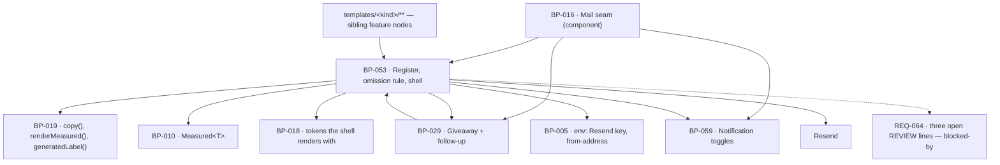

# BP-053 — The mail register, the omission rule, and the shell

- Parent: BP-016
- Kind: **feature** — the leaf cut from REQ-064: what is true of every mail,
  whichever requirement asked for it.

## Responsibility
Compose every mail from one shell and one block list so that an unmeasured value
omits its section rather than printing a zero, a plain-text alternative is
derived from the same blocks rather than authored twice, and no mail is sent on
an occasion the register does not carry.

## Module / boundary
`src/lib/mail/send.ts` (the seam body BP-016 declares), `kinds.ts` (the
register), `blocks/` (the block model and its renderer), `shell/` (the branded
frame and its plain-text twin) and `vendor/` (the one Resend call) — inside
BP-016's `src/lib/mail/`. `structure.md` and `capabilities.md` name BP-016 as
the owner of `sendEmail()` and `MAIL_KINDS`; they are the component's public
entry points and this node is the feature leaf that realises them, which is what
`structure.md`'s own preamble admits when it says a module may hold several BP
nodes.

It does **not** own: any per-kind template — those live in
`src/lib/mail/templates/<kind>/` and belong to the node that owns that kind's
occasions (ADR-040); the copy registry, which is BP-019's and holds every
sentence these blocks render; `Measured<T>` itself, which is BP-010's; the
notification preferences it consults, which are BP-059's; the address-wide
suppression table it consults, which is BP-029's.

## Diagram


## Public interface
```ts
// src/lib/mail/blocks/types.ts — the only vocabulary a template may speak
export type MailBlock =
  | { block: 'heading';   text: CopyKey; vars?: CopyVars }
  | { block: 'paragraph'; text: CopyKey; vars?: CopyVars }
  | { block: 'stat';      label: CopyKey; value: Measured<number>
                          format: 'integer' | 'delta' | 'perMonth'
                          note?: CopyKey }                        // travels with its value or not at all
  | { block: 'list';      label: CopyKey; items: Measured<readonly ListRow[]>; emptyLine: CopyKey }
  | { block: 'verdicts';  label: CopyKey; items: Measured<readonly VerdictRow[]>; emptyLine: CopyKey }
  | { block: 'action';    label: CopyKey; href: string }
  | { block: 'notice';    text: CopyKey; vars?: CopyVars }
  | { block: 'pageBody';  pageTitle: string; written: boolean; markdown: string }

/** Every value that can be absent enters as a Measured<T>. A template holds no
 *  conditional and cannot format a number itself, so no template can forget
 *  criterion 1. */
export function composeMail(m: {
  kind: MailKind
  subject: CopyKey
  blocks: readonly MailBlock[]
  optOut?: { href: string }            // BP-029's lead mail; BP-059's toggle mail
  measurement?: MeasurementState       // required for 'weekly', rejected for every other kind
}): { html: string; text: string; omitted: readonly number[] }

export type MeasurementState =
  | { state: 'complete' }
  | { state: 'partial'; unmeasured: readonly CopyKey[] }   // REQ-065 c4 → criterion 1's line
  | { state: 'none'; nextDueOn: Date }                     // REQ-065 c3 → its own line

// src/lib/mail/kinds.ts — BP-016's declared register, realised
export const MAIL_KINDS: Readonly<Record<MailKind, KindRow>>
export type KindRow = {
  occasionsFrom: string                 // requirement ids; asserted approved by test
  stoppable: false | 'toggle' | 'opt-out'
  unsuppressibleWhen?: string
}

// src/lib/mail/send.ts — BP-016's declared seam, realised
export function sendEmail(m: {
  kind: MailKind; to: string; subject: CopyKey; blocks: MailBlock[]
  optOut?: { href: string }
  measurement?: MeasurementState
  userId?: string                       // required when MAIL_KINDS[kind].stoppable === 'toggle'
  suppressible?: false                  // REQ-057 c7's one send
}): Promise<
  | { sent: true; id: string }
  | { sent: false; reason: 'suppressed' | 'preference-off' | 'preference-unreadable' | 'vendor'
      retryUntil?: Date }>
```

## Data model delta
None. This node stores nothing: the register is a typed constant, the shell is
code, and the vendor's message id is a log field. `BUILD.md` §10's tenth-table
test ("needs a rendered surface that reads it, specified first") is not met by a
send log, and no requirement in this corpus renders one.

`sendEmail` is therefore **not idempotent on its own**. Its callers are jobs, and
each job's natural key is stated in its own feature node (BP-003) — a second
invocation with the same key never reaches this seam.

## Error & edge behavior
- **Omission is structural.** A `stat`, `list` or `verdicts` block whose
  `Measured<T>` is `unmeasured` is dropped from the HTML and from the text, and
  its index is returned in `omitted`. A `zero` renders as zero, through BP-019's
  `renderMeasured`, whose type has no arm that turns one into the other
  (criteria 1 and 2).
- **A measured-empty list states its empty result** in one line — the block's
  own `emptyLine`, which is a required field, so an empty list without a line is
  a compile error rather than a blank section (criterion 3).
- **A mail with nothing left is still sent.** Where every conditional block was
  omitted or empty, the shell appends the nothing-to-report notice and sends.
  Not sending it is not an optimisation: criterion 3 states the send as the
  behaviour, and a customer who hears nothing cannot tell a quiet week from a
  broken product.
- **The two exceptions to that notice** come from `measurement`: `state:
  'none'` renders the week-not-measured line and the next due date instead
  (REQ-065 c3); `state: 'partial'` renders criterion 1's line naming the
  sections that could not be measured, and the nothing-to-report notice is
  suppressed (REQ-065 c4). The two lines are mutually exclusive by construction
  — `MeasurementState` is a union, not three booleans — so the double line the
  requirement's third `REVIEW` fears is unrepresentable here.
- **A note travels with its value or not at all.** `stat.note` is the mechanism
  for REQ-064 criterion 8's locale disclosure: it is a field of the block that
  carries the volume, so an omitted volume takes its disclosure with it and a
  disclosure never stands alone over a number that is not there.
- **Model text has exactly one door.** `pageBody` is the only block carrying a
  string that is not a `CopyKey`, it requires `pageTitle` and `written`, and it
  renders through BP-019's `generatedLabel()`. Every other block's text is a key
  into a frozen literal, so a model-produced sentence in the product's own voice
  is unrepresentable rather than forbidden (criterion 4, REQ-093 c1 and c2).
- **The plain-text alternative is derived, never authored.** `composeMail`
  returns both bodies from one block list; a template cannot supply a text body
  and cannot omit one (criterion 5). A kind whose test does not assert both
  bodies present, and both carrying the same block set, fails.
- **Legality is checked twice, at two different times.** A `kind` outside
  `MAIL_KINDS` does not compile (criterion 6). A row whose `occasionsFrom` names
  a requirement that is not `approved` fails the register test — which is what
  keeps criterion 6's promise true as the corpus moves, and is the cross-artifact
  check BP-016's first decision explains.
- **Stoppability is checked at send, not at schedule.** A `'toggle'` kind
  consults BP-059 and a `'opt-out'` kind consults BP-029's suppressions, both
  immediately before the vendor call, so a choice made between scheduling and
  delivery still holds. `suppressible: false` skips both — the one send REQ-057
  criterion 7 makes unsuppressible.
- **A preference that cannot be read stops a togglable mail** (`reason:
  'preference-off'` versus `'preference-unreadable'` are distinguished so the
  outage is visible in logs). BP-059 states why that direction and not the other.
- A vendor failure returns `{ sent: false, reason: 'vendor', retryUntil }` and
  never throws; retrying inside the window is the caller's, because only the
  caller knows what the recipient is owed (BP-029 criterion 8 is the one place a
  window is promised).

## NFR budget
- `composeMail` is pure and synchronous: no I/O, no interpolation engine, under
  5 ms for a mail of twenty blocks. It is therefore testable without a vendor and
  without a database, which is what makes the omission rule cheap to assert on
  every kind rather than on one.
- One vendor request per send. The `magic-link` kind's 60-second budget
  (REQ-024 c1, recorded in BP-016) is spent almost entirely in the queue, not
  here.
- Every string renders with the language models unavailable (REQ-093 c5) — the
  registry is a literal and this node makes no model call, ever. There is no
  `llm()` import in `src/lib/mail/**` and a lint rule says so.
- Observability: kind, recipient hash, suppression and preference outcome,
  vendor id, retry count, and the count of omitted blocks. Never a body, never a
  recipient address in clear text (BP-016's budget).

## Decisions
1. **The block model is the enforcement of criterion 1, not a convenience** — Status: accepted
   - Context: a missing number omits its section and never prints 0. Enforced in
     templates, that is one rule times nine kinds times every section.
   - Decision: every absent-capable value enters as `Measured<T>` on a block, and
     the renderer is the only code that formats it. Templates declare blocks;
     they hold no conditional and no formatter.
   - Alternatives considered: a lint rule against `0` in templates — rejected, it
     catches the literal and not the coalesce; a template helper templates are
     asked to use — rejected, "asked to" is the failure mode the requirement's
     user story is about.
   - Consequences: adding a section type means adding a `MailBlock` member, which
     forces its unmeasured and its empty behaviour to be stated at that moment.
     Reversing means moving formatting into nine templates, where the first one
     to coalesce is invisible until a customer reads a false zero.
2. **`MeasurementState` is a union carried by the `weekly` kind alone** — Status: accepted
   - Context: criterion 3's two exceptions are both facts about a week's
     measurement (REQ-065 criteria 3 and 4), and both are about the same mail.
   - Decision: one required field for `weekly`, rejected at the type level for
     every other kind; the nothing-to-report notice is chosen from it rather
     than from three independent flags.
   - Alternatives considered: booleans on the compose call — rejected, two of
     the eight combinations are the double line REQ-064's third `REVIEW` names;
     the weekly template deciding — rejected, criterion 3's rule is about every
     mail's empty case, of which the weekly one is a specialisation.
   - Consequences: a future recurring mail with its own measurement states must
     widen the union rather than pass a flag, which is the friction that keeps
     the exception list short.
3. **The plain-text alternative is a second rendering of one block list** — Status: accepted
   - Context: criterion 5 promises a plain-text alternative on every mail; two
     authored bodies is rule 2.4's second copy, and the copy that drifts is the
     one nobody reads.
   - Decision: `composeMail` returns `{ html, text }` from the same blocks.
   - Alternatives considered: an authored text body per template — rejected, the
     omission rule would then have to hold twice per kind; auto-stripping tags
     from the HTML — rejected, it produces a body no one designed and drops the
     opt-out and the action links into naked URLs.
   - Consequences: a shell change touches two renderers at once, on purpose.
4. **The register carries requirement ids, and a test reads them** — Status: accepted
   - Context: criterion 6 makes a mail legal only where a requirement states its
     occasion and its stoppability. BP-016's first decision already fixes the
     register as the home of that table.
   - Decision: `occasionsFrom` is asserted against the requirements corpus in
     `tests/mail/kinds/`: every id exists, every id is `approved`, and every
     `MailKind` reachable from a template appears in the register.
   - Alternatives considered: a documentation table — rejected by BP-016's own
     decision, cited here rather than re-argued.
   - Consequences: retiring a requirement fails the mail test before it fails a
     customer, which is the point.

The three `REVIEW` lines this node is blocked on are stated under Open questions
rather than ruled here; ADR-040 fixes the template partition this node's
`code:` globs assume.

## Blocked-by — REQ-064's three open REVIEW lines (rule 2.3)
This node `satisfies` REQ-064 and carries a `blocked-by` naming it. The three
lines are the requirement's own, they are about this exact seam, and they are
not this node's to rule — they route to `/decide` or back to the analyst. The
design above is built to the requirement **as written**, and against the current
text two of the three appear already answered:

- The first names criterion 6 as promising stoppability for recurring mail, but
  the text that says a recurring mail can be stopped is criterion **7**, and
  criterion 7 as written already carries the exception — "except the single
  occasion REQ-057 criterion 7 makes unsuppressible". Realised here as
  `suppressible: false`, and in the register as `unsuppressibleWhen`.
- The third fears a mail carrying both criterion 1's naming line and criterion
  3's nothing-to-report line on a partly measured week, but criterion 3 as
  written already excepts the partly measured case — "or the week was only
  partly measured (REQ-065 criterion 4), when criterion 1's line naming which
  sections could not be measured stands in its place". Realised here as the
  `MeasurementState` union, where the pair is unrepresentable.
- The second is the one with live residue. Criterion 6 as written does carry the
  legality test REQ-074 and REQ-079 cite it for. What it no longer carries is the
  list of kind names: REQ-079's non-goal quotes "the eight kind names there are
  its registry", and criterion 6 holds no kind names — they are in REQ-064's
  non-goal, which is where BP-016's first decision picks them up. That is a stale
  verbatim quotation in REQ-079, not a gap in this node.

The block is recorded, not enforced (rule 3.3): nothing in this repository holds
a merge against it. It stands until the three lines are ruled.

## Status grounds (rule 3.2)
Self-certified `approved` per rule 3.2. Grounds: cut from REQ-064, which is
`status: approved`; the node is one feature leaf under the approved component
BP-016; `code:` is repo-relative, bounded to five paths inside
`src/lib/mail/` and three test directories, and overlaps no sibling's globs
(ADR-040). The `blocked-by` above is a state on an approved requirement's open
questions, not an unmet stage gate: §3's gate is "no blueprint from a
non-approved requirement", and REQ-064 is approved.

## Open questions
- [ ] REQ-064's three `REVIEW` lines, verbatim in the requirement, are unruled
      (owner: user, via `/decide` or the requirements-analyst). Two appear stale
      against the requirement's current text and one — REQ-079's quotation of
      kind names criterion 6 no longer carries — appears live; the reasoning is
      in the section above and the disposition is not this node's to set.
