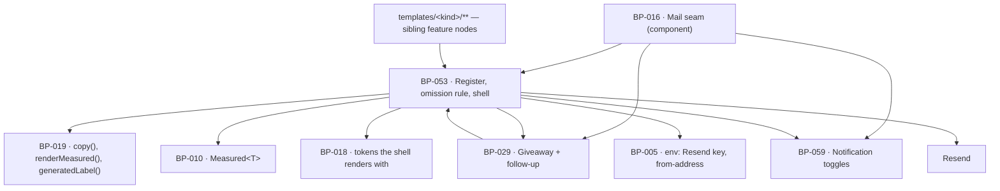

# BP-053 — The mail register, the omission rule, and the shell

- Parent: BP-016
- Kind: **feature** — the leaf cut from REQ-064: what is true of every mail,
  whichever requirement asked for it.

## Responsibility
Compose every mail from one shell and one block list so that an unmeasured value
omits its section rather than printing a zero, a plain-text alternative is
derived from the same blocks rather than authored twice, and no mail is sent on
an occasion the register does not carry.

## Module / boundary
`src/lib/mail/send.ts` (the seam body BP-016 declares), `kinds.ts` (the
register), `blocks/` (the block model and its renderer), `shell/` (the branded
frame and its plain-text twin) and `vendor/` (the one Resend call) — inside
BP-016's `src/lib/mail/`. `structure.md` and `capabilities.md` name BP-016 as
the owner of `sendEmail()` and `MAIL_KINDS`; they are the component's public
entry points and this node is the feature leaf that realises them, which is what
`structure.md`'s own preamble admits when it says a module may hold several BP
nodes.

It does **not** own: any per-kind template — those live in
`src/lib/mail/templates/<kind>/` and belong to the node that owns that kind's
occasions (ADR-040); the copy registry, which is BP-019's and holds every
sentence these blocks render; `Measured<T>` itself, which is BP-010's; the
notification preferences it consults, which are BP-059's; the address-wide
suppression table it consults, which is BP-029's.

## Diagram


## Public interface
```ts
// src/lib/mail/blocks/types.ts — the only vocabulary a template may speak
export type MailBlock =
  | { block: 'heading';   text: CopyKey; vars?: CopyVars }
  | { block: 'paragraph'; text: CopyKey; vars?: CopyVars }
  | { block: 'stat';      label: CopyKey; value: Measured<number>
                          format: 'integer' | 'delta' | 'perMonth'
                          note?: CopyKey }                        // travels with its value or not at all
  | { block: 'list';      label: CopyKey; items: Measured<readonly ListRow[]>; emptyLine: CopyKey }
  | { block: 'verdicts';  label: CopyKey; items: Measured<readonly VerdictRow[]>; emptyLine: CopyKey }
  | { block: 'action';    label: CopyKey; href: string }
  | { block: 'notice';    text: CopyKey; vars?: CopyVars }
  | { block: 'pageBody';  pageTitle: string; written: boolean; markdown: string }

/** Every value that can be absent enters as a Measured<T>. A template holds no
 *  conditional and cannot format a number itself, so no template can forget
 *  criterion 1. */
export function composeMail(m: {
  kind: MailKind
  subject: CopyKey
  blocks: readonly MailBlock[]
  optOut?: { href: string }            // BP-029's lead mail; BP-059's toggle mail
  measurement?: MeasurementState       // required for 'weekly', rejected for every other kind
}): { html: string; text: string; omitted: readonly number[] }

export type MeasurementState =
  | { state: 'complete' }
  | { state: 'partial'; unmeasured: readonly CopyKey[] }   // REQ-065 c4 → criterion 1's line
  | { state: 'none'; nextDueOn: Date }                     // REQ-065 c3 → its own line

// src/lib/mail/kinds.ts — BP-016's declared register, realised
export const MAIL_KINDS: Readonly<Record<MailKind, KindRow>>
export type KindRow = {
  occasionsFrom: string                 // requirement ids; asserted approved by test
  stoppable: false | 'toggle' | 'opt-out'
  unsuppressibleWhen?: string
}

// src/lib/mail/send.ts — BP-016's declared seam, realised
export function sendEmail(m: {
  kind: MailKind; to: string; subject: CopyKey; blocks: MailBlock[]
  optOut?: { href: string }
  measurement?: MeasurementState
  userId?: string                       // required when MAIL_KINDS[kind].stoppable === 'toggle'
  suppressible?: false                  // REQ-057 c7's one send
}): Promise<
  | { sent: true; id: string }
  | { sent: false; reason: 'suppressed' | 'preference-off' | 'preference-unreadable' | 'vendor'
      retryUntil?: Date }>
```

## Data model delta
None. This node stores nothing: the register is a typed constant, the shell is
code, and the vendor's message id is a log field. `BUILD.md` §10's tenth-table
test ("needs a rendered surface that reads it, specified first") is not met by a
send log, and no requirement in this corpus renders one.

`sendEmail` is therefore **not idempotent on its own**. Its callers are jobs, and
each job's natural key is stated in its own feature node (BP-003) — a second
invocation with the same key never reaches this seam.

## Error & edge behavior
- **Omission is structural.** A `stat`, `list` or `verdicts` block whose
  `Measured<T>` is `unmeasured` is dropped from the HTML and from the text, and
  its index is returned in `omitted`. A `zero` renders as zero, through BP-019's
  `renderMeasured`, whose type has no arm that turns one into the other
  (criteria 1 and 2).
- **A measured-empty list states its empty result** in one line — the block's
  own `emptyLine`, which is a required field, so an empty list without a line is
  a compile error rather than a blank section (criterion 3).
- **A mail with nothing left is still sent.** Where every conditional block was
  omitted or empty, the shell appends the nothing-to-report notice and sends.
  Not sending it is not an optimisation: criterion 3 states the send as the
  behaviour, and a customer who hears nothing cannot tell a quiet week from a
  broken product.
- **The two exceptions to that notice** come from `measurement`: `state:
  'none'` renders the week-not-measured line and the next due date instead
  (REQ-065 c3); `state: 'partial'` renders criterion 1's line naming the
  sections that could not be measured, and the nothing-to-report notice is
  suppressed (REQ-065 c4). The two lines are mutually exclusive by construction
  — `MeasurementState` is a union, not three booleans — so the double line
  criterion 3 excepts in its own last sentence is unrepresentable here.
- **A note travels with its value or not at all.** `stat.note` is the mechanism
  for REQ-064 criterion 8's locale disclosure: it is a field of the block that
  carries the volume, so an omitted volume takes its disclosure with it and a
  disclosure never stands alone over a number that is not there.
- **Model text has exactly one door.** `pageBody` is the only block carrying a
  string that is not a `CopyKey`, it requires `pageTitle` and `written`, and it
  renders through BP-019's `generatedLabel()`. Every other block's text is a key
  into a frozen literal, so a model-produced sentence in the product's own voice
  is unrepresentable rather than forbidden (criterion 4, REQ-093 c1 and c2).
- **The plain-text alternative is derived, never authored.** `composeMail`
  returns both bodies from one block list; a template cannot supply a text body
  and cannot omit one (criterion 5). A kind whose test does not assert both
  bodies present, and both carrying the same block set, fails.
- **Legality is checked twice, at two different times.** A `kind` outside
  `MAIL_KINDS` does not compile (criterion 6). A row whose `occasionsFrom` names
  a requirement that is not `approved` fails the register test — which is what
  keeps criterion 6's promise true as the corpus moves, and is the cross-artifact
  check BP-016's first decision explains. **Four rows name requirements that are
  `in-review` as of 2026-09-01** — `draft-ready` (REQ-057), `published`
  (REQ-062), `weekly` (REQ-063) and `account` (REQ-079) — so that test fails
  today and is correct to. It is the check doing its job on an unsigned corpus,
  not a design fault; nothing here changes, and it clears when the owner signs.
- **The `published` occasion now reaches both destinations, and its payload has
  three shapes.** The register's `occasionsFrom: 'REQ-062'` is unchanged and
  needs no edit — what changed is the *population* that occasion reaches. Since
  ADR-084 a WordPress delivery is live at an address, so it is verified at 24
  hours and it occasions this mail exactly as a hosted page does; and since
  REQ-062 criterion 4's three outcomes (ADR-085) BP-049's `PublishedTelling`
  carries one of three copy keys, the two non-`found` ones carrying what the
  check recorded **in place of** the four outcomes and never alongside them. The
  register's kinds, its stoppability column and the omission rule are all
  untouched: the block list differs, and a block list differing is what this
  node's shell exists to absorb.
- **Stoppability is checked at send, not at schedule.** A `'toggle'` kind
  consults BP-059 and a `'opt-out'` kind consults BP-029's suppressions, both
  immediately before the vendor call, so a choice made between scheduling and
  delivery still holds. `suppressible: false` skips both — the one send REQ-057
  criterion 7 makes unsuppressible.
- **A preference that cannot be read stops a togglable mail** (`reason:
  'preference-off'` versus `'preference-unreadable'` are distinguished so the
  outage is visible in logs). BP-059 states why that direction and not the other.
- A vendor failure returns `{ sent: false, reason: 'vendor', retryUntil }` and
  never throws; retrying inside the window is the caller's, because only the
  caller knows what the recipient is owed (BP-029 criterion 8 is the one place a
  window is promised).

## NFR budget
- `composeMail` is pure and synchronous: no I/O, no interpolation engine, under
  5 ms for a mail of twenty blocks. It is therefore testable without a vendor and
  without a database, which is what makes the omission rule cheap to assert on
  every kind rather than on one.
- One vendor request per send. The `magic-link` kind's 60-second budget
  (REQ-024 c1, recorded in BP-016) is spent almost entirely in the queue, not
  here.
- Every string renders with the language models unavailable (REQ-093 c5) — the
  registry is a literal and this node makes no model call, ever. There is no
  `llm()` import in `src/lib/mail/**` and a lint rule says so.
- Observability: kind, recipient hash, suppression and preference outcome,
  vendor id, retry count, and the count of omitted blocks. Never a body, never a
  recipient address in clear text (BP-016's budget).

## Decisions
1. **The block model is the enforcement of criterion 1, not a convenience** — Status: accepted
   - Context: a missing number omits its section and never prints 0. Enforced in
     templates, that is one rule times nine kinds times every section.
   - Decision: every absent-capable value enters as `Measured<T>` on a block, and
     the renderer is the only code that formats it. Templates declare blocks;
     they hold no conditional and no formatter.
   - Alternatives considered: a lint rule against `0` in templates — rejected, it
     catches the literal and not the coalesce; a template helper templates are
     asked to use — rejected, "asked to" is the failure mode the requirement's
     user story is about.
   - Consequences: adding a section type means adding a `MailBlock` member, which
     forces its unmeasured and its empty behaviour to be stated at that moment.
     Reversing means moving formatting into nine templates, where the first one
     to coalesce is invisible until a customer reads a false zero.
2. **`MeasurementState` is a union carried by the `weekly` kind alone** — Status: accepted
   - Context: criterion 3's two exceptions are both facts about a week's
     measurement (REQ-065 criteria 3 and 4), and both are about the same mail.
   - Decision: one required field for `weekly`, rejected at the type level for
     every other kind; the nothing-to-report notice is chosen from it rather
     than from three independent flags.
   - Alternatives considered: booleans on the compose call — rejected, two of
     the eight combinations are the double line REQ-064's third `REVIEW` names;
     the weekly template deciding — rejected, criterion 3's rule is about every
     mail's empty case, of which the weekly one is a specialisation.
   - Consequences: a future recurring mail with its own measurement states must
     widen the union rather than pass a flag, which is the friction that keeps
     the exception list short.
3. **The plain-text alternative is a second rendering of one block list** — Status: accepted
   - Context: criterion 5 promises a plain-text alternative on every mail; two
     authored bodies is rule 2.4's second copy, and the copy that drifts is the
     one nobody reads.
   - Decision: `composeMail` returns `{ html, text }` from the same blocks.
   - Alternatives considered: an authored text body per template — rejected, the
     omission rule would then have to hold twice per kind; auto-stripping tags
     from the HTML — rejected, it produces a body no one designed and drops the
     opt-out and the action links into naked URLs.
   - Consequences: a shell change touches two renderers at once, on purpose.
4. **The register carries requirement ids, and a test reads them** — Status: accepted
   - Context: criterion 6 makes a mail legal only where a requirement states its
     occasion and its stoppability. BP-016's first decision already fixes the
     register as the home of that table.
   - Decision: `occasionsFrom` is asserted against the requirements corpus in
     `tests/mail/kinds/`: every id exists, every id is `approved`, and every
     `MailKind` reachable from a template appears in the register.
   - Alternatives considered: a documentation table — rejected by BP-016's own
     decision, cited here rather than re-argued.
   - Consequences: retiring a requirement fails the mail test before it fails a
     customer, which is the point.

ADR-040 fixes the template partition this node's `code:` globs assume.

## Blocked-by — discharged 2026-09-01 (rule 2.3)
This node carried `blocked-by: [REQ-064]` for the three `REVIEW` lines REQ-064's
`## Open questions` held about this exact seam. **REQ-064 now carries none**: two
were deleted as stale against the requirement's own current text and the third
was closed by an owner ruling
(`requirements/history/REQ-029-041-060-064-071-2026-09-01-review-lines-closed.md`,
"None survives as a `blocked-by` edge"). The reasoning for each closure is that
file's, not restated here (rule 2.4).

The one half that was live when this node was written — REQ-079's quotation of
"the eight kind names" criterion 6 no longer carries — is also closed: REQ-079,
REQ-074 and REQ-077 each now read "the register of kinds is the table REQ-064's
own non-goals place with the mail blueprint", which names no count and no kind.
Nothing in the design above changes: it was built to the requirement as written
and the requirement's text did not move.

## Status grounds (rule 3.2)
Self-certified `approved` per rule 3.2. Grounds: cut from REQ-064 while that
requirement was `status: approved`, which is when §3's gate — "no blueprint from
a non-approved requirement" — was met and read; the node is one feature leaf
under the approved component BP-016; `code:` is repo-relative, bounded to five
paths inside `src/lib/mail/` and three test directories, and overlaps no
sibling's globs (ADR-040).

REQ-064 is `status: in-review` from 2026-09-01, sent back through the owner gate
by the review rounds that closed its `REVIEW` lines. That pass changed **no
criterion text in REQ-064** — its own history entry records "REQ-064's own text
is unchanged by this pass" — so nothing this node was cut from has moved, and the
approval stands on the design the unchanged criteria bind. If the owner's
approval changes a criterion rather than ratifying it, this status reverts and
the affected section is re-derived; the librarian's retroactive refusal (rule
3.2) is the instrument for that, not a `blocked-by` edge, because an
`in-review` requirement mid-gate is not a conflict with another artifact (rule
2.3).

**Status grounds addendum, 2026-09-01 — discharged 2026-09-02.** That addendum
recorded that the two bullets under *Error & edge behavior* read **REQ-062**
while it was `status: in-review`, so §3's gate was not met for them. **The owner
has since approved REQ-062, criterion 5 unchanged. The gate is now met and these
grounds hold.** Nothing in this node's own interface changed on 2026-09-01 and
nothing changes now; REQ-064's criterion text is unchanged, as the paragraph
above records. No retroactive refusal is owed.

## Open questions
None. The three that stood here were REQ-064's own `REVIEW` lines and all three
are closed upstream; see the discharge section above.
