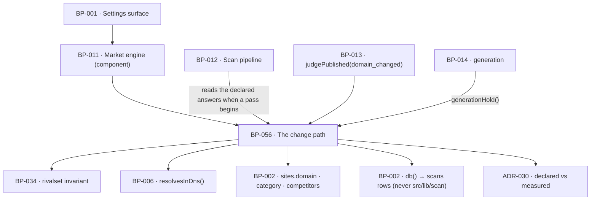

# BP-056 — Changing domain, market or rivals — effective at the next re-measurement

- Parent: BP-011
- Kind: **feature** — cut from REQ-071, a leaf under the market engine.

## Responsibility
Own the three answers that decide what every number in the product is a
measurement of — domain, market, rivals — so that a change is saved at once, takes
effect only at the first weekly re-measurement that begins after the save, and can
never be read as movement.

## Module / boundary
`src/lib/market/changes/` — `declared.ts` (the three declared answers and the saves
that set them), `pending.ts` (what is pending, when it becomes effective, and what
that holds), `markers.ts` (the change markers every series, chart, verdict and
week-count reads). The Settings screen is BP-001's; the rival add/remove invariant
is BP-034's and is imported, not re-implemented (rule 7.1). This module writes no
sentence and holds no layout.

## Diagram


## Public interface
```ts
// src/lib/market/changes/declared.ts
export type ChangeKind = 'domain' | 'category' | 'rivals'
export interface DeclaredAnswers { domain: string; category: string; rivals: RivalSet }
export interface MeasuredAnswers {
  domain: string; category: string; rivals: readonly string[]; at: Date; scanId: string
}
export function declaredAnswers(siteId: string): Promise<DeclaredAnswers>
/** Reads the `scans` rows through BP-002's `db()`. It never imports
 *  `src/lib/scan/`: BP-012 already depends on this module's parent, and the
 *  import would close a cycle `structure.md` rule 6 makes a build failure
 *  (Decisions 4). */
export function measuredAnswers(siteId: string): Promise<MeasuredAnswers | null>

export function saveDomain(a: { siteId: string; domain: string }):
  Promise<{ ok: true; effectiveOn: Date } | { ok: false; because: 'unreachable' }>
export function saveCategory(a: { siteId: string; category: string }): Promise<{ ok: true; effectiveOn: Date }>
export function saveRivals(a: { siteId: string; rivals: RivalSet }): Promise<{ ok: true; effectiveOn: Date }>
//  add/remove themselves are BP-034's addRival / removeRival; these persist the result.

// src/lib/market/changes/pending.ts
export interface PendingChange { kind: ChangeKind; declared: string; measured: string; effectiveOn: Date }
export function pendingChanges(a: {
  declared: DeclaredAnswers; measured: MeasuredAnswers | null; now: Date; timezone: string
}): PendingChange[]
/** The first weekly re-measurement that begins after `savedAt` (REQ-065 criterion 1:
 *  Monday, in the customer's own stated time zone). */
export function effectiveOn(a: { savedAt: Date; timezone: string }): Date
export function generationHold(pending: PendingChange[]):
  | { held: false }
  | { held: true; because: 'domain' | 'category'; resumesOn: Date }

// src/lib/market/changes/markers.ts
export interface ChangeMarker { kind: ChangeKind; on: Date }
export function changeMarkers(a: { siteId: string; from: Date; to: Date }): Promise<ChangeMarker[]>
export function domainHistory(siteId: string): Promise<{ domain: string; firstMeasuredAt: Date }[]>
export function weeksMeasured(siteId: string): Promise<number>   // counts from the current domain's first measurement
```

## Data model delta
None of its own. The three declared answers are `sites.domain`, `sites.category`
and `sites.competitors jsonb`, all in BUILD §10's baseline and owned by BP-002;
the measured answers are read from the scan that produced the current report
(`scans.domain`, `report.market.category`, `report.rivals`), owned by BP-012.
**No `pending_*` column, no change-log table, no migration owned here** — a pending
change is the difference between the two, which is **ADR-030**.

## Error & edge behavior
- **A save is immediate; its effect is not.** `saveCategory` writes
  `sites.category` at once and returns the date the change becomes effective. No
  re-measurement and no question-set re-derivation runs before that date, because
  re-derivation happens only inside a pass and a pass reads the declared answers at
  the moment it begins (criteria 7 to 9).
- **The date shown is the date given.** `effectiveOn` is called once at render and
  again at save from the same clock and time zone; the two must agree, and where
  a save crosses the boundary (a save at 05:59 for a 06:00 pass) the returned date
  is the one the pass will actually honour — the pass reads the row, so the save
  that lands first wins and the returned date is recomputed after the write, not
  before it (criterion 6, last sentence).
- **Nothing between save and pass moves.** Every number on screen comes from the
  last completed scan and carries its date, so criterion 10 holds without a
  freeze mechanism: there is nothing to freeze.
- `saveDomain` refuses an address the product cannot reach — `resolvesInDns()`,
  the same test a rival meets (REQ-021 criterion 9, REQ-026 criterion 8) — and no
  measurement of the new domain runs before the pass (criterion 9).
- **Generation is held only by a domain or a category change**, never by a rival
  change, and the hold names which of the two and the date pages resume
  (criterion 11). `generationHold` returns the reason so the surface can never
  show the empty-pipeline line in its place (REQ-043 criterion 3).
- **A removed rival disappears from every comparison at the next pass, not before**
  (criterion 8), and an empty set is legal: the account runs on, every other
  measurement and the daily page continue, and adding one later restores the
  comparison at the next pass (criterion 16). `rivals: []` is never an error state.
- **Nothing measured under an old answer is ever presented as the new answer's.**
  Every stored value already carries the scan it came from, and `changeMarkers`
  gives every series, chart and movement view the dates to break at (criteria 12
  and 13). `weeksMeasured` counts from the current domain's first measurement.
- **A page's verdict across a domain change is BP-013's**, whose `judgePublished`
  already returns `'not_judgeable'` with reason `'domain_changed'`; this node
  supplies `domainHistory` and states nothing about the verdict itself (criterion
  14, REQ-063 criterion 6; rule 2.4).
- **No contact ever reaches a rival.** No export here takes or returns an address,
  and no import path from `src/lib/market/**` reaches `src/lib/mail/**` — asserted
  as an import-graph test, so criterion 17 is a build failure rather than a review
  finding.
- Where no scan has completed for the site, `measuredAnswers` is `null`, every
  declared answer is pending against nothing, and `pendingChanges` returns `[]` —
  a customer who has changed something before their first pass is not shown a
  change marker against a measurement that does not exist.

## NFR budget
- **0¢.** No vendor call, no model call. `saveDomain` makes one DNS lookup bounded
  at 2 s; everything else is two row reads.
- Latency: a Settings card renders in ≤ 200 ms from two reads; `changeMarkers`
  over a year of scans is one indexed query.
- Timing correctness is the whole budget: `effectiveOn` is computed in the
  customer's stated time zone (REQ-073 criterion 3, the row REQ-071 already
  carries as `confirmed`), and a fixture suite covers DST boundaries, a save
  during a running pass, and a save in the same minute as the schedule.
- Observability: every save with its kind, its effective date and the declared and
  measured values at that moment; every pass logs which declared answers it read.
- Pins needed from BP-005: none new — the weekly schedule is REQ-065's and lives
  with the job runner.

## Decisions
1. **The declared answer and the measured answer are two facts; "pending" is their
   difference** — Status: accepted, recorded as **ADR-030**
   - The rule governs `sites.category` / `sites.domain` / `sites.competitors` across
     BP-034 (which mints them), this node (which changes them), BP-025 and BP-026
     (which re-derive from them) and BP-012 (which reads them when a pass begins) —
     nodes no single blueprint owns — and a `pending_*` column reads as an obvious
     improvement while silently creating a second source of truth. It is therefore
     a standalone landmine ADR and its reasoning is not restated here (rule 2.4).
2. **The Settings card shows the declared answer, with the pending line beside it** — Status: accepted
   - Context: criterion 1 says "the category currently being measured is shown";
     criterion 11 requires a line naming which change is holding pages and the date
     they resume. After a save the two readings diverge: the declared value is what
     the customer just typed, the measured value is what the last pass used.
   - Decision: the card shows the declared value — the answer in force from the
     next pass — and, whenever it differs from the measured one, the pending line
     naming the change and the date. Before any change the two are identical and
     criterion 1 reads the same either way.
   - Alternatives considered: showing the measured value until the pass runs —
     rejected, a customer who saved a correction would be shown the wrong market
     back with no sign their save landed, which is how a save gets made twice;
     showing both values side by side — rejected, criterion 1 asks for one category
     and REQ-041's data rule allows one headline value per module.
   - Cost of reversing: low; it is which of two fields the card reads.
3. **The goal-carrying limb of criteria 12 and 13 is bounded to headline numbers** — Status: accepted
   - Context: REQ-071 carries an open `REVIEW(untestable)` line on exactly this
     limb: "each affected number carries its goal in place of a change" cites
     REQ-041 criterion 4, which defines a goal only for a headline number on
     Overview and pins one goal per headline number. A rival distance or a point on
     a charted series has no goal to carry, so the limb has no pass condition for
     most of the numbers those criteria cover.
   - Decision: across a change, a headline number carries its goal in place of its
     change (REQ-041 criterion 4, unchanged); every other affected number — a rival
     distance, a charted point, a series — carries the change marker
     `changeMarkers` supplies and **no** change figure, which is the part of
     criteria 12 and 13 that is testable for it. Nothing is invented to stand in
     for a goal that REQ-041 does not define.
   - Alternatives considered: minting a goal per rival distance and per series
     point — rejected, a goal is a customer-visible number the product states and
     REQ-041's non-goal pins it per headline number; leaving the limb unimplemented
     — rejected, the rest of both criteria is testable and blocking the whole node
     on one clause would stop seventeen criteria for one.
   - Consequences: the REVIEW line stays with the requirement for the analyst to
     rule (rule 2.4 — its one home is REQ-071's own `## Open questions`); if the
     ruling widens the limb, it widens `markers.ts` and nothing else.
   - Cost of reversing: low; one function's return shape.

4. **The measured answers are read from rows, not from the scan module** — Status: accepted
   - Context: BP-012 (`src/lib/scan/`) already depends on BP-011
     (`src/lib/market/`). Importing `readCurrentReport` or `StoredReport` from here
     would close a cycle, which `registry/structure.md` rule 6 makes a build
     failure rather than a review comment.
   - Decision: `measuredAnswers`, `changeMarkers`, `domainHistory` and
     `weeksMeasured` query `scans` through BP-002's `db()` — the direction rule 6
     permits (`src/lib/` → `src/lib/db/`) — and project only the four fields this
     node needs. The arrow from BP-012 to this node runs the other way: a pass
     reads the declared answers when it begins.
   - Alternatives considered: importing `readCurrentReport()` — rejected, the cycle
     above; having the Settings adapter supply the rows — rejected here (unlike
     BP-034's setup card, Decisions 4 there), because `changeMarkers` needs a
     *sequence* of scans over a date range and pushing that query into `src/app/`
     would be engine logic in a route handler, which `structure.md` rule 1 forbids.
   - Consequences: two nodes read `scans` — BP-012 for the current-report pointer,
     this node for the historical sequence. They are different questions, so this
     is not two implementations of one capability (rule 7.1); if a third reader
     appears, the sequence query belongs in one place and that place is here.
   - Cost of reversing: low; a query moves.

## Status grounds (rule 3.2)
Self-certified `approved` under rule 3.2. Grounds: cut on `/expand-requirement`
from **REQ-071**, `status: approved`, as are the five requirements it depends on
(REQ-021, REQ-043, REQ-063, REQ-065, REQ-070) — §3's blueprint gate. It satisfies
exactly that requirement, lives inside BP-011's boundary, and overlaps no
sibling's globs. The requirement's own open `REVIEW` line is answered as far as it
can be derived (Decisions 3) and is not restated here.

## Open questions
