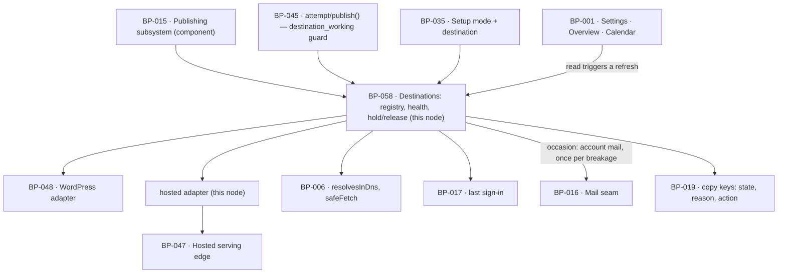

# BP-058 — A broken destination is a state the customer can fix, not an error loop

- Parent: BP-015
- Kind: **feature** — a leaf cut straight from REQ-074: the destination as an
  object with a state, a last-checked date, one action to fix it, and a queue
  that holds rather than loses.

## Responsibility
Carry each destination's current state and the date it was last checked, hold
the customer's pages while it is broken and release them in order when it is
fixed, and never let a credential or a vendor payload reach a screen, a mail or
an export.

## Module / boundary
`src/lib/publish/destinations/` **except** `wordpress/`, which is BP-048's:

| Path | Holds |
|---|---|
| `index.ts` | The registry: `adapterFor(kind)`, the destination read model, connect / disconnect / reconnect. |
| `config/` | Encryption at rest, the sealed accessor, and destruction on disconnect. The only place a credential is in plaintext. |
| `health/` | `checkHealth`, `ensureFreshHealth`, the reason taxonomy, the once-per-breakage mail occasion. |
| `hosted/` | The hosted `DestinationAdapter`: slug and live address, DNS readiness, the record to set, cache invalidation. |

The serving of hosted pages is **BP-047's** (`src/app/(hosted)/`). The state
machine, the retry policy and the publication row are **BP-045's**. The
WordPress adapter is **BP-048's**, and receives its decrypted config from
`config/` for the duration of one call.

## Diagram


## Public interface
```ts
// src/lib/publish/destinations/index.ts
export type DestinationKind = 'hosted' | 'wordpress'
export type DestinationHealth = 'ok' | 'expired' | 'error'         // BUILD §10's enum, unchanged
export type HealthReason =
  | 'never_connected' | 'dns_unset' | 'dns_elsewhere'
  | 'credentials_expired' | 'credentials_invalid' | 'unreachable' | 'destination_rejected'

export interface DestinationView {          // everything a surface may see, and nothing more
  id: string
  kind: DestinationKind
  health: DestinationHealth                 // rendered as working / needs reconnecting / failing
  reason: HealthReason | null
  lastCheckedAt: Date
  heldPages: number
  action: 'none' | 'reconnect' | 'set_dns'
  copy: { state: CopyKey; line: CopyKey | null }   // keys only — never a sentence, never a payload
}

export function adapterFor(kind: DestinationKind): DestinationAdapter
export function listDestinations(siteId: string): Promise<DestinationView[]>
/**
 * `config: null` is a **deferred connection** (REQ-028 criteria 3 and 5): the row
 * is created `expired` / `never_connected`, no network call is made, and the
 * result is `ok`. A non-null config is validated by the adapter's `health`.
 */
export function connect(a: { siteId: string; kind: DestinationKind; config: unknown | null; by: Actor }):
  Promise<{ ok: true; destinationId: string; health: DestinationHealth } | { ok: false; reason: HealthReason }>
export function disconnect(destinationId: string, by: Actor): Promise<{ ok: true; credentialsDestroyed: true }>
export function reconnect(a: { destinationId: string; config: unknown; by: Actor }):
  Promise<{ ok: true; held: number; releasing: boolean } | { ok: false; reason: HealthReason }>

// src/lib/publish/destinations/config/
/** Decrypts for the duration of one call and returns nothing that outlives it. */
export function withConfig<T, R>(destinationId: string, fn: (cfg: T) => Promise<R>): Promise<R>

// src/lib/publish/destinations/health/
export function checkHealth(destinationId: string): Promise<{ health: DestinationHealth; reason: HealthReason | null; checkedAt: Date }>
/** REQ-074 c1: re-checks in-line when `last_checked_at` is older than 24 h, then returns. */
export function ensureFreshHealth(destinationId: string): Promise<DestinationView>
/** REQ-074 c6's occasion; returns at most one per breakage. */
export function breakageMailDue(siteId: string, now: Date): Promise<
  { due: false } | { due: true; destinationId: string; held: number; copy: 'mail.account.destinationBroken' }
>

// src/lib/publish/destinations/hosted/
export const hostedAdapter: DestinationAdapter        // kind: 'hosted'
export interface DnsRecord { type: 'CNAME'; name: 'content'; value: string }
export function dnsRecordFor(siteId: string): Promise<DnsRecord | { pending: 'no_domain_yet' }>
export function liveUrlFor(a: { domain: string; slug: string }): string
```

## Data model delta
On the `destinations` topic — `supabase/migrations/*_destinations*.sql`, this
node's glob under structure.md rule 3. `BUILD.md` §10 already gives
`id, site_id, kind, config jsonb, health, created_at`, and BP-002 already
declares the addition of `last_checked_at` (REQ-074 criterion 1); the migration
file carrying it is this node's.

| Column | Why |
|---|---|
| `health_reason text null` | REQ-074 criterion 1 shows three states; REQ-059 criterion 2 and REQ-028 criterion 5 each need a **different written line** inside one of them ("waiting on your DNS", "not connected yet"). The reason selects the copy key and the action; the three states stay exactly `BUILD.md` §10's enum. |
| `health_changed_at timestamptz not null` | Criterion 6 counts 24 hours from when it broke, and criterion 6's "no further mail until it is reconnected and breaks again" is a comparison against this. |
| `broken_mail_sent_at timestamptz null` | The once-per-breakage guard. Cleared on every transition back to `ok`. |
| `config` is ciphertext | Encrypted at rest with a key from BP-005's `env`; no read path used by any surface returns it, and the row's `select` list for `DestinationView` does not include it. |
| partial unique index `(site_id) where deleted_at is null` | **One live destination per site.** It carries REQ-074's non-goal ("More than one destination of the same kind per site") a fortiori, and it is what makes REQ-028 criterion 5's "nothing is published to any other destination" true by construction. The derivation is BP-035's decision 2; the migration file is this node's. |
| `deleted_at timestamptz null` | Disconnect destroys the credential and keeps the row, because published pages stay live and their publications point at it (criterion 4). |

## Error & edge behavior
- **Three states the customer reads, one enum underneath.** `ok` → working,
  `expired` → needs reconnecting, `error` → failing. A destination that was never
  connected is `expired` with reason `never_connected`, because criterion 2's
  offer — an action plus one line saying pages are being held and nothing has
  been lost — is exactly what REQ-028 criterion 5 asks for at setup. The band is
  the same; the line and the action differ by reason.
- **Last checked is never more than 24 hours old, whether or not a publish was
  attempted.** `ensureFreshHealth` runs the check in-line on the read path when
  `last_checked_at` is stale, before the list renders. This satisfies criterion 1
  exactly — the promise is about the date the customer reads — and it does so
  without a background job and without depending on the kill switch, which stops
  `publish/execute` and `draft/generate` (BP-003).
- **The breakage mail rides an existing job.** Criterion 6 needs an occasion when
  the customer has *not* signed in, so a read cannot supply it.
  `breakageMailDue` is evaluated inside `draft/generate`'s per-site daily
  invocation, which is the same site loop that would otherwise be preparing the
  page that is now being held. It returns due at most once per breakage:
  `health <> 'ok'` ∧ `now - health_changed_at ≥ 24 h` ∧
  `broken_mail_sent_at is null` ∧ `lastSignInAt < health_changed_at`. Reaching
  `ok` clears `broken_mail_sent_at`, which is how "until it is reconnected and
  breaks again" is expressed as data.
- **Reconnect releases, at the ordinary rate.** A successful `reconnect` sets
  `ok`, returns the number of pages waiting, and — **only where publishing is
  on** (BP-045's `switch/`) — lets them resume in BP-045's `resumeOrder`, under
  the one-a-day and eight-a-week ceilings. Where publishing is off, none
  publishes: they stay held, listed and exportable (criterion 3, REQ-056
  criterion 13, and REQ-056's own non-goal saying a reconnected destination
  releases nothing while publishing is off). This node never publishes anything
  itself; it clears a guard.
- **Disconnect destroys the credential and nothing else.** `config` is
  overwritten with null in the same transaction that sets `deleted_at`; pages
  already published stay live — no `unpublish` is called and no publication row
  is touched (deleting one would break ADR-080's guard) — and no further
  delivery is attempted, because `adapterFor` is never reached for a row with
  `deleted_at`.
- **No destination, or every destination broken.** BP-045's
  `destination_working` guard fails and the attempt returns
  `no_destination` — a member of the non-retryable set — so the page comes to
  rest in `needs_attention` by REQ-056 criterion 4's limb for a reason no
  repeated attempt could clear, with no further automatic attempt and nothing
  silently dropped or marked published (criterion 5). There is no fallback
  destination, ever: REQ-028 criterion 5 forbids publishing to one the customer
  did not choose.
- **Hosted health is a DNS question.** `checkHealth` for `hosted` resolves
  `content.{sites.domain}` through BP-006's `resolvesInDns()`: unset →
  `expired/dns_unset`; resolving somewhere that is not our edge →
  `expired/dns_elsewhere`; resolving to us → `ok`. Until it is `ok`, no page is
  delivered and none is recorded as live at that address (REQ-059 criterion 2),
  and `dnsRecordFor` supplies the record to set. A site with no domain yet
  returns `{pending:'no_domain_yet'}` so the setup card can state that the record
  appears once an address is entered, rather than showing a blank (REQ-028
  criterion 2, REQ-091 criterion 2).
- **Hosted delivery writes no external system.** `hostedAdapter.deliver`
  computes the slug and the live address, returns them for BP-045's publication
  row, and invalidates BP-047's `hosted:site:*` and `hosted:page:*` cache tags.
  Its idempotency is the unique index alone, because the page *is* the row —
  there is no second system to reconcile (ADR-080).
- **Nothing technical ever reaches the customer.** `DestinationView` is the
  whole of what a surface may see; it carries copy keys, a state, a reason token
  and a count, and there is no field on it that can hold a vendor string. Vendor
  payloads stop in each adapter's error mapping (BP-048's `errors.ts`, this
  node's health mapping) and are logged at most as a classified reason, never as
  a body (criterion 7). Export and mail read the same view.
- **Health checks make no writes to a customer's site**, so a health check
  during a delivery cannot interfere with it, and a stale check never causes a
  publish: BP-045 re-reads health inside the claim transaction.

## NFR budget
- `listDestinations` p95 ≤ 60 ms when health is fresh; ≤ 3.5 s when
  `ensureFreshHealth` must re-check (one DNS resolution or one authenticated
  REST read). At most two destinations exist per site, so the worst case is
  bounded and no read path fans out.
- Health checks are debounced to at most one per destination per 60 s, so a
  burst of page loads makes one check. Chosen (rule 1.1) as the smallest value
  that collapses a normal navigation burst; reversal is one pin.
- The freshness window is 24 h, taken directly from criterion 1 and pinned in
  BP-005 (`DESTINATION_HEALTH_MAX_AGE_H: 24`) rather than written in this module.
- `config` encryption: authenticated symmetric encryption with a key from
  BP-005's `env`; the ciphertext never leaves the database except into
  `withConfig`'s callback, and `withConfig` returns the callback's value, never
  the config.
- Observability: one log line per health check — destination id, kind, health,
  reason, duration. Never a credential, never a response body, never a base URL
  containing one.

## Decisions
1. **Health is refreshed on read; the breakage mail rides `draft/generate`** —
   Status: accepted
   - Context: criterion 1 requires a last-checked date never more than 24 hours
     old "whether or not a publish was attempted in between". BP-003 closes
     `JobId` at six and states that adding one "is a change to this node", which
     this node may not make. Riding `publish/execute` fails when publishing is
     off; riding `weekly/refresh` is seven times too slow.
   - Decision: two occasions, each matched to what it must guarantee. The
     **date the customer reads** is guaranteed by refreshing in-line on the read
     path — which is precisely what criterion 1 promises, and which no job can
     be stopped out of. The **mail to a customer who has not signed in**
     (criterion 6) is evaluated inside `draft/generate`'s existing per-site daily
     loop, which is the same loop that would have prepared the held page.
   - Alternatives considered: a seventh job id, `destination/health` — not
     rejected on the merits, and it is the clean answer; it is not taken here
     because it is an edit to BP-003, which is another node's file and is being
     written concurrently. It is reported rather than made (rule 4.2).
     Refreshing only on publish — rejected, criterion 1 says explicitly
     "whether or not a publish was attempted".
   - Consequences: a read path can make a network call, which is why it is
     debounced and bounded to two destinations. The kill switch stops
     `draft/generate`, so a breakage mail can be delayed by a stop — during
     which REQ-092 already makes the product say its work stopped. **Cost of
     reversing:** low. Adding the seventh job later moves one call out of a loop
     and deletes the read-path refresh; nothing about the data model changes,
     which is why the shortcut is safe to take now.
2. **`health_reason` is a separate column, and the three states stay `BUILD.md`
   §10's enum** — Status: accepted
   - Context: three requirements land different lines inside one of criterion
     1's three states — DNS unset (REQ-059 c2), never connected (REQ-028 c5),
     credential expired (REQ-074 c2).
   - Decision: keep `health(ok/expired/error)` exactly as specified and add a
     reason that selects the copy key and the action.
   - Alternatives considered: widening the health enum to six members —
     rejected, it changes a specified column and makes criterion 1's three
     states a mapping the surface has to know. Deriving the reason at render
     time — rejected, the reason is what the check observed and cannot be
     recovered later.
   - Consequences: one column, one exhaustive union, and every surface renders
     the state from `health` and the sentence from `reason`.
3. **Disconnect keeps the row and destroys the credential** — Status: accepted
   - Context: criterion 4 — credentials destroyed, pages already published stay
     live, nothing further sent.
   - Decision: null the ciphertext, set `deleted_at`, leave the row and every
     publication pointing at it untouched.
   - Alternatives considered: deleting the destination row — rejected twice
     over: publications reference it, and deleting rows that guard the
     at-most-once property is exactly the tidy-up ADR-080 exists to forbid.
   - Consequences: a disconnected-and-reconnected destination is the same row
     with a new credential, so its publication history and its held queue
     survive, which is what criterion 3's "how many pages are waiting" counts.

## Status grounds (rule 3.2)
Self-certified `approved`. Grounds: cut from REQ-074, `status: approved`, so
§3's blueprint gate is met; one `satisfies` edge written at creation; `code:`
globs sit inside BP-015's `src/lib/publish/**` and inside BP-015's declared
`supabase/migrations/*_destinations*.sql`, and are disjoint from BP-048's
`destinations/wordpress/**`. No `blocked-by`: the REQ-056/REQ-079 conflict is
about a write into the customer's WordPress on unpublish and lands on BP-048;
nothing in this node's registry, health or hold-and-release behaviour depends on
how it is ruled.

## Open questions
