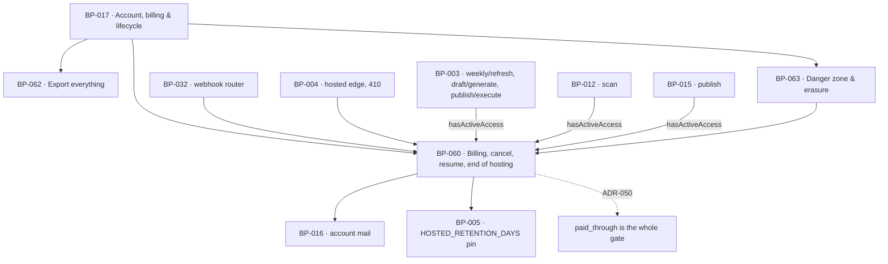

# BP-060 — Billing, cancellation, resume, and the end of hosting

- Parent: BP-017
- Kind: **feature** — a leaf of the Epic → Feature → Capability tree, cut from
  REQ-076.

## Responsibility
Hold the paid-through date that is the product's single access gate, let the
customer see their billing, cancel, resume and reach the portal without asking
anyone, and end hosted serving 30 days after that date with both notices sent.

## Module / boundary
`src/lib/account/billing/` — the billing summary, the portal link, cancel and
resume, the Stripe subscription-event handlers BP-032's router delegates to, the
single `hasActiveAccess` gate, and the hosted-retention clock. It owns the
`users_subscription` and `sites_hosting` migration topics.

Outside this boundary: the Settings billing card is BP-001's surface and its
sentences are BP-019's; the 410 is served by BP-004, which reads this node's
`hostedServingState`; the two notices are sent through BP-016's `account` kind;
the loops that consult the gate are BP-003, BP-012 and BP-015.

## Diagram


## Public interface
```ts
/** REQ-076 criterion 1. Every value is read from Stripe at request time except
 *  `paidThrough`, which is ours. Dates are returned as instants; the customer's
 *  time zone is applied at render (BP-019), never here. */
export function billingSummary(userId: string): Promise<{
  planKey: 'plan.single'                   // one plan; the words are BP-019's
  priceKeys: typeof PRICE_COPY_KEYS        // BP-030
  nextInvoice: { at: Date; amountCents: number; currency: 'eur' } | null
  card: { brand: string; last4: string; expMonth: number; expYear: number } | null
  paidThrough: Date
  cancelledAt: Date | null
  invoicesVia: 'portal'
}>

/** REQ-076 criterion 2. One portal session; `returnTo` is same-origin-checked and
 *  the customer comes back still signed in (the session is a cookie this node
 *  never touches). */
export function portalLink(userId: string, returnTo: string):
  Promise<{ url: string } | { ok: false; reason: 'no_customer' | 'vendor' }>

/** The portal configuration, exported so a test asserts REQ-076 criteria 2 and 9
 *  against the object. All four changes the criterion names are enabled; plan
 *  switching is not, because there is one plan (REQ-022 c3). */
export const PORTAL_FEATURES: {
  payment_method_update: { enabled: true }
  customer_update: { enabled: true; allowed_updates: ['address', 'tax_id', 'email'] }
  invoice_history: { enabled: true }
  subscription_cancel: { enabled: true; mode: 'at_period_end' }
  subscription_update: { enabled: false }
}

/** REQ-076 criterion 3. Returns the exact date access ends so the confirming
 *  screen can state it; nothing is cut off now. */
export function cancelSubscription(userId: string):
  Promise<{ ok: true; accessEndsAt: Date; hostedServingEndsAt: Date | null }
        | { ok: false; reason: 'already_cancelled' | 'vendor' }>

/** REQ-076 criterion 6 — before or after the paid-through date, without
 *  contacting anyone, onto the same domain, category and competitor set. Resume
 *  never touches `sites`. */
export function resumeSubscription(userId: string):
  Promise<{ ok: true; paidThrough: Date } | { ok: false; reason: 'not_cancelled' | 'vendor' }>

/** REQ-076 criterion 8 — THE access gate. See ADR-050 before changing this. */
export function hasActiveAccess(siteId: string): Promise<boolean>

/** REQ-076 criterion 10 — what BP-004 asks before serving a hosted address. */
export function hostedServingState(siteId: string): Promise<
  | { serve: true }
  | { serve: false; because: 'retention_elapsed' | 'account_deleted' }   // BP-004 answers 410
>

/** Stripe subscription-lifecycle handlers, called by BP-032's router. */
export function onSubscriptionEvent(event: Stripe.Event): Promise<void>

/** Due-work queries; BP-003 owns the schedule (see BP-032 decision 4). */
export function sitesDueHostingEndNotice(now: Date): Promise<string[]>   // at access end, and 7 days before stop
export function sitesDueHostingStop(now: Date): Promise<string[]>
```

## Data model delta
`users` (additive, `*_users_subscription_*.sql`):
- `stripe_subscription_id text null`
- `paid_through timestamptz not null` — the gate. Set at provisioning to the first
  period end and advanced by `onSubscriptionEvent`; never computed at read time.
- `cancelled_at timestamptz null`
- BUILD §10's `plan_status(active/past_due/canceled)` is kept as the **record of
  what Stripe says** and is read by no gate (ADR-050).

`sites` (additive, `*_sites_hosting_*.sql`):
- `hosted_serving_ends_at timestamptz null` — `paid_through + HOSTED_RETENTION_DAYS`,
  stamped when access ends, cleared on resume, and set to `now()` by BP-063 on
  deletion.
- `hosting_end_notice_at timestamptz null`, `hosting_end_reminder_at timestamptz null`
  — the two notices REQ-076 c11 requires, stamped so neither is sent twice and a
  missing stamp is visible.

`HOSTED_RETENTION_DAYS = 30` and `HOSTING_END_REMINDER_DAYS = 7` are pins in BP-005
(owner ruling on record: 30-day hosted retention), asserted in `tests/pins.test.ts`.

## Error & edge behavior
- `hasActiveAccess` is `paid_through > now()`, full stop. Cancelled: still true
  until the date. Latest renewal unpaid (`past_due`): still true until the date.
  Deleted: `paid_through` is set to `now()` by BP-063, so it is false at once.
  **Read ADR-050 before adding any other term to this expression.**
- Cancellation cuts nothing off now (c3). The one exception is generation: a page
  whose publish moment would fall after `paid_through` is not generated — the
  publish moment is BP-015's `becomesPublishable().at`, not the planned date, and
  this node exposes only `paid_through` for BP-015 to compare against. This node
  contains no scheduling logic.
- Once the date passes: nothing further is generated, published or charged; a draft
  in review can no longer be approved (BP-015's guard, reading this gate) and stays
  exportable (BP-062, which never consults this gate). Pages already published stay
  live — on the customer's own destination indefinitely, on hosted until
  `hosted_serving_ends_at`.
- After the date, a sign-in link is still sent and signing in still works
  (c5) — `requestMagicLink` (BP-032) does not consult this node, by design and by
  test. Settings still offers export, billing details and resume.
- `resumeSubscription` after the paid-through date creates a new Stripe
  subscription against the existing customer, advances `paid_through`, clears
  `hosted_serving_ends_at` and both notice stamps, and touches `sites.domain`,
  category and competitors not at all (c6).
- The end-of-hosting notices: one at the moment access ends, however it ends
  (c11's "however it ends" includes lapsing without a cancellation), and one 7 days
  before serving stops. Both are `account` kind and unstoppable (BP-016's register).
  A deletion sends neither and the window never begins (c10, c11; REQ-079 c6).
- `sitesDueHostingStop` is idempotent: stopping serving is a state
  (`hosted_serving_ends_at <= now()`), so a job that runs twice, late, or not at
  all still yields the right answer at read time. `hostedServingState` computes
  from the timestamp; no job flips a boolean.
- `past_due`, failed renewals, refunds and chargebacks: no code path invents
  behaviour for them (REQ-076 non-goal, owner ruling). `onSubscriptionEvent`
  records the Stripe status and does nothing else.

## NFR budget
- `hasActiveAccess` p95 ≤ 10 ms — three subsystems call it per unit of scheduled
  work. One indexed read of `users.paid_through` via `sites.user_id`; no Stripe call.
- `billingSummary` p95 ≤ 1.2 s (two Stripe reads, cached 60 s per user).
- `hostedServingState` is on the hosted edge's request path: p95 ≤ 10 ms, cacheable
  for 60 s, and it fails **closed on deletion** and **open on retention** — a lookup
  error while `deleted_at` is unknown must not serve a deleted customer's page.
- No Stripe secret, portal URL or card PAN is logged; `last4` and brand may be.
- Authorisation: every function except `hostedServingState` and
  `onSubscriptionEvent` requires a session bound to `userId`. `hostedServingState`
  is server-only, called by BP-004 with a site id it resolved from the `Host` header.

## Decisions
1. **410, not 404, and the same code for both endings** — Status: accepted (parameter, rule 1.1)
   - Context: REQ-076 c10 fixes 410 Gone for the retention-elapsed case. REQ-079 c4
     and c6 say the hosted CMS "no longer serves it" for a deletion without naming a
     code.
   - Decision: `hostedServingState` returns `serve: false` with a reason, and BP-004
     answers 410 for both. Two codes for one condition would be two implementations
     of one capability (rule 7.1).
   - Alternatives considered: 404 for deletion — rejected; 410 is the honest answer
     (it existed, it is gone) and it de-indexes faster, which is what a departing
     customer wants.
   - Consequences: reversal is one branch in BP-004. Cheap.
2. **`paid_through` is stamped, not computed from Stripe at read time** — Status: accepted
   - Context: three scheduled loops ask the gate on every unit of work.
   - Decision: the gate is one local column, advanced by webhook. A Stripe outage
     cannot revoke a paying customer's access.
   - Alternatives considered: query Stripe in `hasActiveAccess` — rejected on both
     latency and availability; it makes a vendor outage look like a cancellation.
   - Consequences: a missed webhook can leave `paid_through` stale. Mitigation: a
     daily reconciliation reading Stripe for subscriptions whose period end exceeds
     the stored value. Staleness fails **towards** the customer keeping access.
3. **The two hosting notices are stamps, not sends** — Status: accepted
   - Context: c11 requires that no customer's live pages go dark without both
     notices having been sent.
   - Decision: `hosting_end_notice_at` / `hosting_end_reminder_at` are the record.
     `sitesDueHostingStop` refuses to stop serving a site missing either stamp, and
     raises instead. A page going dark unannounced is worse than a page served a day
     longer than promised.
   - Alternatives considered: stop on the date regardless — rejected, it converts a
     mail failure into a broken promise the customer sees.
4. **The portal is the only surface for four things, and the product offers none of
   them** — Status: accepted
   - Context: REQ-076 c2 — card, invoice address, VAT number, invoices — "no other
     surface in the product offers a field for any of the four".
   - Decision: `PORTAL_FEATURES` is exported and asserted; no `POST /api/settings/*`
     route exists for any of the four (BP-001's closed allow-list, REQ-070 c4).
   - Consequences: correcting a VAT number costs a round trip to Stripe's UI. That is
     the requirement, and criterion 9 is met there.

See also **ADR-050** (landmine — the gate is `paid_through` alone) and **ADR-052**
(landmine — €49 is tax-inclusive; Stripe Tax stays off).

## Status grounds (rule 3.2)
Self-certified `approved` per rule 3.2. Grounds: cut from REQ-076, `status:
approved`; `satisfies: [REQ-076]` and nothing else; `code:` globs sit inside
BP-017's and overlap no sibling's. REQ-076's open `rests-on` row about the portal's
tax-ID capability is carried forward unchanged, not discharged.

## Open questions
