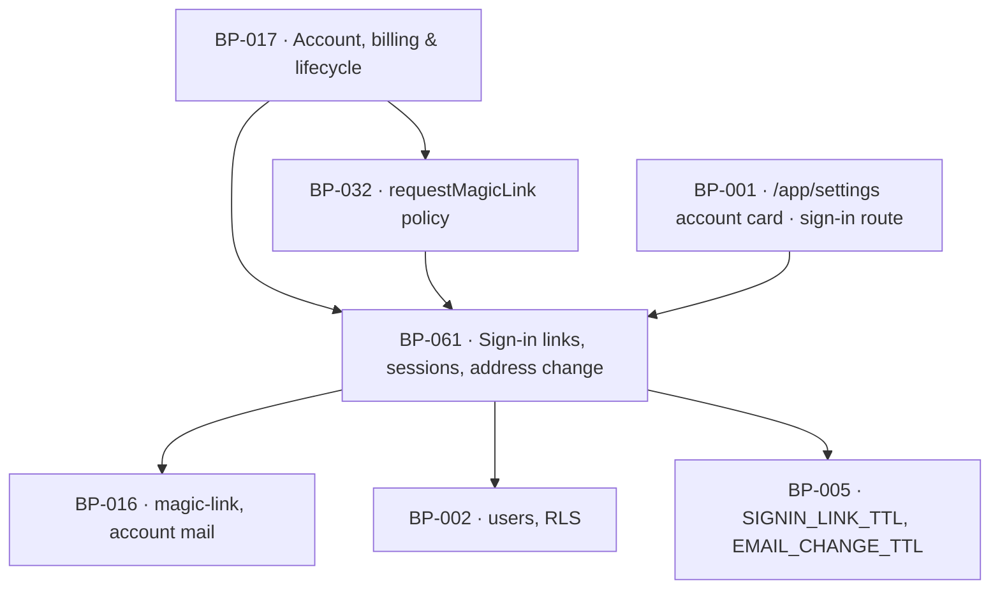

# BP-061 — Changing the sign-in address, and signing out

- Parent: BP-017
- Kind: **feature** — a leaf of the Epic → Feature → Capability tree, cut from
  REQ-077.

## Responsibility
Own the one-time link and the session it creates, and move an account's sign-in
address so that the new address proves itself before the old one stops working.

## Module / boundary
`src/lib/account/session/` — token issuance and redemption, session creation,
reading and ending, and the pending-email-change state machine. It owns the
`users_identity` migration topic.

Outside this boundary: **who** may be sent a link and what an unknown address is
told is BP-032's policy (`requestMagicLink`); this node issues, it does not
decide. The account card is BP-001's surface and its sentences are BP-019's; the
mails ride BP-016's `magic-link` and `account` kinds. This node depends on nothing
inside BP-017, which is what keeps the dependency BP-032 → BP-061 acyclic.

## Diagram


## Public interface
```ts
export type LinkPurpose = 'sign_in' | 'email_change'

/** Issues a single-use token and sends it. Called by BP-032 (`sign_in`) and by
 *  `beginEmailChange` (`email_change`). It applies no eligibility policy of its
 *  own — that is the caller's, deliberately (see decision 1). */
export function issueLink(a: { userId: string; to: string; purpose: LinkPurpose }):
  Promise<{ issued: true; expiresAt: Date } | { issued: false; reason: 'vendor' }>

/** Single-use. Redeeming a `sign_in` token creates a session; redeeming an
 *  `email_change` token completes the change and creates a session at the new
 *  address. Any second use of the same token is `spent`. */
export function redeemLink(token: string): Promise<
  | { ok: true; purpose: LinkPurpose; userId: string; session: SessionCookie }
  | { ok: false; reason: 'expired' | 'spent' | 'unknown'; lineKey: 'signin.link_dead' }
>

export function currentSession(): Promise<{ userId: string; siteId: string } | null>

/** REQ-077 criterion 5. Ends this session only. */
export function signOut(): Promise<void>

/** REQ-077 criterion 1 — what the account card reads. `name` and `email` are the
 *  account's; the invoice address is not here and is never returned by this node
 *  (REQ-076 c2). */
export function accountCard(userId: string): Promise<{
  name: string | null
  email: string
  pending: { email: string; expiresAt: Date } | null
  noteKeys: readonly ['account.magic_link_note', 'account.invoices_go_to_billing']
}>

/** REQ-077 criterion 2. The old address keeps working until the new one is used. */
export function beginEmailChange(userId: string, next: string): Promise<
  | { ok: true; expiresAt: Date }
  | { ok: false; reason: 'in_use';  lineKey: 'account.email_in_use' }
  | { ok: false; reason: 'invalid'; lineKey: 'account.email_invalid' }
>

/** REQ-077 criterion 4. Cancelling a pending change leaves the account unchanged. */
export function cancelEmailChange(userId: string): Promise<void>
```

## Data model delta
`users` (additive, `*_users_identity_*.sql`):
- `name text null`
- `pending_email citext null`, `pending_email_token_hash text null`,
  `pending_email_sent_at timestamptz null` — the whole of the pending state; a
  cancelled or lapsed change clears all three atomically.
- partial unique index on `lower(pending_email)` where not null, **and** the
  in-use check reads `users.email` and `users.pending_email` together, so two
  customers cannot race onto one address.

New table `auth_links`: `token_hash text primary key`, `user_id`, `purpose`,
`sent_to citext`, `expires_at`, `spent_at`. Tokens are stored hashed
(SHA-256, no salt needed for a high-entropy secret); the plaintext exists only in
the mail. This is the tenth table and it has a rendered surface that reads it —
every sign-in in the product (BUILD §10's bar).

## Error & edge behavior
- **The old address never stops working before the new one proves itself** (c2).
  `beginEmailChange` writes only the pending columns; `users.email` changes inside
  `redeemLink`'s transaction and not before. A customer who mistypes and never
  redeems is unaffected: the change lapses at `EMAIL_CHANGE_TTL` (24 h, REQ-077 c4).
- `beginEmailChange` refuses an address that is already a ReachKit account — including
  a soft-deleted one within its 30-day window (BP-063), because that account's
  address is still present and could be reachable again by a support action. Refusal
  sends no link and changes nothing.
- Validity is a syntactic check plus a deliverability attempt; no MX probe, no
  disposable-domain list. A refused-as-invalid address is answered with one written
  line and nothing else changes.
- On successful redemption of an `email_change`: `users.email` becomes the new
  address, every unspent token for that user is marked `spent`, all other sessions
  for that user are ended, and one `account` mail goes to the **old** address
  (c3). If that mail fails, the change still stands and the failure is raised —
  reverting an address the customer has already proved would lock them out of the
  account they just moved.
- Sign-out ends the current session only (c5). Other devices keep their sessions;
  REQ-077 states no global sign-out and none is invented.
- A link redeemed after expiry, after use, or that never existed gets one line and
  three indistinguishable responses — a different answer per reason is an
  account-existence oracle.
- Rate limiting: at most one live token per `(user_id, purpose)`. Issuing a new one
  spends the previous. A customer who clicks "send me a link" three times has one
  working link — the newest — which is what they will click.

## NFR budget
- `currentSession` p95 ≤ 5 ms; it is on every authenticated request. Cookie-verified,
  one indexed read at most.
- `issueLink` inside the 60-second promise BP-032 inherits from REQ-024 c1: token
  written and handed to BP-016 in ≤ 500 ms.
- No token plaintext, cookie value or link URL is ever logged, in any environment.
  Tokens are compared in constant time against the stored hash.
- Authorisation: `issueLink` is server-only. `redeemLink` is unauthenticated by
  necessity. `accountCard`, `beginEmailChange`, `cancelEmailChange` and `signOut`
  require a session bound to `userId`.
- Observability: one event per issue, redeem and change, carrying `userId`,
  `purpose` and outcome — never the address, never the token.

## Decisions
1. **Issuance is a primitive here; eligibility is a policy in BP-032** — Status: accepted
   - Context: `requestMagicLink` must answer three different things depending on
     whether an account, a held payment, or nothing exists (REQ-020 c4, REQ-024 c5),
     while an email change must send a link to an address that is *not yet* an
     account. One function cannot own both without a circular dependency between the
     two nodes.
   - Decision: BP-061 owns the token and the session and applies no eligibility rule;
     BP-032 owns the policy and calls in. Dependency runs one way, BP-032 → BP-061.
   - Alternatives considered: BP-061 owning `requestMagicLink` too — rejected, it would
     need `checkout_session_id` to answer `payment_held_account_opening`, which is
     BP-030's and BP-032's topic, and the cycle returns.
   - Consequences: two nodes touch one customer-visible flow. The seam is a single
     function signature and one test asserts that `issueLink` consults no account state.
2. **Token TTLs: 24 hours for an email change, 24 hours for a sign-in link** —
   Status: accepted (parameter, rule 1.1)
   - Context: REQ-077 c4 fixes 24 hours for the change link. No requirement states a
     sign-in link's lifetime.
   - Decision: `EMAIL_CHANGE_TTL_HOURS = 24` (required) and `SIGNIN_LINK_TTL_HOURS = 24`
     (chosen), both pins in BP-005. Derivation: the product has no password, so the
     link is the only key; a founder who pays in the evening and opens the mail the
     next morning must not be locked out, and REQ-024 c6's own backstop runs at 24
     hours, so a shorter sign-in TTL would create a window where the guaranteed link
     is already dead. Matching the two also means one expiry line for the customer.
   - Alternatives considered: 15 minutes or 1 hour, the common default — rejected on
     the reasoning above; the mitigating control is single use plus one live token
     per purpose, not a short window.
   - Reversal cost: one pin and one copy string. Low.
3. **Tokens are stored hashed and the plaintext lives only in the mail** — Status: accepted
   - Context: a database read must not yield a working key to every account.
   - Decision: SHA-256 of a 256-bit random token; constant-time comparison.
   - Alternatives considered: storing the token — rejected outright.
4. **A completed email change ends the account's other sessions** — Status: accepted
   - Context: REQ-077 c3 says only the new address can sign in afterwards. It says
     nothing about sessions already open.
   - Decision: end them. The likeliest reason to move an address is that the old one
     is no longer the customer's.
   - Consequences: a customer changing their address on a laptop is signed out on
     their phone and gets a fresh link. Stated in the account card's copy key, not
     invented at the screen.

## Status grounds (rule 3.2)
Self-certified `approved` per rule 3.2. Grounds: cut from REQ-077, `status:
approved`; `satisfies: [REQ-077]` and nothing else; `code:` globs sit inside
BP-017's and overlap no sibling's. The `auth_links` table clears BUILD §10's
tenth-table bar: `/app/settings`'s account card and every sign-in read it.

## Open questions
