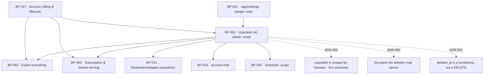

# BP-063 — Unpublish everything, delete account, and erasure

- Parent: BP-017
- Kind: **feature** — a leaf of the Epic → Feature → Capability tree, cut from
  REQ-079.

## Responsibility
Run the product's only two irreversible actions in an order that puts every page
in the customer's hands before any of it goes, and erase what remains 30 days later.

## Module / boundary
`src/lib/account/lifecycle/` — the danger zone: the export handover that gates both
actions, `unpublishEverything`, `deleteAccount`, and the purge. It owns the
`users_erasure` and `sites_erasure` migration topics.

Outside this boundary: the danger-zone card and its two confirmations are BP-001's
surface and BP-019's sentences; the archive is BP-062's; per-destination
un-publishing is BP-015's `DestinationAdapter.unpublish()`; ending the subscription
is BP-060's; the `account` mail is BP-016's; the purge's schedule is BP-003's.

## Diagram


## Public interface
```ts
/** REQ-079 criterion 1. Exactly two actions, each with one sentence saying what it
 *  removes, what it keeps, and whether the account survives. Naming only — the
 *  sentences are the owner's, in BP-019's registry. */
export const DANGER_ZONE: readonly [
  { action: 'unpublish_all';   sentenceKey: 'danger.unpublish_all';   accountSurvives: true },
  { action: 'delete_account';  sentenceKey: 'danger.delete_account';  accountSurvives: false },
]
export type DangerAction = typeof DANGER_ZONE[number]['action']

/** REQ-079 criteria 2 and 3 — the handover. Step one of two: build the archive and
 *  hand it over. Nothing is unpublished or deleted by this call. The ticket is
 *  spent by `confirm`, and only after `takenAt` is stamped. */
export function beginDangerAction(a: { siteId: string; action: DangerAction }): Promise<
  | { ok: true; ticket: string; archive: ReadableStream<Uint8Array>; filename: string }
  | { ok: false; reason: ExportFailure; lineKey: 'danger.export_failed' }   // c3: the action does not proceed
>

/** Called by BP-001's download route once the archive has been fully written to the
 *  client. Until this is stamped, `confirm` refuses. */
export function markExportTaken(ticket: string): Promise<void>

/** REQ-079 criteria 2 to 6. Refuses unless the ticket exists, is unspent, is not
 *  expired, and carries `takenAt`. There is no other entry point to either action. */
export function confirmDangerAction(a: { ticket: string; typedConfirmation: string }): Promise<
  | { ok: true; result: UnpublishAllResult }                       // unpublish_all
  | { ok: true; result: DeleteAccountResult }                      // delete_account
  | { ok: false; reason: 'no_ticket' | 'export_not_taken' | 'expired' | 'spent' | 'not_confirmed' }
>

export interface UnpublishAllResult {
  takenDown: number
  /** ADR-082: this is now the **projection** over the per-page `unreachable`
   *  outcomes `unpublish()` returned, grouped by destination — never a second,
   *  independent reachability decision taken here (rule 2.4). Its meaning is
   *  unchanged: a destination that could not be reached, and not a page that was
   *  named rather than written to. */
  stillLive: ReadonlyArray<{ destinationId: string; kind: 'hosted' | 'wordpress'; liveUrls: readonly string[] }>
  publishingSwitchedOff: true          // c5 — and it stays off until the customer switches it on
  lineKey: 'danger.some_still_live' | 'danger.all_taken_down'
}

export interface DeleteAccountResult {
  signedOut: true
  subscriptionEndedAt: Date
  stillLive: UnpublishAllResult['stillLive']   // c6 — named in one `account` mail to the deleted address
  /** c6's WordPress half. **Four sentences, one per REQ-056 c16 outcome, each
   *  with its own count** (the 2026-09-01 round-two fold; earlier it was one
   *  count and one place, and before that a list). The outcome set has one home
   *  and it is REQ-056 c16's (rule 2.4), so this is keyed by
   *  `UnpublishResult`'s four WordPress arms and never by a set of its own.
   *
   *  - `returned_to_draft` — made live by ReachKit and now back to draft. Has a
   *    place. **This is the populous arm since ADR-084**, and it was the empty
   *    one when this interface was written.
   *  - `named_for_removal` — created and never made live, "which nobody
   *    published, which were never public, and into which nothing has been
   *    written". Has a place. **Empty in production since ADR-084**, kept
   *    renderable for the reason ADR-084 Decision 4 keeps the arm.
   *  - `already_gone` — no longer in that site when ReachKit went to return
   *    them. **`place: null` by construction, not by capability**: c6 says this
   *    sentence names no place "because there is nothing there to find". A
   *    non-null place here would send the customer to look for posts that cannot
   *    be in the list.
   *  - `unreachable` — standing in a site ReachKit could not reach, may still be
   *    live, nothing written. Has a place.
   *
   *  "An outcome holding no posts is not named at all rather than named with a
   *  count of none", so an entry with `count === 0` is absent from the map and
   *  the mail cannot render a zero. `place` is REQ-060 c6's list, which exists
   *  only where the stamp was applied (ADR-083): `null` where the site would not
   *  take it, and that sentence then says so and still carries its count — an
   *  owner-owed sentence, not one this node mints. */
  leftInWordPress: Partial<Record<
    'returned_to_draft' | 'named_for_removal' | 'already_gone' | 'unreachable',
    { count: number; place: WordPressListPlace | null }
  >>
  purgeDueAt: Date                              // c7 — deleted_at + 30 days
}
/** The one place, from BP-058's `stamp_capable` row and BP-005's pin. This node
 *  renders no sentence and builds no URL text — it hands the values to the
 *  `account` mail's blocks (BP-053) and the copy key is BP-019/BP-020's. */
export interface WordPressListPlace { siteBaseUrl: string; stampSlug: string }

/** Due-work query; BP-003 owns the schedule (BP-032 decision 4's pattern). */
export function accountsDueForPurge(now: Date): Promise<string[]>
export function purgeAccount(userId: string): Promise<{ purged: true }>
```

## Data model delta
`users` (additive, `*_users_erasure_*.sql`):
- `deleted_at timestamptz null` — the tombstone. See **ADR-051**.
- `purge_due_at timestamptz null` — `deleted_at + ERASURE_DAYS`, stored rather than
  computed so a change to the pin cannot retroactively move an existing customer's date.

`sites` (additive, `*_sites_erasure_*.sql`):
- `publishing_enabled boolean not null default true` — REQ-070 c1's "whether pages
  publish at all"; c5 sets it false and nothing in this module ever sets it true.

New table `danger_tickets`: `ticket text primary key`, `site_id`, `action`,
`created_at`, `taken_at timestamptz null`, `spent_at timestamptz null`,
`expires_at`. It has a rendered surface (the danger zone's two-step confirmation)
and clears BUILD §10's tenth-table bar.

`ERASURE_DAYS = 30` and `DANGER_TICKET_TTL_MINUTES = 30` are pins in BP-005.

## Error & edge behavior
- **Order is fixed and each step is a precondition of the next**: build and hand
  over the export → take live pages down → (deletion only) end the subscription →
  (deletion only) stamp `deleted_at` → purge at 30 days. A step that fails stops the
  ones after it.
- **An export that cannot be produced stops the action** (c3). `beginDangerAction`
  returns c3's line and issues no ticket. There is no override, no "delete anyway"
  and no support path around it in this module.
- **An export the customer does not take stops the action** (c3). `confirm` refuses
  with `export_not_taken`. A ticket expires after 30 minutes; the customer starts
  again and takes a fresh archive. See decision 1 for why `takenAt` is stamped by the
  download route and what it can and cannot prove.
- **Nothing happens without explicit confirmation** (c2). `confirmDangerAction`
  requires a ticket the customer's own action created *and* a typed confirmation.
  No `GET` reaches either action; no email link performs one.
- **A destination that cannot be reached is reported, never retried into silence**
  (c4, c6). Its pages are listed as still live with one written line. Unpublishing is
  idempotent per publication, so a partial run followed by a retry converges.
  Which pages those are is read from the per-page `unreachable` outcomes
  (ADR-082), not decided here.
- **The deletion mail's WordPress half is four sentences, one per outcome, each
  with its own count and — where there is anywhere to look — its own place**
  (c6, as rewritten on 2026-09-01), and never a list of posts, whatever the
  number. It is keyed by REQ-056 c16's four outcomes because that is where the
  outcome set lives (rule 2.4); this node counts the `publications.unpublish_outcome`
  values the run produced and never re-derives a population of its own.
  - **No sentence carries two outcomes or one count for both.** The type is a map
    keyed by the arm, so a single count spanning two arms is unrepresentable
    rather than forbidden.
  - **An outcome holding no posts is not named at all**, so the absent key is the
    representation and no sentence can render a zero. **Since ADR-084 that is how
    `named_for_removal` normally disappears from this mail** — the arm is empty in
    production and the mail simply does not carry its sentence. That is the arm
    working as specified and is not evidence it can be deleted (ADR-084 Decision
    4).
  - **`already_gone` names no place, by construction.** Its entry's `place` is
    always `null` and not because a site refused the stamp: c6 says the sentence
    names no place "because there is nothing there to find". Sending the customer
    to a list to look for posts that cannot be in it is the failure that fold
    corrected.
  - The place for the other three is REQ-060 c6's list and exists only where
    BP-058's `stamp_capable` is true for that destination (ADR-083). Where it is
    not, `place` is `null`, the sentence says so and still carries its count, and
    this node invents nothing — the sentence is owner-owed and is under Open
    questions.
- **Unpublish-all switches publishing off and leaves it off** (c5). Nothing in this
  module, in BP-015's reconnect path, or in BP-003's daily loop may set
  `publishing_enabled` back to true; only the customer's own Settings toggle does.
  The account stays active, its content stays listed and stays exportable.
- **Deletion makes everything unreachable at the moment of the stamp** (c7): sign-in
  finds no account, export refuses, a published page's record is gone from every
  product surface. This is enforced in BP-002's row policy, not by an `if` in each
  caller — see ADR-051.
- **Deletion ends the subscription at once** (c6): BP-060 cancels immediately and
  sets `paid_through = now()`, so `hasActiveAccess` is false at once, the hosted
  30-day retention window never begins, and neither hosting notice is sent.
  Whether the unused remainder is refunded is out of scope (refunds deferred).
- **The purge at 30 days** (c7) removes the account and its sign-in address, the
  site, its pages, drafts, measurements, destination credentials, and every copy of
  the customer's own page content — including `drafts.grounded_fact`, whose retention
  under REQ-050 c1 ends here. Purge is idempotent and resumable: it deletes in
  dependency order within one transaction per site and re-running it on a purged
  account is a no-op.
- The `danger_tickets` row and its archive are themselves purged with the account.

## NFR budget
- `beginDangerAction` inherits BP-062's export budget (first byte ≤ 10 s, archive
  ≤ 120 s). `confirmDangerAction` returns within 30 s or returns with `stillLive`
  populated for the destinations it could not reach in that window — it never blocks
  the customer on a dead WordPress.
- Purge: a whole account within 60 s; the due-work query is one indexed scan on
  `purge_due_at`. It runs on the `account/maintenance` tick, whose period is
  **BP-003's** and is stated only there (decision 6), so the outer bound on c7's
  promise is 30 days plus one tick.
- Authorisation: every function except `accountsDueForPurge`/`purgeAccount` (server
  only) requires a session bound to the site's owner. `markExportTaken` requires the
  same session *and* a matching ticket.
- No destination credential, archive byte or deleted address is logged. One event per
  begin, take, confirm and purge, carrying ids and outcomes only.
- Observability: a purge that finds rows it cannot delete is an alert, not a warning —
  it means data promised gone at 30 days is still present.

## Blocked-by — discharged 2026-08-31 by ADR-081, carried by ADR-082
This node carried `blocked-by: [REQ-056, BP-015]` because REQ-056 c16 and REQ-079
c4 described what ReachKit does inside a customer's own WordPress two
incompatible ways. The owner ruled: **scope by liveness** — a page ReachKit
published there is returned to draft; a page it created but never made live is
named, and not touched. Each criterion is true of its own population, and the
branch this node was waiting on is now specified in BP-048. The ruling and its
rejected readings are ADR-081's, carried forward by **ADR-082** after criterion
16 grew to four outcomes, and by **ADR-084**, which supersedes ADR-082 and
**inverts which arms have members** without changing the union's shape: since the
owner's ruling of 2026-09-01 every post ReachKit creates there is made live by
it, so "returned to draft" is now the populous half of criterion 4 and "created
but never made live" is the empty one. The discriminator is unchanged —
`publications.made_live_by_us` (BP-045), never a re-read of the customer's site —
and it is now `true` for every WordPress row, which is exactly what makes it look
deletable. Cite **ADR-084**.

What this changes here: criterion 4's WordPress half is now determinate.
`unpublishEverything` calls `DestinationAdapter.unpublish()` per publication as
before and takes no branch of its own — it reports what came back. Criteria 1, 2,
3, 5, 6 and 7, criterion 4's hosted half and its unreachable-destination half
were never blocked and are unchanged. `UnpublishAllResult.stillLive` keeps its
meaning — a destination that could not be reached, and not a page that was named
rather than written to — and is now derived from the per-page outcomes rather
than computed a second time here (ADR-082).

## Decisions
1. **The export handover is a two-step ticket, and `takenAt` is stamped by the
   download route** — Status: accepted
   - Context: REQ-079 c3 requires that the export be "produced and downloaded by
     them" before anything is destroyed, and that the action not proceed if "they do
     not take it". A server cannot observe a file landing in a downloads folder.
   - Decision: `beginDangerAction` issues a ticket and streams the archive;
     BP-001's route calls `markExportTaken` only after the last byte has been written
     to the response without error; `confirmDangerAction` refuses without that stamp.
   - Alternatives considered: fire the export and proceed in the same call — rejected,
     it is exactly the silent destruction BUILD §4.7's danger-zone line promises
     against. A client-side "I have the file" checkbox — rejected, it proves less than
     a completed response.
   - Consequences: the strongest available claim is "the whole archive left our
     process for this customer's session", not "the customer holds the file". That is
     stated here so nobody later reads the ticket as proof of possession. The customer
     pays one extra click.
2. **Unpublish-all switches publishing off, and nothing in the system switches it
   back on** — Status: accepted
   - Context: REQ-079 c5 requires that no page be published by the daily loop and none
     released by a destination being reconnected (REQ-074 c3).
   - Decision: `publishing_enabled` is a `sites` column this module only ever sets to
     false; the only writer of `true` is the customer's Settings toggle
     (REQ-070 c1). BP-015's reconnect path reads it and refuses.
   - Alternatives considered: unpublish the pages and leave the switch alone —
     rejected, the next day's loop republishes them and the customer's action is
     quietly undone, which c5 names.
3. **The purge runs hourly, not daily** — Status: **superseded by decision 6**
   (2026-08-31). Recorded, not deleted: the reasoning below is why the cadence is
   sub-daily at all, and decision 6 only moves where the period is stated.
   - Context: REQ-079 c7 promises the data is gone "when 30 days have passed". A daily
     cron makes the true bound 31 days.
   - Decision: hourly, on `purge_due_at <= now()`, so the bound is 30 days + 1 h.
   - Alternatives considered: daily (simpler, breaks the stated day); continuous
     (needless load for a rare event).
   - Reversal cost: one schedule entry in BP-003. Low.
4. **`purge_due_at` is stored, not computed** — Status: accepted
   - Context: `ERASURE_DAYS` is a pin, and a pin can change.
   - Decision: stamp the date at deletion. A customer who was promised a date keeps it.
   - Alternatives considered: `deleted_at + ERASURE_DAYS` at query time — rejected, it
     silently moves the promised date of everyone already in the window.
5. **Deletion's hosted take-down reuses BP-060's serving state; there is no second
   switch** — Status: accepted
   - Context: two ways for hosted serving to end — retention elapsed (REQ-076 c10) and
     deletion (REQ-079 c6).
   - Decision: this node sets `sites.hosted_serving_ends_at = now()` and BP-060's
     `hostedServingState` answers `serve: false` for both. One capability, one owner
     (rule 7.1); both end in BP-004's 410 (BP-060 decision 1).

6. **The purge's cadence is BP-003's; this node states a bound, not a period** —
   Status: accepted (2026-08-31, supersedes decision 3)
   - Context: decision 3 wrote "hourly" and this node's NFR budget wrote "30 days
     plus one hour". BP-003's NFR budget writes that `account/maintenance` — the
     tick that calls `accountsDueForPurge`/`purgeAccount` — "fires every 15
     minutes", derived there from REQ-024 criterion 5's tightest obligation, and
     pins it as BP-005's `MAINTENANCE_TICK_MINUTES`. Two homes for one number, and
     decision 3 itself had already conceded the ownership: its own reversal cost
     reads "one schedule entry in BP-003", and this node's `## Module / boundary`
     reads "the purge's schedule is BP-003's".
   - Which is right on the promise: **both**, and 15 minutes is strictly tighter,
     so REQ-079 criterion 7's "when 30 days have passed" holds on either and no
     test in the corpus depends on the period. This is a rule 2.4 defect only —
     the second copy, caught before it diverged into a broken promise rather than
     after.
   - Decision: this node states the *bound* — 30 days plus one `account/maintenance`
     tick — and never the period. The period is BP-003's NFR budget and BP-005's
     pin, and a change to it is made in one place.
   - Alternatives considered: **restate 15 minutes here, matching BP-003** —
     rejected, it is the same second copy with a fresher value, and the next
     cadence change re-opens exactly this finding; **give the purge its own job
     with its own hourly schedule** — rejected, BP-003 decision 1 already ruled
     the four daily-or-slower obligations ride one guarded tick, and a second
     scheduled job for a rare event is a capability with two owners (rule 7.1).
   - Cost of reversing: one sentence. Nothing derives from it.

See also **ADR-051** (landmine — `deleted_at` is a tombstone and the 30-day gap is
load-bearing; the enforcement point is BP-002's row policy), **ADR-082**
(unpublish is scoped by liveness and states which of five things happened;
supersedes ADR-081) and **ADR-083** (landmine — the two marks on a post, and the
place this node's mail names).

## Status grounds (rule 3.2)
Self-certified `approved` per rule 3.2. Grounds: cut from REQ-079 while that
requirement was `status: approved` — the moment §3's blueprint gate was met and
read; `satisfies: [REQ-079]` and nothing else; `code:` globs sit inside BP-017's
and overlap no sibling's. Its `blocked-by` on REQ-056 / BP-015 is discharged by
ADR-081, carried forward by ADR-082.

**Status grounds addendum, 2026-09-01 (rule 3.2) — the gate this edit does not
meet.** REQ-079 is `status: in-review` while the owner's signature is pending on
three folds, all carried into this node above: the liveness scoping in criterion
4; the **inversion** of criterion 4's two WordPress populations under ADR-084;
and the rewriting of criterion 6's WordPress half into **four sentences, one per
REQ-056 criterion 16 outcome, each with its own count** — the third shape that
half has taken in two days (a list, then a count and a place, now four
sentences). The edit also reads **REQ-056** and **REQ-060** (`in-review`, both)
for the outcome set and for the place. All three carry **zero open `REVIEW(...)`
lines** after two full review rounds (rule 3.4), so the text is settled — but
§3's gate reads *no blueprint from a non-approved requirement*, and **that gate
is not met for this edit**. The `approved` status is asserted under rule 3.2 on
the design, not on the gate.

`DeleteAccountResult.leftInWordPress` has now changed shape twice, and the work
order implementing this mail is owed a third re-extract — the planner's, stated
here so it is not read as covered. If the owner's signature changes criterion 4
or 6 rather than ratifying it, this node returns to review with it by the
librarian's retroactive refusal (rule 3.2). No `blocked-by`: an `in-review`
requirement mid-gate is not a conflict with another artifact (rule 2.3).

## Open questions
- [ ] What REQ-079 criterion 6's mail says about posts left in a customer's
      WordPress at a site that would not take ADR-083's stamp, where there is no
      place to name (owner: user). The count and the "theirs to keep or remove"
      half are unaffected; only the place is missing.
- [ ] REQ-079 criterion 6's unreachable-destination arm — "names it and says what
      they must do about it" — for a **hosted** destination, where after account
      deletion the customer can do nothing and the population is unbounded in the
      same way the WordPress one was (owner: user; reported by the analyst in the
      round-two fold and not settled there). Neither the count-and-place shape nor
      an action translates, so this node renders whatever sentence the owner
      rules and mints none.
